# Issue-to-PR Workflow

This diagram shows how an issue is taken from evaluation to a pushed PR, and
where the AI pauses for your input. It reflects the rules in
[`.github/copilot-instructions.md`](./copilot-instructions.md) (the "Issue
Definition of Done" gate and the "one stop before commit" checkpoint policy).

## Key principles

- **Validate before building** -- an open issue is not a mandate. The AI confirms
  the bug/gap is real (`file:line`) and worth doing, and may recommend
  closing/reshaping instead of implementing.
- **Automatic quality gate** -- after implementation, `go-reviewer` and
  `artifact-auditor` run automatically. The AI does not ask permission to run
  them.
- **One stop before commit** -- implementation, review, and fixes happen in a
  single continuous pass. The AI interrupts only for genuine judgment-call
  questions, then presents one summary and asks once to commit.
- **Approval-gated git** -- commit and push are separate approvals. Commits are
  signed (`-S`) and DCO signed-off (`-s`).
- **`/pr-review` is user-run** -- it operates on the open GitHub PR (review
  threads, CI, Codecov) and is run by you after push.

## Flow

```mermaid
flowchart TD
    A([You: evaluate issue #xxx for implementation]) --> B{Triage &#47; validation gate}
    B -->|Not legit / redundant / better solved another way| C[AI recommends close or reshape]
    C --> Z([Stop])
    B -->|Legitimate| D[AI builds implementation plan]
    D --> E{Plan ambiguity, assumption,<br/>or scope question?}
    E -->|Yes| F[AI asks you: options + recommendation]
    F --> G([You: answer, authorize implementation])
    E -->|No| G

    G --> H[AI implements plan]
    H --> I[Build + race tests + targeted tests until green]

    I --> J[[Auto Definition-of-Done gate]]
    J --> K[go-reviewer: full multi-phase review]
    K --> L[artifact-auditor: tests, docs,<br/>examples, integration, MCP]
    L --> M[AI resolves CRITICAL / HIGH / real MEDIUM]

    M --> N{Finding needs a judgment call?<br/>design tradeoff, breaking change, scope}
    N -->|Yes| O[AI asks you: options + recommendation]
    O --> P([You: answer])
    P --> M
    N -->|No, routine| Q[AI re-validates: build, race, integration]

    Q --> R[/Single consolidated summary:<br/>changes, findings + resolutions,<br/>coverage, test results/]
    R --> S{You: approve commit?}
    S -->|No| Z
    S -->|Yes| T[AI commits: signed -S + DCO -s]
    T --> U{You: approve push?}
    U -->|No| Z2([Stop: committed, not pushed])
    U -->|Yes| V[AI pushes branch]
    V --> W([You: run /pr-review on the open PR])
    W --> X([PR review threads, CI, Codecov])
```

## Where the AI stops for you

| Checkpoint | Who decides | Notes |
|---|---|---|
| Triage verdict | AI reports; you react | May recommend close/reshape instead of implementing |
| Plan questions | You | Only when there is a real ambiguity/assumption/scope call |
| Authorize implementation | You | Green-light to start coding |
| Gate judgment calls | You | Only for non-obvious findings (design/scope/breaking) |
| Approve commit | You | Single ask after one consolidated summary |
| Approve push | You | Separate approval from commit |
| `/pr-review` | You | Run manually after push, once the PR exists |

Everything else -- running the review/completeness gate, fixing routine
findings, re-validating -- happens automatically without asking permission.
