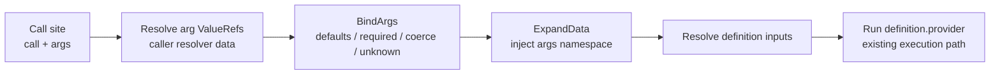

# Parameterized Provider Calls (`spec.calls`)

## Overview

A single endpoint is often invoked repeatedly with different inputs -- a
validation or lookup endpoint hit once per item, group, or environment. Today
authors must duplicate the entire provider configuration (URL, headers, body
template, auth, retry, timeout) for each distinct set of inputs.

This design introduces a **provider-agnostic, reusable call mechanism**. A new
`spec.calls` section holds named definitions, each declaring typed `args` plus a
provider and its inputs. Any resolve, transform, validate, or action step invokes
a definition via `call:` + `args:` instead of `provider:` + `inputs:`. At
runtime the call is expanded as a macro at the resolver/action layer -- the
underlying provider is unchanged. HTTP is the first consumer, but the mechanism
works for any provider.

## Problem Statement

1. **Duplication** -- Reusing one endpoint with N different input sets requires N
   full copies of the request config. Changes must be applied N times.
2. **No parameterization** -- There is no way to declare a request "shape" once
   and supply only the differing arguments per call site.
3. **No de-duplication** -- Identical calls made from multiple resolvers each
   issue their own request, even when the arguments are equal.
4. **Error opacity** -- Without typed arguments, malformed inputs surface as
   provider errors far from the call site rather than clear, argument-level
   diagnostics.

## Design

### Concepts

- **Call definition** (`spec.calls.<name>`) -- a reusable, named request. Declares
  typed `args`, a `provider`, and provider `inputs` that reference those
  arguments via the `args` namespace.
- **Call site** (`call:` + `args:`) -- a step or action that invokes a definition,
  supplying argument values.
- **`args` namespace** -- inside a definition's inputs, arguments are referenced as
  `_.args.x` (CEL) and `{{ .args.x }}` (Go template).

### Expansion Flow

Per call site, at runtime:

1. Resolve the call-site `args` values against the caller's resolver data
   (literals, `rslvr`, `expr`, `tmpl` -- standard `ValueRef`).
2. Bind and validate the resolved values against the declared `ArgDef` set:
   apply defaults, enforce required, coerce types, reject unknown args.
3. Inject the bound arguments into the eval context under the `args` key.
4. Resolve the definition's `inputs` against the enriched context.
5. Run the definition's provider through the **existing** provider execution
   path.



### Example

```yaml
spec:
  calls:
    groupMembershipCheck:
      args:
        user:
          type: string
          required: true
        groups:
          type: array
          required: true
      provider: http
      inputs:
        method: POST
        url: https://api.example.com/validate/user-in-any-group
        authProvider: entra
        scope: api://example/.default
        autoParseJson: true
        body:
          tmpl: |
            {
              "user": "{{ .args.user }}",
              "groups": {{ .args.groups | toJson }}
            }

  resolvers:
    createAllowed:
      resolve:
        with:
          - call: groupMembershipCheck
            args:
              user: { expr: "_.requestor" }
              groups: { expr: "_.createGroups" }

    updateAllowed:
      resolve:
        with:
          - call: groupMembershipCheck
            args:
              user: { expr: "_.requestor" }
              groups: { expr: "_.updateGroups" }
```

One definition, two call sites passing different args, producing independent
requests and results.

## Locked Design Decisions

These were settled with the maintainer and are not re-litigated here:

1. **Provider-agnostic** `spec.calls` (not top-level `httpCalls`, not HTTP-only).
   HTTP is just the first consumer.
2. `call:` + `args:` is supported on **all four** step types: resolve
   (`ProviderSource`), transform (`ProviderTransform`), validate
   (`ProviderValidation`), and actions (`action.Action`).
3. **Opt-in de-duplication** via `dedup: true` on a definition; in-memory and
   single-run only (never persisted to state, never dedups across separate runs).
4. **Named-only** argument binding in v1 (no positional binding).
5. **Accessor namespace is `args`**: `{{ .args.x }}` in Go templates and
   `_.args.x` in CEL. Bare `args.x` (CEL top-level variable) is intentionally
   **not** supported in v1 -- arguments are always accessed under the `_` prefix,
   consistent with the rest of scafctl CEL. See
   [Resolved Decisions](#resolved-decisions).
6. Argument values at call sites may be literals, resolver refs (`rslvr`), CEL
   (`expr`), or templates (`tmpl`) -- i.e. standard `ValueRef`.
7. **Strict isolation.** Definitions may reference only `args` (plus
   always-available globals like `__params`). A definition input that references
   a solution resolver by name is a **validation error**, not a warning: it
   breaks isolation and injects hidden dependency edges that change scheduling
   for every call site. Data must be passed in as a declared argument.

Args support typed scalars (string, int, bool, number), lists (`array`), and
maps/objects, with required/optional + default. List/map args must be
serializable into structured request bodies (`toJson` in templates,
`json.marshal` in CEL).

## Architecture

### Package Layout and Import-Cycle Safety

The existing dependency direction (leaf to root) is:

```text
spec  <-- resolver <-- solution
  ^          ^            ^
  +-- action +            |
             +------------+
```

`pkg/spec` is the leaf. `resolver.ValueRef` and `resolver.CoerceType` alias the
`spec` equivalents; `action` imports `spec` directly; `solution` imports both
`resolver` and `action`.

| New code | Package | Cycle risk |
|----------|---------|-----------|
| `ArgDef`, `Call`, `CallRef` | `pkg/spec` (new `call.go`) | none -- leaf |
| `Calls` field on `Spec` | `pkg/solution` | none |
| Embed `CallRef` into the three resolver step types | `pkg/resolver` | none |
| Embed `CallRef` into `action.Action` | `pkg/action` | none |
| `BindArgs`, `ExpandData` | **new `pkg/call`** | none |

**Critical rule:** `pkg/call` imports **only** `pkg/spec` (plus stdlib,
`celexp`, `gotmpl`). Provider dispatch stays in `resolver`/`action`, which import
`call`. This keeps `call` a pure bind/expand utility and avoids a
`resolver <-> call` cycle.

### Type Definitions

New file `pkg/spec/call.go`:

```go
// ArgDef declares a single named, typed argument accepted by a Call definition.
type ArgDef struct {
	Type        Type   `json:"type,omitempty" yaml:"type,omitempty"`
	Required    bool   `json:"required,omitempty" yaml:"required,omitempty"`
	Default     any    `json:"default,omitempty" yaml:"default,omitempty"`
	Description string `json:"description,omitempty" yaml:"description,omitempty"`
}

// Call is a reusable, provider-agnostic request definition.
type Call struct {
	Args     map[string]*ArgDef   `json:"args,omitempty" yaml:"args,omitempty"`
	Provider string               `json:"provider" yaml:"provider"`
	Inputs   map[string]*ValueRef `json:"inputs,omitempty" yaml:"inputs,omitempty"`
	Dedup    bool                 `json:"dedup,omitempty" yaml:"dedup,omitempty"`
}

// CallRef is embedded into step/action types. Exactly one of {Call, Provider}
// may be set on a host step (enforced by validation).
type CallRef struct {
	Call string               `json:"call,omitempty" yaml:"call,omitempty"`
	Args map[string]*ValueRef `json:"args,omitempty" yaml:"args,omitempty"`
}

func (c *CallRef) HasCall() bool { return c != nil && c.Call != "" }
```

`CallRef` is embedded (`json:",inline" yaml:",inline"`) into `ProviderSource`,
`ProviderTransform`, `ProviderValidation`, and `action.Action`. `Calls
map[string]*spec.Call` is added to `Spec`.

> Because `Provider` on these host structs is currently effectively required,
> introducing `call` as an alternative means `provider` becomes `omitempty` at
> the schema level, and the "exactly one of provider|call" invariant is enforced
> in validation and lint instead.

### Bind / Expand Engine (`pkg/call`)

`BindArgs(callName, def, resolved)` binds already-resolved call-site values
against the definition's `ArgDef` set. `ExpandData(resolverData, boundArgs)`
returns a copy of the resolver data with the bound args under the `args` key.
Bind is **pure** -- call-site `ValueRef` resolution happens in the executor
(which owns the resolver data), keeping `pkg/call` free of executor dependencies.

**Bind order (per call site):**

1. **Resolve** each `CallRef.Args[name]` ValueRef in the host step's context.
2. **Unknown-arg check** -- any resolved key not declared in `def.Args` is an
   error naming the call and the offending argument.
3. **Defaults + required** -- for each declared arg absent from the resolved set:
   required is an error; otherwise apply `Default`, else the type zero value.
4. **Coercion** -- `spec.CoerceType(value, argDef.Type)` per arg; coercion
   failures name the call, argument, expected type, and actual value.
5. **Namespace injection** -- `ExpandData` sets `enriched["args"] = boundArgs`.

**Namespace exposure:** `_.args.x` (CEL) and `{{ .args.x }}` (template) both work
because `args` is a key in the resolver data map, which `ValueRef.Resolve` uses
as the CEL `_` map and spreads at the template top level. Bare `args.x` (CEL
top-level variable) is **not** supported in v1 -- see
[Resolved Decisions](#resolved-decisions).

### Runtime Wiring

Both `resolver.Executor` and `action.Executor` gain a `WithCalls(map[string]*spec.Call)`
option and a `calls` field. `spec.Calls` is threaded in at the executor
construction sites (solution execute/render and the `run` CLI commands).

The resolver executor adds a data-aware runner, `executeProviderWithData`,
alongside the existing `executeProviderWithSelf`. It mirrors the self variant but
resolves inputs against an explicitly enriched data map (the one carrying the
`args` namespace). Each dispatch site (resolve/transform/validate) branches on
`HasCall()`:

```go
func (e *Executor) expandAndRunCall(ctx, ref spec.CallRef, self any) (any, error) {
	def := e.calls[ref.Call]                       // validated to exist
	resolverData := resolverCtx.ToMap()
	resolvedArgs := resolve each ref.Args[name]    // caller context
	bound := call.BindArgs(ref.Call, def, resolvedArgs)
	// dedup memo check (see below)
	enriched := call.ExpandData(resolverData, bound)
	return e.executeProviderWithData(ctx, def.Provider, def.Inputs, self, enriched)
}
```

`when` and `forEach` live on the **host step**, not on `CallRef`, so they are
evaluated exactly as today; inside the loop body the executor dispatches to
`expandAndRunCall` when `HasCall()` is true. For `forEach`, args resolution must
also see `__item`/aliases, so an iteration-aware variant threads the iteration
context. The action executor follows the same pattern and composes with the
action's existing `when`, `retry`, `timeout`, `forEach`, and `resultSchema`.

### DAG Dependency Extraction

`extractDependencies` and `BuildPhases` learn about the `calls` map. Per call
site:

1. **Call-site arg refs** -- extract dependencies from each `CallRef.Args`
   ValueRef (`rslvr`/`expr`/`tmpl`).
2. **`args` exclusion** -- the reserved name `args` (and globals like `__params`)
   is filtered from extracted dependencies so `_.args.*` never produces spurious
   ordering edges.
3. **No definition-input edges** -- because definitions are strictly isolated
   (their inputs may not reference solution resolvers, enforced as a validation
   error), invoking a call contributes no extra resolver dependencies. This is
   what the `call-definition-resolver-ref` lint rule enforces.

**Cycle safety:** definitions cannot reference other calls (nested calls are
prohibited), so there is no call-to-call recursion in the graph. Any cycle
introduced by a definition-referenced resolver is caught by the existing
`BuildPhases` cycle detector.

### Validation and Lint

Spec validation (`pkg/solution/spec_validation.go`) adds static checks:

- **Exclusivity** -- `call` and `provider` on the same step is an error.
- **Neither** -- a step must set exactly one of `call` or `provider`.
- **Call exists** -- `call` must reference a declared `spec.calls` entry.
- **`args` only with `call`** -- `args` without `call` is an error.
- **Static required/unknown args** -- required args absent at a call site and
  undeclared args supplied at a call site are errors (static, best-effort).
- **Definition validity** -- each `Call` has a provider; each `ArgDef.Type` is a
  known type; `Default` only when not required.
- **Nested-call prohibition** -- a definition's inputs cannot invoke another call.

Lint rules added to `KnownRules`:

| Rule | Severity | Check |
|------|----------|-------|
| `call-not-found` | error | `call:` references a non-existent definition |
| `provider-call-exclusive` | error | both `provider` and `call` set on one step |
| `call-missing-arg` | error | required arg not supplied at a call site |
| `call-unknown-arg` | warning | call site supplies an undeclared arg |
| `call-definition-resolver-ref` | **error** | a definition input references a solution resolver by name (breaks isolation) |
| `nested-call` | error | a definition attempts to invoke another call |

### De-duplication (opt-in)

- **Scope** -- per-run, in-memory only, reset at the start of each `Execute`. Never
  persisted to state; never dedups across separate runs.
- **Trigger** -- only when the definition sets `dedup: true`.
- **Key** -- `callName + canonicalJSON(boundArgs)`, canonicalized with sorted map
  keys so logically-equal arg sets collide and ordering differences do not.
  Binding happens **before** keying, so defaults/coercion are reflected.
- **Value** -- the memoized provider output. A concurrent first-computation is
  guarded (locked future/`sync.Once` pattern) so parallel resolvers sharing a key
  run the provider exactly once.

### Schema Regeneration

The solution schema is generated **dynamically at runtime** via Huma reflection
over `solution.Solution`; there is **no committed JSON schema golden file**.
Adding `Calls` to `Spec` and embedding `CallRef` automatically flows into
`GenerateSolutionSchema()`, the MCP `get_solution_schema` tool, and the schema
API endpoint. Verification is by schema unit tests asserting that `calls`,
`call`, and `args` appear and that the embedded `CallRef` fields promote onto the
parent object schema.

## Testing Strategy

- **`pkg/spec`** -- YAML/JSON round-trip for `ArgDef`/`Call`/`CallRef`, including
  inline embedding.
- **`pkg/call`** -- table-driven `BindArgs`: defaults, required-missing, unknown
  arg, every type coercion, list/map preservation for structured bodies,
  call-site-aware error text; `ExpandData` non-mutation; canonical-key stability.
- **`pkg/resolver`** -- expand-and-run with a mock provider: one definition
  invoked from two sites with different args producing independent outputs;
  `_.args.x` and `{{ .args.x }}` in definition inputs; `when`/`forEach`
  composition; dedup hit-count (one invocation for identical args when
  `dedup: true`, two when false); isolation enforcement and cycle detection.
- **`pkg/solution`** -- each validation error path plus the isolation error path.
- **`pkg/lint`** -- one case per new rule.
- **`pkg/action`** -- action `call` branch composing with retry/timeout/when.
- **Integration** -- real `httptest.Server`: a definition invoked from resolve,
  transform, validate, and action steps; args referenced in URL/method/headers/
  query/body/scope/clientId via `tmpl:` and `expr:`; list/map serialized into a
  JSON body; `autoParseJson` output shape (`statusCode`/`body`/`headers`);
  missing-required and wrong-type failures with call-site-aware errors; dedup
  single-request assertion via a server hit counter.
- **Schema** -- `calls`/`call`/`args` present and embedded promotion correct.

Target 70%+ patch coverage. Verify with `task test`, `task lint`, and
`task test:e2e`.

## Documentation and Examples

- `examples/calls/` -- the group-membership example (two resolvers reusing one
  definition) plus a structured-body list/map example.
- A docs tutorial covering authoring calls, argument typing, the `args`
  namespace, dedup, and the isolation contract.

## Risks and Considerations

1. **`Provider` becoming optional** loosens existing schema and validation; the
   "exactly one of provider|call" invariant must be enforced everywhere
   `provider` was previously assumed non-empty.
2. **Huma embedded-struct schema shape** -- verify `call`/`args` promote cleanly
   onto the parent object schema; fall back to explicit fields if Huma emits an
   awkward `$ref`.
3. **Signature ripple** -- adding a `calls` parameter to `BuildPhases`/
   `ExtractDependencies` touches many callers and tests (mechanical but wide).
4. **Dedup thread-safety** -- parallel resolvers sharing a key must compute once;
   use a locked future pattern, not a naive map read/write.
5. **`args` leaking as a dependency** -- must be filtered during extraction to
   avoid spurious ordering edges.
6. **Error clarity** -- all bind/validation errors must name the call and, where
   possible, the host resolver/action and step index.
7. **`forEach` + call** -- args resolution inside a `forEach` body must see
   `__item`/aliases via the iteration-aware runner variant.

## Resolved Decisions

- **Bare `args.x` in CEL is deferred (v1 ships `_.args.x` only).** The current
  `ValueRef.Resolve` path injects `args` as a key in the `_` map, not as a
  top-level CEL variable, so `_.args.x` and `{{ .args.x }}` work while bare
  `args.x` fails to compile (`undeclared reference to 'args'`). This was verified
  empirically with the CEL evaluator. Requiring the `_.` prefix is also
  consistent with every other CEL expression in scafctl, so it is the preferred
  surface -- not merely a limitation.

  Supporting bare `args.x` later would require a `ValueRef.ResolveWithVars`
  variant that passes `args` through the top-level `additionalVars` channel and
  routing definition-input resolution through it. This is a non-breaking,
  additive change that can be introduced in a future version if a concrete need
  arises; v1 does not implement it.

## Prior Art

The design draws on established parameterized-invocation patterns:

- GitHub Actions reusable/composite workflows -- typed inputs with
  required/default, `${{ inputs.x }}`.
- Terraform modules -- `variable` blocks with type/default/validation, `var.x`.
- GraphQL typed operation variables -- `$x: T!`.
- Karate `call` with an args map.
