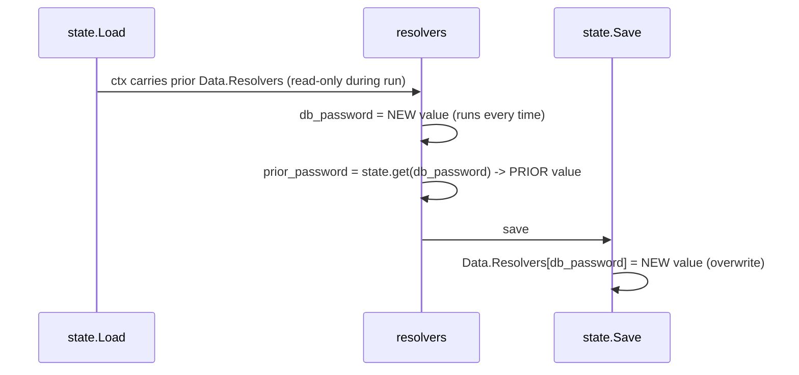

# Persisted Resolvers & State Provider

## Overview

scafctl's state file today persists three things: the merged parameter set (for
deterministic replay), immutable resolver values (locked and verified across
runs), and action fingerprints. It deliberately does **not** persist ordinary
resolver outputs, because scafctl relies on deterministic replay: given the same
parameters, every resolver recomputes the same value on every run.

This design adds two composable capabilities:

1. **Persisted resolvers** -- an opt-in `persist: true` flag on a resolver that
   records the resolver's output into the state file after each run, purely for
   later retrieval. Persistence does **not** change replay, does **not** cause
   the resolver to be skipped, and does **not** feed the value back into resolver
   inputs automatically.
2. **A `state` provider** -- a read-only provider (`CapabilityFrom`) that a
   resolver can use to read a previously persisted value out of the loaded state
   snapshot, i.e. the value from the **prior** run, before the current run
   overwrites it.

Together these reproduce a legacy capability from the predecessor tool
(`mycli`): one resolver can explicitly read another resolver's previously saved
value and do whatever it wants with it.

## Motivation

We are converting existing `mycli` solution files to scafctl. In `mycli`,
every resolver's value was saved into state, and any resolver could explicitly
read the saved value of another resolver from a prior run. scafctl's
deterministic-replay model does not save arbitrary resolver values, so this
legacy pattern currently has no equivalent.

This is a required migration feature. Rather than reintroduce `mycli`'s
save-everything model (which would erode scafctl's determinism guarantees), we
add a narrow, explicit, opt-in mechanism: authors mark exactly the resolvers
whose values need to survive, and read them back only through an explicit
provider call.

## Non-Goals & Invariants

These constraints define the scope. Any change that violates one of them is out
of scope for this design.

1. **Replay is unaffected.** Persisting a resolver value never changes how
   replay works. Persisted values are never automatically injected into resolver
   inputs. The parameter set remains the sole driver of deterministic replay.
2. **Every resolver still runs every time.** `persist: true` does not cause a
   resolver to be skipped or short-circuited. There is no "generate once, reuse"
   behavior at the persist layer.
3. **Existing immutable behavior does not change.** Immutable resolvers are still
   verified before actions execute, and an attempt to change an immutable value
   still fails as early as it is identified. Only the on-disk storage location of
   immutable entries moves; the semantics are identical.
4. **Reads see the prior run's snapshot.** The `state` provider reads the state
   as loaded at the start of the run, before the end-of-run overwrite. Within a
   single run, `state.get("A")` returns the value persisted by the previous run,
   while `_.A` returns the value produced by the current run.
5. **Breaking change is acceptable.** The CLI is in beta with no users. The state
   file schema changes without a migration path. Old state files are not
   supported.

## Design

### Resolver spec: the `persist` flag

A new optional boolean field is added to the resolver spec:

```yaml
resolvers:
  - name: cluster_id
    persist: true
    from:
      provider: exec
      inputs:
        command: "uuidgen"
```

Semantics:

- `persist: false` (default) -- current behavior; the value is not written to
  state.
- `persist: true` -- after a successful run, the resolver's output is written to
  the state file's unified resolver section (see below).
- `immutable: true` implies `persist: true`. Immutability is a stricter form of
  persistence: the value is not only recorded but also locked and verified.
  During solution load, `immutable: true` normalizes so that downstream code sees
  a persisted entry marked immutable.

### Unified state section

The state file's `immutables` map is replaced by a single `resolvers` map keyed
by resolver name. Each entry carries a discriminator identifying whether it is
immutable.

Current (`pkg/state/types.go`):

```go
Immutables map[string]*ImmutableEntry `json:"immutables"`
```

New:

```go
// Resolvers maps resolver names to their persisted outputs. Populated by
// resolvers marked persist: true or immutable: true. Immutable entries are
// verified on replay; persist-only entries are overwritten each run.
Resolvers map[string]*PersistedEntry `json:"resolvers"`
```

```go
type PersistedEntry struct {
    // Value is the resolver's persisted output.
    Value any `json:"value"`

    // Type is the resolver's declared type.
    Type string `json:"type"`

    // Immutable discriminates immutable entries (verify-or-lock) from
    // persist-only entries (overwrite each run).
    Immutable bool `json:"immutable"`

    // CreatedAt is when the entry was first written. For immutable entries this
    // is the lock time and never changes.
    CreatedAt time.Time `json:"createdAt"`

    // UpdatedAt is when the entry was last written. For immutable entries it
    // equals CreatedAt; for persist-only entries it advances each run.
    UpdatedAt time.Time `json:"updatedAt"`
}
```

The `Immutable` field is a typed discriminator, not a free-form tag, because it
gates two different lifecycle behaviors (see below).

Schema version bumps from `1` to `2`. Old state files are not migrated.

### Save-time behavior

At save time (post-resolver execution), a single pass over the resolvers
branches on the entry kind:

- **Immutable resolver** -- unchanged from today. If no prior entry exists, lock
  the value (`CreatedAt = UpdatedAt = now`, `Immutable = true`). If a prior entry
  exists and matches, do nothing. If it differs, this path is not reached at save
  time because the mismatch is already caught earlier (see verification below).
- **Persist-only resolver** -- overwrite the entry with the current value and set
  `UpdatedAt = now` (`CreatedAt` preserved if the entry already existed).

Both paths only act on resolvers that completed with status `Success`. Skipped
(`when: false`) or failed resolvers do not overwrite an existing entry, mirroring
the current `CheckImmutables` behavior. This ensures a transient failure never
clobbers a previously good persisted value.

### Immutable verification (unchanged)

`VerifyImmutables` continues to run after resolver execution but **before** any
action executes, so that an attempt to change an immutable value aborts the run
before side effects occur. Its only change is that it now iterates the unified
`Resolvers` map and filters on `Immutable == true` instead of reading a dedicated
`Immutables` map. Behavior is identical: same early-abort point, same error.

For `run resolver` invocations (no actions), the immutable violation surfaces at
save time as it does today. Because resolvers are pure, this is still before any
side effect.

### The `state` provider

A new builtin provider named `state` with `CapabilityFrom`, dispatched on an
`operation` input, usable inside a resolver's `from` clause.

```yaml
resolvers:
  # Recomputes fresh every run and records its value for next time.
  - name: db_password
    persist: true
    from:
      provider: exec
      inputs:
        command: "openssl rand -hex 16"

  # Explicitly reads the value db_password persisted on the PRIOR run.
  - name: prior_password
    from:
      provider: state
      operation: get
      key: db_password
      default: ""   # optional; returned when the key is absent (e.g. first run)
```

Behavior:

- `operation: get` reads `key` from the state loaded at the start of the run
  (via `state.FromContext(ctx)`), returning `PersistedEntry.Value`.
- The provider reads **only** the in-memory loaded snapshot. It never re-reads
  the backend from disk. This is what guarantees it returns the prior run's value
  and never observes the current run's not-yet-written overwrite.
- On a missing key: return `default` if provided, otherwise return null. First
  runs therefore bootstrap without error.
- When state is disabled for the solution, `state.get` returns `default`/null (a
  persisted value can never exist without state).
- Dry-run reads the loaded snapshot normally; it is read-only and has no side
  effect.

#### Map mode (`keys` / `all`)

Instead of a single `key`, an author may read many persisted values into one map.
Specify **exactly one** of `key`, `keys`, or `all`:

```yaml
resolvers:
  # Read an explicit set of persisted keys into a map.
  - name: prior_config
    from:
      provider: state
      operation: get
      keys: [region, tier, cluster_id]

  # Read the entire persisted snapshot into a map.
  - name: prior_state
    from:
      provider: state
      operation: get
      all: true
```

- The resolver value is the **bare map** (`_.prior_config.region`), keeping the
  same shape convention as single-key mode returning a bare scalar.
- Absent keys are **omitted** from the map rather than defaulted, so
  `has(_.prior_config.tier)` and `_.prior_config.?tier.orValue(d)` stay faithful.
  This restores the key-absence fidelity that a hand-assembled `cel` map loses.
- The present-key list (and, in `keys` mode, the requested-but-absent `missing`
  list) is reported in provider **metadata** (visible via `run provider`), not in
  the resolver value. Reconstruct the missing set in CEL with
  `myKeys.filter(k, !has(_.prior_config[k]))`.
- `default` is only valid with a single `key`; combining it with `keys`/`all` is
  an error (in map mode absence is expressed by omission).
- Like `key`, `keys`/`all` create no dependency edges in the resolver graph.

### Ordering guarantee

The correctness of the feature rests on the run lifecycle: state is loaded into
the context before resolvers execute, and the loaded `Data` is mutated only at
save time.



On the next run, `prior_password` reads what was written as NEW here. This is the
`mycli` read-back semantic.

### DAG independence

`state.get("A")`'s `key` must be treated as an opaque string by dependency
extraction and graph building. It must **not** create a `dependsOn` edge to
resolver `A`. Otherwise a resolver that reads its own prior persisted value
(resolver `A` calling `state.get("A")`) would form a self-cycle and fail graph
construction. The ordering safety of `state.get` comes entirely from the
load-before-run lifecycle, not from the dependency graph.

## Edge Cases

| Case | Behavior |
|------|----------|
| First run, key absent | `state.get` returns `default` if set, else null. |
| Resolver reads its own prior value | Allowed; `key` is opaque to the DAG, so no self-cycle. |
| `state.get` within a run vs `_.A` | `state.get("A")` = prior run's value; `_.A` = current run's value. Documented and intentional. |
| Persist resolver skipped (`when: false`) | Prior entry retained, not wiped. |
| Persist resolver fails | Prior entry retained; no overwrite. |
| `persist: true` + `immutable: true` | Normalizes to immutable (which implies persist). Optional lint info. |
| State disabled + `state.get` | Returns `default`/null; a persisted value cannot exist. |
| Orphaned entry (resolver removed/renamed) | Retained until explicit `state delete`. No auto-prune, matching current immutable policy. |
| Large persisted value | Subject to existing `WarnValueSize` / `MaxValueSize` limits. |
| Sensitive persisted value | Written to the state file as-is. The file backend is plaintext JSON; a redaction flag is a future enhancement (see below). |

## Security Considerations

Persisting a resolver value writes it to the state file. For the builtin file
backend this is plaintext JSON. Marking a resolver `persist: true` when its
output is sensitive (e.g. a generated password) widens the secret-exposure
surface compared to today, and such values will also appear in `state list` and
snapshots.

This design does not add redaction. A `sensitive: true` marker on
`PersistedEntry` that drives redaction in `state list` and snapshots, and/or a
requirement that sensitive persistence use a secure backend, is deferred to a
future enhancement. Authors should not mark resolvers `persist: true` for secret
values until redaction lands, unless the state backend is itself secured.

## Affected Code

- `pkg/spec` -- add the `persist` field to the resolver spec; normalize
  `immutable: true` to imply persist.
- `pkg/state/types.go` -- replace `Immutables`/`ImmutableEntry` with
  `Resolvers`/`PersistedEntry`; bump `SchemaVersionCurrent` to `2`.
- `pkg/state/immutable.go` -- update `CheckImmutables` / `VerifyImmutables` to
  read the unified section filtered by `Immutable == true`; add the persist-only
  overwrite pass.
- `pkg/provider/builtin/fileprovider/file_state.go` -- update the load-time
  nil-init block for the new section.
- `pkg/cmd/scafctl/state/{set,get,list,delete}.go` -- update to the unified
  section; `set` supports `--persist` and `--immutable`.
- New builtin `state` provider (`CapabilityFrom`, `operation: get`) reading the
  context snapshot.
- Dependency extraction / graph building -- ensure the `state` provider's `key`
  input is not treated as a resolver reference.
- Docs, examples, and MCP tool metadata updated for the new provider and flag.

## Implementation Increments

1. **Storage & spec (PR 1)** -- unified `Resolvers` section, `persist` flag,
   save-time persist pass, immutable verification retargeted to the new section,
   CLI `state` subcommands updated. The state file changes are self-contained and
   reviewable without the provider.
2. **State provider (PR 2)** -- the `state` provider (`operation: get`, opaque
   `key`, reads context snapshot), DAG independence, docs/examples/MCP metadata.
   The provider is inert without PR 1.

## Open Questions

1. Should `state.get` support reading multiple keys or the whole persisted map in
   one call, or is single-`key` sufficient for the migration corpus?
2. Should the CLI allow operators to hand-seed persisted values via
   `state set --persist` (noting they are overwritten on the next run)?
3. When should a `sensitive` redaction flag and/or secure-backend requirement for
   persisted secrets be prioritized?

## Future Enhancements

- `sensitive: true` on persisted entries with redaction in `state list` and
  snapshots.
- Additional `state` provider operations (e.g. `list`, multi-key `get`).
- Lint rule cross-checking `state.get` keys against resolvers marked
  persist/immutable to catch typos at author time.
