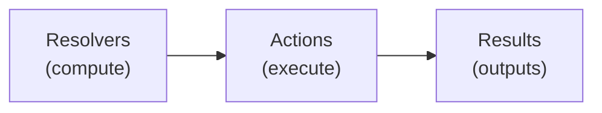

# Actions Tutorial

This tutorial introduces the Actions feature in scafctl, which enables executing side-effect operations as a declarative action graph.

## Overview

Actions are the execution phase of a scafctl solution. While **resolvers** compute and gather data, **actions** perform work based on that data.



**Key Principles:**
- Resolvers compute data, actions perform work
- All resolvers evaluate before any action executes
- Actions can depend on other actions
- Actions can access results from completed actions

## Quick Start

### 1. Hello World

The simplest action workflow. Create a file called `hello-actions.yaml`:

```yaml
apiVersion: scafctl.io/v1
kind: Solution
metadata:
  name: hello-actions
  version: 1.0.0
  description: My first action workflow

spec:
  # Resolvers provide data for actions
  resolvers:
    greeting:
      type: string
      resolve:
        with:
          - provider: static
            inputs:
              value: "Hello, World!"

  # Workflow defines action execution
  workflow:
    actions:
      greet:
        provider: exec
        inputs:
          command:
            expr: "'echo ' + _.greeting"
```

Run it:

{}
```bash
scafctl run solution -f hello-actions.yaml
```
{}
{}
```powershell
scafctl run solution -f hello-actions.yaml
```
{}


Output:

```
Hello, World!
```

### 2. Dependencies

Actions can depend on other actions. Create a file called `build-pipeline.yaml`:

```yaml
apiVersion: scafctl.io/v1
kind: Solution
metadata:
  name: build-pipeline
  version: 1.0.0

spec:
  resolvers: {}
  workflow:
    actions:
      build:
        provider: exec
        inputs:
          command: "echo Building..."
      
      test:
        provider: exec
        dependsOn: [build]  # test runs AFTER build
        inputs:
          command: "echo Testing..."
      
      deploy:
        provider: exec
        dependsOn: [test]   # deploy runs AFTER test
        inputs:
          command: "echo Deploying..."
```

This creates a linear chain: `build → test → deploy`

Run it:


{}
```bash
scafctl run solution -f build-pipeline.yaml
```
{}
{}
```powershell
scafctl run solution -f build-pipeline.yaml
```
{}


Output:

```
Building...
Testing...
Deploying...
```

### 3. Parallel Execution

Actions without dependencies (or with the same dependencies) run in parallel. Create a file called `parallel.yaml`:

```yaml
apiVersion: scafctl.io/v1
kind: Solution
metadata:
  name: parallel-example
  version: 1.0.0

spec:
  resolvers: {}
  workflow:
    actions:
      init:
        provider: exec
        inputs:
          command: "echo Initializing..."
      
      build:
        provider: exec
        dependsOn: [init]
        inputs:
          command: "echo Building..."
      
      test:
        provider: exec
        dependsOn: [init]    # Same dependency as build
        inputs:
          command: "echo Testing..."  # Runs in PARALLEL with build
      
      deploy:
        provider: exec
        dependsOn: [build, test]  # Waits for BOTH
        inputs:
          command: "echo Deploying..."
```

This creates a diamond pattern:
```
    init
    /  \
 build  test  ← run in parallel
    \  /
   deploy
```

Run it:


{}
```bash
scafctl run solution -f parallel.yaml
```
{}
{}
```powershell
scafctl run solution -f parallel.yaml
```
{}


Output (build and test may appear in either order since they run in parallel):

```
Initializing...
Building...
Testing...
Deploying...
```

## Conditions (`when`)

Actions can be conditional — they only execute when a CEL expression evaluates to `true`. If the condition is `false`, the action is skipped.

Create a file called `conditional-demo.yaml`:

```yaml
apiVersion: scafctl.io/v1
kind: Solution
metadata:
  name: conditional-demo
  version: 1.0.0

spec:
  resolvers:
    environment:
      type: string
      resolve:
        with:
          - provider: parameter
            onError: continue
            inputs:
              key: environment
          - provider: static
            inputs:
              value: staging

  workflow:
    actions:
      setup:
        provider: exec
        inputs:
          command:
            expr: "'echo Setting up for ' + _.environment"

      staging-deploy:
        provider: exec
        dependsOn: [setup]
        when:
          expr: "_.environment == 'staging'"
        inputs:
          command: "echo Deploying to staging..."

      prod-deploy:
        provider: exec
        dependsOn: [setup]
        when:
          expr: "_.environment == 'prod'"
        inputs:
          command: "echo Deploying to production..."

      notify:
        provider: exec
        dependsOn: [staging-deploy, prod-deploy]
        inputs:
          command:
            expr: "'echo Deployment to ' + _.environment + ' complete'"
```

### Run with Default (staging)


{}
```bash
scafctl run solution -f conditional-demo.yaml
```
{}
{}
```powershell
scafctl run solution -f conditional-demo.yaml
```
{}


Output:

```
Setting up for staging
Deploying to staging...
Deployment to staging complete
```

The `prod-deploy` action is skipped because the condition `_.environment == 'prod'` is `false`.

### Run with Production


{}
```bash
scafctl run solution -f conditional-demo.yaml -r environment=prod
```
{}
{}
```powershell
scafctl run solution -f conditional-demo.yaml -r environment=prod
```
{}


Output:

```
Setting up for prod
Deploying to production...
Deployment to prod complete
```

Now `staging-deploy` is skipped and `prod-deploy` runs instead.

---

## ForEach

ForEach expands a single action into multiple iterations — one for each item in an array. Each iteration can access the current element via `__item` and its index via `__index`.

Create a file called `foreach-demo.yaml`:

```yaml
apiVersion: scafctl.io/v1
kind: Solution
metadata:
  name: foreach-demo
  version: 1.0.0

spec:
  resolvers:
    targets:
      type: array
      items:
        type: string
      resolve:
        with:
          - provider: static
            inputs:
              value:
                - server1.example.com
                - server2.example.com
                - server3.example.com
    version:
      type: string
      resolve:
        with:
          - provider: static
            inputs:
              value: v1.2.3

  workflow:
    actions:
      build:
        provider: exec
        inputs:
          command:
            expr: "'echo Building version ' + _.version + '...'"

      deploy:
        provider: exec
        dependsOn: [build]
        forEach:
          in:
            expr: "_.targets"
          concurrency: 2
          onError: continue
        inputs:
          command:
            expr: "'echo Deploying ' + _.version + ' to ' + __item"

      verify:
        provider: exec
        dependsOn: [deploy]
        inputs:
          command:
            expr: "'echo Verifying ' + string(size(_.targets)) + ' deployments...'"
```


{}
```bash
scafctl run solution -f foreach-demo.yaml
```
{}
{}
```powershell
scafctl run solution -f foreach-demo.yaml
```
{}


Output:

```
Building version v1.2.3...
Deploying v1.2.3 to server1.example.com
Deploying v1.2.3 to server2.example.com
Deploying v1.2.3 to server3.example.com
Verifying 3 deployments...
```

The `deploy` action expands into three iterations -- one per target. With `concurrency: 2`, at most two deploy iterations run in parallel. The `verify` action waits for all iterations to complete. Note that servers may appear in a different order due to parallel execution.

### ForEach Options

| Option | Description |
|--------|-------------|
| `in` | CEL expression returning an array to iterate over |
| `item` | Alias for `__item` (e.g., `item: server` lets you use `server` instead) |
| `index` | Alias for `__index` |
| `concurrency` | Max parallel iterations (default: unlimited) |
| `onError` | `fail` (default) or `continue` — controls behavior when an iteration fails |

---

## Error Handling

By default, if an action fails the entire workflow stops. Use `onError: continue` to allow the workflow to proceed past failures.

Create a file called `error-handling-demo.yaml`:

```yaml
apiVersion: scafctl.io/v1
kind: Solution
metadata:
  name: error-handling-demo
  version: 1.0.0

spec:
  resolvers: {}

  workflow:
    actions:
      optional-cleanup:
        description: Optional cleanup that might fail
        provider: exec
        onError: continue
        inputs:
          command: "echo 'Attempting optional cleanup...' && exit 1"

      required-setup:
        provider: exec
        inputs:
          command: "echo 'Running required setup...'"

      main-work:
        provider: exec
        dependsOn: [optional-cleanup, required-setup]
        inputs:
          command: "echo 'Doing main work...'"
```


{}
```bash
scafctl run solution -f error-handling-demo.yaml
```
{}
{}
```powershell
scafctl run solution -f error-handling-demo.yaml
```
{}


Output:

```
Attempting optional cleanup...
Running required setup...
Doing main work...
```

The `optional-cleanup` action fails (`exit 1`), but because `onError: continue` is set, the workflow continues. The `main-work` action still runs.

Without `onError: continue`, the workflow would stop at `optional-cleanup` and `main-work` would be skipped.

---

## Action Results

Actions can access results from previously completed actions using `__actions`. This enables data flow between actions.

Create a file called `results-demo.yaml`:

```yaml
apiVersion: scafctl.io/v1
kind: Solution
metadata:
  name: results-demo
  version: 1.0.0

spec:
  resolvers:
    user_id:
      type: int
      resolve:
        with:
          - provider: static
            inputs:
              value: 42

  workflow:
    actions:
      fetch-user:
        provider: cel
        inputs:
          expression: |
            {"id": 42, "name": "John Doe", "email": "john@example.com"}

      greet:
        provider: exec
        dependsOn: [fetch-user]
        inputs:
          command:
            expr: "'echo Hello, ' + __actions['fetch-user'].results.name + '!'"
```


{}
```bash
scafctl run solution -f results-demo.yaml
```
{}
{}
```powershell
scafctl run solution -f results-demo.yaml
```
{}


Output:

```
Hello, John Doe!
```

The `fetch-user` action uses the `cel` provider to return structured data. The `greet` action accesses that data via `__actions['fetch-user'].results.name`.

### Available Fields in `__actions.<name>`

| Field | Description |
|-------|-------------|
| `results` | The action's output data |
| `status` | Execution status (`succeeded`, `failed`, `skipped`) |
| `inputs` | Resolved input values |
| `error` | Error message (if failed) |

### Action Aliases

Referencing actions via `__actions['my-long-action-name'].results.field` can be verbose. You can declare an `alias` on an action to create a shorter top-level variable in CEL expressions.

```yaml
apiVersion: scafctl.io/v1
kind: Solution
metadata:
  name: alias-demo
  version: 1.0.0

spec:
  resolvers: {}
  workflow:
    actions:
      fetch-configuration:
        alias: config
        provider: cel
        inputs:
          expression: |
            {"region": "us-east-1", "env": "production"}

      deploy:
        provider: exec
        dependsOn: [fetch-configuration]
        inputs:
          command:
            expr: "'echo Deploying to ' + config.results.region"
```

With the alias `config`, you can write `config.results.region` instead of `__actions['fetch-configuration'].results.region`. The `__actions` form still works alongside aliases.

**Alias Rules:**
- Must match `^[a-zA-Z_][a-zA-Z0-9_-]*$`
- Cannot start with `__` (reserved prefix)
- Cannot conflict with action names or reserved names (`true`, `false`, `null`, etc.)
- Must be unique across all actions in the workflow

---

## Resolver Execution Metadata (`__execution`)

After resolvers run and before any action executes, the full resolver execution metadata is available in every action's CEL context as `__execution`. This lets actions gate on resolver outcomes, surface timing data, or adapt behavior based on how the resolver phase completed.

### Shape of `__execution`

`__execution` mirrors the `--show-execution` output structure:

| Field | Description |
|---|---|
| `__execution["resolvers"]["name"].status` | Resolver outcome: `"success"`, `"failed"`, or `"skipped"` |
| `__execution["resolvers"]["name"].phase` | Execution phase number (int) |
| `__execution["resolvers"]["name"].duration` | Duration string, e.g. `"3ms"` |
| `__execution["resolvers"]["name"].dependencyCount` | Number of dependencies |
| `__execution["summary"].phaseCount` | Total number of resolver phases |
| `__execution["summary"].resolverCount` | Number of resolvers that executed |
| `__execution["summary"].totalDuration` | Total resolver execution duration |

### Gate an Action on Resolver Success

~~~yaml
apiVersion: scafctl.io/v1
kind: Solution
metadata:
  name: execution-aware-demo
  version: 1.0.0
spec:
  resolvers:
    environment:
      type: string
      resolve:
        with:
          - provider: static
            inputs:
              value: staging

    deploy_target:
      type: string
      resolve:
        with:
          - provider: cel
            inputs:
              expression: "_.environment + '-cluster'"

  workflow:
    actions:
      print-summary:
        provider: message
        inputs:
          message:
            expr: >
              'Deploying to ' + _.environment +
              ' -- resolver phases: ' + string(__execution['summary']['phaseCount'])
          type: info

      non-prod-deploy:
        provider: message
        dependsOn: [print-summary]
        when:
          expr: "_.environment != 'production'"
        inputs:
          message:
            expr: >
              'Deploying to ' + _.deploy_target +
              ' (phase 1 resolver: environment, phase 2: deploy_target)'
          type: success
~~~

Run it:


{}
```bash
scafctl run solution -f execution-aware-demo.yaml
```
{}
{}
```powershell
scafctl run solution -f execution-aware-demo.yaml
```
{}


Output (staging environment, non-production path):

```
💡 Deploying to staging -- resolver phases: 2
✅ Deploying to staging-cluster (phase 1 resolver: environment, phase 2: deploy_target)
```

The emoji prefixes come from the `message` provider's `type` field (`info` and `success`).

### `__execution` vs `__actions`

| Variable | Available | Contents |
|---|---|---|
| `__execution` | All actions (always) | Resolver execution metadata |
| `__actions["name"]` | Downstream actions only | Results from previously completed actions |

> [!NOTE]
> See `examples/solutions/execution-aware-actions/solution.yaml` for a complete working example.

---

## Retry

Actions can automatically retry on failure with configurable backoff strategies.

Create a file called `retry-demo.yaml`:

```yaml
apiVersion: scafctl.io/v1
kind: Solution
metadata:
  name: retry-demo
  version: 1.0.0

spec:
  resolvers: {}

  workflow:
    actions:
      fixed-retry:
        description: Fixed delay between retries (always 2s)
        provider: exec
        retry:
          maxAttempts: 3
          backoff: fixed
          initialDelay: 2s
        inputs:
          command: "echo 'Fixed retry attempt succeeded'"

      linear-retry:
        description: Linearly increasing delay (1s, 2s, 3s, ...)
        provider: exec
        dependsOn: [fixed-retry]
        retry:
          maxAttempts: 4
          backoff: linear
          initialDelay: 1s
          maxDelay: 10s
        inputs:
          command: "echo 'Linear retry attempt succeeded'"

      exponential-retry:
        description: Exponentially increasing delay (500ms, 1s, 2s, 4s, ...)
        provider: exec
        dependsOn: [linear-retry]
        retry:
          maxAttempts: 5
          backoff: exponential
          initialDelay: 500ms
          maxDelay: 30s
        inputs:
          command: "echo 'Exponential retry attempt succeeded'"

      retry-with-timeout:
        description: Retry combined with a per-action timeout
        provider: exec
        dependsOn: [exponential-retry]
        timeout: 30s
        retry:
          maxAttempts: 3
          backoff: exponential
          initialDelay: 1s
          maxDelay: 5s
        inputs:
          command: "echo 'Retry + timeout succeeded'"
```


{}
```bash
scafctl run solution -f retry-demo.yaml
```
{}
{}
```powershell
scafctl run solution -f retry-demo.yaml
```
{}


Output:

```
Fixed retry attempt succeeded
Linear retry attempt succeeded
Exponential retry attempt succeeded
Retry + timeout succeeded
```

Since all commands succeed on the first try, no retries occur. Retries only trigger on failures.

### Backoff Strategies

| Strategy | Delay pattern | Best for |
|----------|--------------|----------|
| `fixed` | Constant (e.g., always 2s) | Known recovery time |
| `linear` | Increases linearly (1s, 2s, 3s, ...) | Gradually increasing wait |
| `exponential` | Doubles each time (1s, 2s, 4s, 8s, ...) | External API calls, rate limits |

### Conditional Retry (retryIf)

Use a CEL expression to retry only on specific error types:

```yaml
retry:
  maxAttempts: 5
  backoff: exponential
  initialDelay: 1s
  retryIf: "__error.statusCode == 429 || __error.statusCode >= 500"
```

The `__error` variable provides context about the failure:

| Field | Type | Description |
|-------|------|-------------|
| `__error.message` | string | The error message |
| `__error.type` | string | Error category: `http`, `exec`, `timeout`, `validation`, `unknown` |
| `__error.statusCode` | int | HTTP status code (0 for non-HTTP errors) |
| `__error.exitCode` | int | Process exit code (0 for non-exec errors) |
| `__error.attempt` | int | Current attempt number (1-based) |
| `__error.maxAttempts` | int | Maximum retry attempts configured |

Common patterns:

```yaml
# Only retry on timeouts
retryIf: "__error.type == 'timeout'"

# Retry on rate limits or server errors
retryIf: "__error.statusCode == 429 || __error.statusCode >= 500"

# Limit effective retries regardless of maxAttempts
retryIf: "__error.attempt < 3"

# Disable retry entirely (even with retry config present)
retryIf: "false"
```

---

## Timeout

Limit how long an action can run before being terminated:

```yaml
actions:
  quick-check:
    provider: exec
    timeout: 30s
    inputs:
      command: "echo 'Must finish in 30 seconds'"
```

If the action exceeds its timeout, it fails with a timeout error. You can combine `timeout` with `retry` to automatically retry timed-out operations.

---

## Exclusive Actions

When two actions share a resource (a database, a file, an external API), they cannot safely run at the same time — even if the DAG would otherwise schedule them concurrently. Use `exclusive` to declare mutual exclusion without forcing a specific order.

### Basic Example

Create `exclusive-demo.yaml`:

```yaml
apiVersion: scafctl.io/v1
kind: Solution
metadata:
  name: exclusive-demo
  version: 1.0.0

spec:
  workflow:
    actions:
      updateDatabase:
        provider: exec
        exclusive:
          - migrateDatabase   # Cannot run at the same time as migrateDatabase
        inputs:
          command: "echo 'Updating users table...'"

      migrateDatabase:
        provider: exec
        inputs:
          command: "echo 'Running migrations...'"

      sendNotification:
        provider: exec
        dependsOn:
          - updateDatabase
          - migrateDatabase
        inputs:
          command: "echo 'Done — notifying team'"
```

Both database actions are eligible to run at the same time (neither depends on the other), but `exclusive: [migrateDatabase]` on `updateDatabase` forces the executor to run one and then the other.

Run it:


{}
```bash
scafctl run solution -f exclusive-demo.yaml
```
{}
{}
```powershell
scafctl run solution -f exclusive-demo.yaml
```
{}


### Key Rules

| Rule | Detail |
|------|--------|
| **One-way** | Only the declaring action needs `exclusive`. The listed action does not need a reciprocal declaration. |
| **No ordering** | `exclusive` does not imply `dependsOn`. The actions may execute in any order, just not simultaneously. |
| **ForEach expansion** | If `deploy` declares `exclusive: [migrate]`, all expanded instances (`deploy[0]`, `deploy[1]`, …) individually exclude `migrate`. |
| **Same section only** | Referenced actions must be in the same section (`workflow.actions`). Cross-section exclusion (e.g., `workflow.finally`) is not supported. |
| **No self-reference** | Listing an action's own name is a validation error. |

### When to Use `exclusive`

- **Database access**: Two actions that write to the same table or run migrations
- **Rate-limited APIs**: Prevent overwhelming an external service with concurrent requests
- **File operations**: Two actions that read/write the same file or directory

> [!NOTE]
> **Tip:** Prefer `dependsOn` when there is a true data dependency (one action needs the output of another). Use `exclusive` when the dependency is only about shared resource access and the execution order does not matter.

---

## Finally Section

Finally actions **always run**, even if main actions fail. This is essential for cleanup operations like removing temporary resources.

Create a file called `finally-demo.yaml`:

```yaml
apiVersion: scafctl.io/v1
kind: Solution
metadata:
  name: finally-demo
  version: 1.0.0

spec:
  resolvers:
    test_db:
      type: string
      resolve:
        with:
          - provider: static
            inputs:
              value: test_db_12345

  workflow:
    actions:
      create-test-db:
        provider: exec
        inputs:
          command:
            expr: "'echo Creating test database: ' + _.test_db"

      run-tests:
        provider: exec
        dependsOn: [create-test-db]
        inputs:
          command: "echo Running tests against test database..."

      generate-reports:
        provider: exec
        dependsOn: [run-tests]
        inputs:
          command: "echo Generating test reports..."

    finally:
      cleanup-db:
        provider: exec
        inputs:
          command:
            expr: "'echo Dropping test database: ' + _.test_db"

      notify:
        provider: exec
        dependsOn: [cleanup-db]
        inputs:
          command: "echo Workflow complete, cleanup finished"
```


{}
```bash
scafctl run solution -f finally-demo.yaml
```
{}
{}
```powershell
scafctl run solution -f finally-demo.yaml
```
{}


Output:

```
Creating test database: test_db_12345
Running tests against test database...
Generating test reports...
Dropping test database: test_db_12345
Workflow complete, cleanup finished
```

The finally actions run after all main actions complete. If `run-tests` failed, the cleanup would still execute.

### Finally Rules

- Finally actions run **after all main actions** (whether they succeeded or failed)
- Finally actions can only use `dependsOn` to reference **other finally actions** — not main actions. Using `dependsOn: [main-action]` inside `finally` is a validation error.
- To **read results from a main action** inside a finally action, use `__actions.<name>` in `inputs` or `when`. The scheduler does not need a dependency entry because structural ordering already guarantees all main actions finish first. The reference appears in `crossSectionRefs` on the rendered graph for traceability.
- ForEach is **not allowed** in the finally section

```yaml
# ✅ Valid: read a main action result from finally via __actions
finally:
  upload-logs:
    provider: exec
    inputs:
      command:
        expr: "'echo upload: test outcome=' + string(__actions.run-tests.status)"

# ✅ Valid: order two finally actions with dependsOn
  notify:
    provider: exec
    dependsOn: [upload-logs]
    inputs:
      command: "echo done"

# ❌ Invalid: dependsOn cannot cross sections
  bad-action:
    provider: exec
    dependsOn: [run-tests]   # validation error: run-tests is in workflow.actions
```

---

## Inputs Reference

Inputs are passed to the provider and support several value types:

**Literal values:**
```yaml
inputs:
  command: "echo hello"
  count: 42
  enabled: true
```

**Resolver references:**
```yaml
inputs:
  environment:
    rslvr: environment
```

**CEL expressions:**
```yaml
inputs:
  url:
    expr: "'https://api.example.com/' + _.endpoint"
```

**Go templates:**
```yaml
inputs:
  message:
    tmpl: "Deploying {{ .project }} to {{ .environment }}"
```

---

## Providers Reference

Actions use providers to execute operations. Providers must have the `action` capability.

Built-in providers with action capability:

| Provider | Description |
|----------|-------------|
| `exec` | Execute shell commands |
| `cel` | Evaluate CEL expressions and return structured data |
| `http` | Make HTTP requests |
| `file` | File operations |
| `git` | Git operations |
| `sleep` | Delay execution |

See [Provider Reference](provider-reference.md) for complete provider documentation.

---

## Running Solutions

### Execute Mode

Run a solution (resolvers + actions):


{}
```bash
# Basic execution
scafctl run solution -f hello-world.yaml

# Run with progress output
scafctl run solution -f hello-world.yaml --progress

# JSON output (for scripts/pipelines)
scafctl run solution -f hello-world.yaml -o json

# Override resolver values
scafctl run solution -f conditional-demo.yaml -r environment=prod

# Limit parallel actions
scafctl run solution -f foreach-demo.yaml --max-action-concurrency=2

# Dry-run (show plan without executing)
scafctl run solution -f hello-world.yaml --dry-run

# Run resolvers only (skip actions, for debugging)
scafctl run resolver -f conditional-demo.yaml -r environment=staging

# Run specific resolvers for inspection
scafctl run resolver config -f conditional-demo.yaml -r environment=staging
```
{}
{}
```powershell
# Basic execution
scafctl run solution -f hello-world.yaml

# Run with progress output
scafctl run solution -f hello-world.yaml --progress

# JSON output (for scripts/pipelines)
scafctl run solution -f hello-world.yaml -o json

# Override resolver values
scafctl run solution -f conditional-demo.yaml -r environment=prod

# Limit parallel actions
scafctl run solution -f foreach-demo.yaml --max-action-concurrency=2

# Dry-run (show plan without executing)
scafctl run solution -f hello-world.yaml --dry-run

# Run resolvers only (skip actions, for debugging)
scafctl run resolver -f conditional-demo.yaml -r environment=staging

# Run specific resolvers for inspection
scafctl run resolver config -f conditional-demo.yaml -r environment=staging
```
{}


### Render Mode

Generate an executor-ready artifact:


{}
```bash
# Render to JSON (default)
scafctl render solution -f hello-world.yaml

# Render to YAML
scafctl render solution -f hello-world.yaml -o yaml

# Write to file
scafctl render solution -f hello-world.yaml -o json > graph.json
```
{}
{}
```powershell
# Render to JSON (default)
scafctl render solution -f hello-world.yaml

# Render to YAML
scafctl render solution -f hello-world.yaml -o yaml

# Write to file
scafctl render solution -f hello-world.yaml -o json > graph.json
```
{}


### Working Directory Override

Use `--cwd` (`-C`) to run solutions from a different directory. All file paths in actions (reads, writes, exec commands) resolve against the specified directory:


{}
```bash
# Run a solution in a different project directory
scafctl --cwd /path/to/project run solution -f solution.yaml

# Combine with --output-dir: resolvers read from --cwd, actions write to --output-dir
scafctl -C /path/to/project run solution -f solution.yaml --output-dir /tmp/output
```
{}
{}
```powershell
# Run a solution in a different project directory
scafctl --cwd /path/to/project run solution -f solution.yaml

# Combine with --output-dir: resolvers read from --cwd, actions write to --output-dir
scafctl -C /path/to/project run solution -f solution.yaml --output-dir /tmp/output
```
{}


The rendered output includes:
- Expanded actions (ForEach iterations)
- Materialized inputs
- Execution phases
- Dependency graph

## Best Practices

### 1. Keep Actions Focused

Each action should do one thing well:

```yaml
# Good: separate concerns
actions:
  build:
    provider: exec
    inputs:
      command: "go build"
  
  test:
    provider: exec
    inputs:
      command: "go test"

# Avoid: combining unrelated operations
actions:
  build-and-test:
    provider: exec
    inputs:
      command: "go build && go test && other-stuff"
```

### 2. Use Meaningful Names

```yaml
# Good
actions:
  deploy-to-staging:
    ...
  run-integration-tests:
    ...

# Avoid
actions:
  step1:
    ...
  step2:
    ...
```

### 3. Set Appropriate Timeouts

```yaml
actions:
  quick-check:
    timeout: 30s
  
  build:
    timeout: 15m
  
  e2e-tests:
    timeout: 1h
```

### 4. Use OnError Wisely

```yaml
actions:
  # Critical operations should fail fast
  database-migration:
    onError: fail
  
  # Optional operations can continue
  send-notification:
    onError: continue
```

### 5. Leverage ForEach for Parallelism

```yaml
actions:
  deploy:
    forEach:
      in:
        expr: "_.targets"
      concurrency: 3  # Deploy to 3 targets at once
```

### 6. Use Finally for Cleanup

```yaml
workflow:
  actions:
    create-test-env:
      ...
  
  finally:
    destroy-test-env:
      ...  # Always clean up
```

## Examples

See the [examples/actions/](../examples/actions/) directory for complete working examples:

- `hello-world.yaml` - Simplest action workflow
- `sequential-chain.yaml` - Linear dependencies
- `parallel-with-deps.yaml` - Diamond pattern
- `foreach-deploy.yaml` - Multi-target deployment
- `error-handling.yaml` - OnError continue
- `retry-backoff.yaml` - Retry strategies
- `conditional-retry.yaml` - Conditional retry with retryIf
- `conditional-execution.yaml` - When conditions
- `finally-cleanup.yaml` - Cleanup actions
- `action-alias.yaml` - Action aliases for shorter expression references
- `complex-workflow.yaml` - Full CI/CD example

## Troubleshooting

### Action Skipped

Check:
1. `when` condition evaluated to false
2. A dependency failed (see `SkipReasonDependencyFailed`)

### Timeout Exceeded

The action took longer than its timeout. Consider:
1. Increasing the timeout
2. Breaking into smaller actions
3. Checking for hanging processes

### Retry Exhausted

All retry attempts failed. Check:
1. The underlying service availability
2. Network connectivity
3. Consider increasing `maxAttempts`

### Cycle Detected

Actions have circular dependencies. Check `dependsOn` references:
```yaml
# Invalid: circular dependency
actions:
  a:
    dependsOn: [b]
  b:
    dependsOn: [a]  # Cycle!
```

## Next Steps

- [Authentication Tutorial](auth-tutorial.md) — Set up authentication for your workflows
- [CEL Expressions Tutorial](cel-tutorial.md) — Master CEL expressions and extension functions
- [Resolver Tutorial](resolver-tutorial.md) — Deep dive into resolvers
- [Provider Reference](provider-reference.md) — Complete provider documentation
