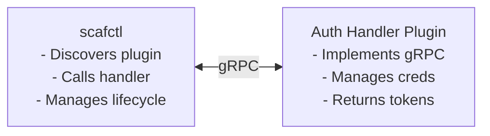

# Auth Handler Development Guide

This guide explains how to create custom auth handlers for scafctl. Auth handlers manage identity verification, credential storage, and token acquisition for identity providers (e.g., Entra ID, GitHub, GCP, Okta, AWS SSO).

Auth handlers can be delivered in two ways:

| | **Builtin** | **Plugin** |
|---|---|---|
| **Where it lives** | Compiled into the scafctl binary | Separate executable (any language with gRPC) |
| **Registration** | `authRegistry.Register(...)` in `root.go` | Discovered at runtime from plugin cache or catalog |
| **Credential storage** | Uses `pkg/secrets` (OS keychain) | Plugin manages its own credential storage |
| **Crash isolation** | Shares process with scafctl | Isolated process — plugin crash doesn't take down CLI |
| **Distribution** | Ships with scafctl releases | OCI catalog artifact (`kind: auth-handler`) or standalone binary |
| **Interface** | `auth.Handler` (8 methods) | `plugin.AuthHandlerPlugin` (9 methods) |

> [!WARNING]
> **Prerequisite**: Read the [Extension Concepts](extension-concepts.md) page for terminology (provider vs auth handler vs plugin).

## Auth Handler Architecture

Auth handlers implement the `auth.Handler` interface:

```go
type Handler interface {
    // Name returns the unique identifier for this auth handler.
    Name() string

    // DisplayName returns a human-readable name for display purposes.
    DisplayName() string

    // Login initiates the authentication flow.
    // For interactive flows (device code), blocks until completion or timeout.
    Login(ctx context.Context, opts LoginOptions) (*Result, error)

    // Logout clears stored credentials for this handler.
    Logout(ctx context.Context) error

    // Status returns the current authentication status.
    Status(ctx context.Context) (*Status, error)

    // GetToken returns a valid access token.
    // Uses cached tokens when available, otherwise refreshes from IDP.
    GetToken(ctx context.Context, opts TokenOptions) (*Token, error)

    // InjectAuth adds authentication to an HTTP request.
    // Primary entry point for providers (e.g., HTTP provider).
    InjectAuth(ctx context.Context, req *http.Request, opts TokenOptions) error

    // SupportedFlows returns the authentication flows this handler supports.
    SupportedFlows() []Flow

    // Capabilities returns feature flags (e.g., scopes, tenant ID).
    Capabilities() []Capability
}
```

### Optional Interfaces

Auth handlers can optionally implement these interfaces for token management:

```go
// TokenLister enumerates all cached tokens (refresh + access).
type TokenLister interface {
    ListCachedTokens(ctx context.Context) ([]*CachedTokenInfo, error)
}

// TokenPurger removes expired access tokens from the cache.
type TokenPurger interface {
    PurgeExpiredTokens(ctx context.Context) (int, error)
}
```

### Key Differences from Providers

| Aspect | Provider | Auth Handler |
|--------|----------|-------------|
| **State** | Stateless | Stateful (cached tokens, refresh tokens) |
| **Interface size** | 2 methods | 8+ methods |
| **Registry** | Versioned (name + version) | Simple map (name only) |
| **Lifecycle** | Called per-resolver/action | Persists across commands |
| **Credentials** | None | Manages secrets, tokens, sessions |

## Types Reference

### Flows

| Flow | Constant | Description |
|------|----------|-------------|
| `device_code` | `auth.FlowDeviceCode` | OAuth 2.0 device authorization — user opens URL, enters code |
| `interactive` | `auth.FlowInteractive` | Browser-based OAuth redirect |
| `service_principal` | `auth.FlowServicePrincipal` | Client ID + secret |
| `workload_identity` | `auth.FlowWorkloadIdentity` | Kubernetes federated token |
| `pat` | `auth.FlowPAT` | Personal access token from environment |
| `metadata` | `auth.FlowMetadata` | Cloud metadata server (GCE, Cloud Run) |
| `gcloud_adc` | `auth.FlowGcloudADC` | gcloud Application Default Credentials |

### Capabilities

| Capability | Constant | Description |
|------------|----------|-------------|
| `scopes_on_login` | `auth.CapScopesOnLogin` | Handler accepts scopes during login |
| `scopes_on_token_request` | `auth.CapScopesOnTokenRequest` | Handler accepts scopes on each token request |
| `tenant_id` | `auth.CapTenantID` | Handler uses a tenant ID (multi-tenant IDPs) |
| `hostname` | `auth.CapHostname` | Handler supports hostname-based routing |
| `federated_token` | `auth.CapFederatedToken` | Handler supports federated token exchange |

### Identity Types

| Type | Constant | Description |
|------|----------|-------------|
| `user` | `auth.IdentityTypeUser` | Human user (device code, interactive) |
| `service-principal` | `auth.IdentityTypeServicePrincipal` | App/service identity |
| `workload-identity` | `auth.IdentityTypeWorkloadIdentity` | Kubernetes workload |

### Core Types

| Type | Fields | Purpose |
|------|--------|---------|
| `LoginOptions` | `TenantID`, `Scopes`, `Flow`, `Timeout`, `DeviceCodeCallback` | Input to `Login()` |
| `TokenOptions` | `Scope`, `MinValidFor`, `ForceRefresh` | Input to `GetToken()` / `InjectAuth()` |
| `Result` | `Claims`, `ExpiresAt` | Output from `Login()` |
| `Status` | `Authenticated`, `Claims`, `ExpiresAt`, `LastRefresh`, `TenantID`, `IdentityType`, `ClientID`, `TokenFile`, `Scopes` | Output from `Status()` |
| `Token` | `AccessToken`, `TokenType`, `ExpiresAt`, `Scope`, `CachedAt`, `Flow`, `SessionID` | Output from `GetToken()` |
| `Claims` | `Issuer`, `Subject`, `TenantID`, `ObjectID`, `ClientID`, `Email`, `Name`, `Username`, `IssuedAt`, `ExpiresAt` | Parsed identity claims |
| `CachedTokenInfo` | `Handler`, `TokenKind`, `Scope`, `TokenType`, `Flow`, `ExpiresAt`, `CachedAt`, `IsExpired`, `SessionID` | For `TokenLister` |

### Sentinel Errors

Use these in your implementations for consistent error handling:

| Error | When to return |
|-------|---------------|
| `auth.ErrNotAuthenticated` | User is not logged in |
| `auth.ErrAuthenticationFailed` | Login failed |
| `auth.ErrTokenExpired` | Refresh token expired (re-login required) |
| `auth.ErrConsentRequired` | IDP requires additional consent |
| `auth.ErrInvalidScope` | Requested scope is invalid |
| `auth.ErrFlowNotSupported` | Requested flow not supported by this handler |
| `auth.ErrUserCancelled` | User cancelled the flow |
| `auth.ErrTimeout` | Flow timed out |
| `auth.ErrAlreadyAuthenticated` | Already logged in (if handler forbids re-login) |
| `auth.ErrCapabilityNotSupported` | Feature not supported |

## Quick Start: Minimal Builtin Auth Handler

Here's a skeleton for a new builtin auth handler:

```go
package myidp

import (
    "context"
    "fmt"
    "net/http"
    "time"

    "github.com/go-logr/logr"
    "github.com/oakwood-commons/scafctl/pkg/auth"
    "github.com/oakwood-commons/scafctl/pkg/secrets"
)

const (
    HandlerName        = "my-idp"
    HandlerDisplayName = "My Identity Provider"
)

type Handler struct {
    config      *Config
    secretStore secrets.Store
    secretErr   error
    logger      logr.Logger
}

type Config struct {
    ClientID      string
    DefaultScopes []string
}

func DefaultConfig() *Config {
    return &Config{
        ClientID:      "default-client-id",
        DefaultScopes: []string{"openid", "profile"},
    }
}

// Option configures the Handler.
type Option func(*Handler)

func WithConfig(cfg *Config) Option {
    return func(h *Handler) {
        if cfg != nil {
            if cfg.ClientID != "" {
                h.config.ClientID = cfg.ClientID
            }
            if len(cfg.DefaultScopes) > 0 {
                h.config.DefaultScopes = cfg.DefaultScopes
            }
        }
    }
}

func WithSecretStore(store secrets.Store) Option {
    return func(h *Handler) { h.secretStore = store }
}

func WithLogger(lgr logr.Logger) Option {
    return func(h *Handler) { h.logger = lgr }
}

// New creates a new handler.
// Secret store errors are deferred so metadata methods always work.
func New(opts ...Option) (*Handler, error) {
    h := &Handler{config: DefaultConfig()}
    for _, opt := range opts {
        opt(h)
    }

    // Initialize secret store if not provided
    if h.secretStore == nil {
        store, err := secrets.New()
        if err != nil {
            h.secretErr = fmt.Errorf("failed to initialize secrets store: %w", err)
        } else {
            h.secretStore = store
        }
    }

    return h, nil
}

// ensureSecrets gates operations that require credential storage.
func (h *Handler) ensureSecrets() error {
    if h.secretStore == nil {
        if h.secretErr != nil {
            return h.secretErr
        }
        return fmt.Errorf("secrets store not initialized")
    }
    return nil
}

// --- Metadata methods (always work, even without secrets) ---

func (h *Handler) Name() string                  { return HandlerName }
func (h *Handler) DisplayName() string            { return HandlerDisplayName }
func (h *Handler) SupportedFlows() []auth.Flow    { return []auth.Flow{auth.FlowDeviceCode} }
func (h *Handler) Capabilities() []auth.Capability { return []auth.Capability{auth.CapScopesOnLogin} }

// --- Operations (require secrets) ---

func (h *Handler) Login(ctx context.Context, opts auth.LoginOptions) (*auth.Result, error) {
    if err := h.ensureSecrets(); err != nil {
        return nil, err
    }

    // 1. Validate the requested flow
    if opts.Flow != "" && opts.Flow != auth.FlowDeviceCode {
        return nil, auth.ErrFlowNotSupported
    }

    // 2. Start device code flow with your IDP
    // ...

    // 3. If device code flow, relay the code to the user
    if opts.DeviceCodeCallback != nil {
        opts.DeviceCodeCallback("ABCD-1234", "https://myidp.example.com/device", "Enter the code")
    }

    // 4. Poll until user completes login or timeout
    // ...

    // 5. Store refresh token in secret store
    // h.secretStore.Set("scafctl.auth.myidp.refresh_token", refreshToken)

    // 6. Return claims
    return &auth.Result{
        Claims: &auth.Claims{
            Issuer:  "https://myidp.example.com",
            Subject: "user123",
            Email:   "user@example.com",
            Name:    "Test User",
        },
        ExpiresAt: time.Now().Add(24 * time.Hour),
    }, nil
}

func (h *Handler) Logout(ctx context.Context) error {
    if err := h.ensureSecrets(); err != nil {
        return err
    }
    // Delete stored refresh token and access tokens
    _ = h.secretStore.Delete("scafctl.auth.myidp.refresh_token")
    return nil
}

func (h *Handler) Status(ctx context.Context) (*auth.Status, error) {
    if err := h.ensureSecrets(); err != nil {
        return &auth.Status{Authenticated: false}, nil
    }
    // Check if refresh token exists and is valid
    // Return current status
    return &auth.Status{
        Authenticated: false,
    }, nil
}

func (h *Handler) GetToken(ctx context.Context, opts auth.TokenOptions) (*auth.Token, error) {
    if err := h.ensureSecrets(); err != nil {
        return nil, err
    }
    // 1. Check cache for valid access token
    // 2. If cached token is valid for opts.MinValidFor, return it
    // 3. Otherwise refresh using stored refresh token
    // 4. Cache and return new access token
    return nil, auth.ErrNotAuthenticated
}

func (h *Handler) InjectAuth(ctx context.Context, req *http.Request, opts auth.TokenOptions) error {
    token, err := h.GetToken(ctx, opts)
    if err != nil {
        return err
    }
    req.Header.Set("Authorization", token.TokenType+" "+token.AccessToken)
    return nil
}
```

> [!CAUTION]
> **Convention**: All builtin auth handlers export a `HandlerName` constant, use functional options, defer secret store errors, and name the constructor `New(opts ...Option)`.

## Registering as a Builtin Auth Handler

Builtin auth handlers are registered in `pkg/cmd/scafctl/root.go`:

```go
// In PersistentPreRunE:
authRegistry := auth.NewRegistry()

// Initialize your handler
var myOpts []myidp.Option
if cfg.Auth.MyIDP != nil {
    myOpts = append(myOpts, myidp.WithConfig(&myidp.Config{
        ClientID:      cfg.Auth.MyIDP.ClientID,
        DefaultScopes: cfg.Auth.MyIDP.DefaultScopes,
    }))
}
myOpts = append(myOpts, myidp.WithLogger(*lgr))
myHandler, err := myidp.New(myOpts...)
if err != nil {
    lgr.V(1).Info("warning: failed to initialize my-idp auth handler", "error", err)
} else {
    if regErr := authRegistry.Register(myHandler); regErr != nil {
        lgr.V(1).Info("warning: failed to register my-idp auth handler", "error", regErr)
    }
}

ctx = auth.WithRegistry(ctx, authRegistry)
```

> [!WARNING]
> **Important**: Registration failures are logged at V(1), not fatal — the CLI still works for non-auth commands.

## Testing Your Auth Handler

### Unit Testing with MockHandler

The `auth` package provides a `MockHandler` for testing:

```go
import (
    "testing"
    "github.com/oakwood-commons/scafctl/pkg/auth"
    "github.com/stretchr/testify/assert"
    "github.com/stretchr/testify/require"
)

func TestMyHandler_Name(t *testing.T) {
    h, err := New()
    require.NoError(t, err)
    assert.Equal(t, HandlerName, h.Name())
    assert.Equal(t, HandlerDisplayName, h.DisplayName())
}

func TestMyHandler_SupportedFlows(t *testing.T) {
    h, err := New()
    require.NoError(t, err)
    flows := h.SupportedFlows()
    assert.Contains(t, flows, auth.FlowDeviceCode)
}

func TestMyHandler_Login(t *testing.T) {
    // Use a mock secret store
    mockStore := &MockSecretStore{}
    h, err := New(WithSecretStore(mockStore))
    require.NoError(t, err)

    result, err := h.Login(context.Background(), auth.LoginOptions{
        Flow:   auth.FlowDeviceCode,
        Scopes: []string{"openid"},
        DeviceCodeCallback: func(userCode, verificationURI, message string) {
            assert.NotEmpty(t, userCode)
        },
    })
    require.NoError(t, err)
    assert.NotNil(t, result.Claims)
}

func TestMyHandler_UnsupportedFlow(t *testing.T) {
    h, err := New(WithSecretStore(&MockSecretStore{}))
    require.NoError(t, err)
    _, err = h.Login(context.Background(), auth.LoginOptions{
        Flow: auth.FlowPAT,
    })
    assert.ErrorIs(t, err, auth.ErrFlowNotSupported)
}
```

### Mock Interface Pattern

Define interfaces for external dependencies (HTTP client, token endpoint):

```go
// mock.go
type MockSecretStore struct {
    data    map[string]string
    setErr  bool
    getErr  bool
}

func (m *MockSecretStore) Get(key string) (string, error) {
    if m.getErr {
        return "", fmt.Errorf("mock get error")
    }
    v, ok := m.data[key]
    if !ok {
        return "", fmt.Errorf("key not found: %s", key)
    }
    return v, nil
}

func (m *MockSecretStore) Set(key, value string) error {
    if m.setErr {
        return fmt.Errorf("mock set error")
    }
    if m.data == nil {
        m.data = make(map[string]string)
    }
    m.data[key] = value
    return nil
}

func (m *MockSecretStore) Delete(key string) error {
    delete(m.data, key)
    return nil
}
```

### Integration Tests in root

See `tests/integration/cli_test.go`. Auth-specific tests use the CLI:


{}
```bash
# Login
scafctl auth login --handler my-idp --flow device_code

# Check status
scafctl auth status --handler my-idp -o json

# Get token
scafctl auth token --handler my-idp

# Logout
scafctl auth logout --handler my-idp
```
{}
{}
```powershell
# Login
scafctl auth login --handler my-idp --flow device_code

# Check status
scafctl auth status --handler my-idp -o json

# Get token
scafctl auth token --handler my-idp

# Logout
scafctl auth logout --handler my-idp
```
{}


## Best Practices

### 1. Defer Secret Store Errors

Always defer secret store initialization errors so metadata methods (`Name()`, `DisplayName()`, `SupportedFlows()`, `Capabilities()`) work regardless:

```go
func New(opts ...Option) (*Handler, error) {
    h := &Handler{config: DefaultConfig()}
    for _, opt := range opts {
        opt(h)
    }
    if h.secretStore == nil {
        store, err := secrets.New()
        if err != nil {
            h.secretErr = fmt.Errorf("failed to initialize secrets store: %w", err)
        } else {
            h.secretStore = store
        }
    }
    return h, nil
}
```

### 2. Validate Flows

Check the requested flow against your supported flows:

```go
func (h *Handler) Login(ctx context.Context, opts auth.LoginOptions) (*auth.Result, error) {
    if opts.Flow != "" && opts.Flow != auth.FlowDeviceCode {
        return nil, auth.ErrFlowNotSupported
    }
    // ...
}
```

### 3. Implement InjectAuth via GetToken

The standard pattern is to call `GetToken` then set the `Authorization` header. This keeps token acquisition and header injection decoupled:

```go
func (h *Handler) InjectAuth(ctx context.Context, req *http.Request, opts auth.TokenOptions) error {
    token, err := h.GetToken(ctx, opts)
    if err != nil {
        return err
    }
    req.Header.Set("Authorization", token.TokenType+" "+token.AccessToken)
    return nil
}
```

### 4. Use Proper Error Types

Return sentinel errors from `pkg/auth/errors.go` so callers can handle them consistently:

```go
// Good: sentinel error
return nil, auth.ErrNotAuthenticated

// Good: wrapped with context
return nil, &auth.Error{Handler: HandlerName, Operation: "get_token", Cause: auth.ErrTokenExpired}

// Bad: generic error
return nil, fmt.Errorf("not logged in")
```

### 5. Cache Access Tokens

Don't request new access tokens on every `GetToken` call. Cache them and check `MinValidFor`.

**Important:** Cache keys are partitioned by authentication flow, config identity fingerprint, and scope to prevent cross-flow and cross-config contamination (e.g., a token from one WIF configuration being served when a different WIF configuration is active):

```go
func (h *Handler) GetToken(ctx context.Context, opts auth.TokenOptions) (*auth.Token, error) {
    flow := h.determineFlow(ctx) // e.g., auth.FlowInteractive, auth.FlowWorkloadIdentity
    fingerprint := auth.FingerprintHash(h.config.ClientID + ":" + h.config.TenantID)
    // Check cache first
    cached, _ := h.tokenCache.Get(ctx, flow, fingerprint, opts.Scope)
    if cached != nil && !opts.ForceRefresh && cached.IsValidFor(opts.MinValidFor) {
        return cached, nil
    }
    // Refresh or acquire new token
    // ...
    // Cache the result
    h.tokenCache.Set(ctx, flow, fingerprint, opts.Scope, token)
}
```

### 6. Support TokenLister and TokenPurger

If your handler caches tokens on disk, implement the optional interfaces:

```go
var _ auth.TokenLister = (*Handler)(nil)
var _ auth.TokenPurger = (*Handler)(nil)

func (h *Handler) ListCachedTokens(ctx context.Context) ([]*auth.CachedTokenInfo, error) {
    // Return all cached tokens (refresh + access)
    return h.tokenCache.ListAll()
}

func (h *Handler) PurgeExpiredTokens(ctx context.Context) (int, error) {
    // Remove only expired access tokens
    return h.tokenCache.PurgeExpired()
}
```

## Directory Structure

```
pkg/auth/myidp/
├── handler.go           # Main implementation
├── handler_test.go      # Unit tests
├── config.go            # Configuration types
├── token_cache.go       # Token caching logic
├── mock.go              # Mock interfaces for testing
└── README.md            # Documentation (optional)
```

## Delivering as a Plugin

Instead of compiling your auth handler into scafctl, you can ship it as a **plugin** — a standalone executable that communicates with scafctl over gRPC. This lets you:

- Integrate with any identity provider without forking scafctl
- Use any language that supports gRPC
- Distribute auth handlers independently via OCI catalogs

### Architecture



> [!NOTE]
> **Key difference from provider plugins**: Auth handler plugins manage their own credential storage. The host calls `GetToken()` over gRPC and injects the returned token into `http.Request` headers locally.

### Plugin Interface

Auth handler plugins implement `plugin.AuthHandlerPlugin`:

```go
type AuthHandlerPlugin interface {
    // GetAuthHandlers returns metadata for all auth handlers in this plugin.
    GetAuthHandlers(ctx context.Context) ([]AuthHandlerInfo, error)

    // ConfigureAuthHandler sends host-side configuration to a named handler
    // once after plugin load. Receives quiet/noColor/binaryName/settings,
    // the HostService broker ID, and protocol version.
    ConfigureAuthHandler(ctx context.Context, handlerName string, cfg ProviderConfig) error

    // Login initiates authentication. The callback relays device-code prompts.
    Login(ctx context.Context, handlerName string, req LoginRequest,
          deviceCodeCb func(DeviceCodePrompt)) (*LoginResponse, error)

    // Logout clears stored credentials.
    Logout(ctx context.Context, handlerName string) error

    // GetStatus returns current authentication status.
    GetStatus(ctx context.Context, handlerName string) (*auth.Status, error)

    // GetToken returns a valid access token.
    GetToken(ctx context.Context, handlerName string, req TokenRequest) (*TokenResponse, error)

    // ListCachedTokens returns all cached tokens.
    ListCachedTokens(ctx context.Context, handlerName string) ([]*auth.CachedTokenInfo, error)

    // PurgeExpiredTokens removes expired tokens. Returns count removed.
    PurgeExpiredTokens(ctx context.Context, handlerName string) (int, error)

    // StopAuthHandler requests graceful shutdown of a named handler.
    // Return nil if not implemented.
    StopAuthHandler(ctx context.Context, handlerName string) error
}
```

### Quick Start

```go
// main.go
package main

import (
    "context"
    "fmt"
    "time"

    "github.com/oakwood-commons/scafctl/pkg/auth"
    "github.com/oakwood-commons/scafctl/pkg/plugin"
)

type OktaPlugin struct{}

func (p *OktaPlugin) GetAuthHandlers(ctx context.Context) ([]plugin.AuthHandlerInfo, error) {
    return []plugin.AuthHandlerInfo{
        {
            Name:         "okta",
            DisplayName:  "Okta",
            Flows:        []auth.Flow{auth.FlowDeviceCode, auth.FlowServicePrincipal},
            Capabilities: []auth.Capability{auth.CapScopesOnLogin, auth.CapTenantID},
        },
    }, nil
}

func (p *OktaPlugin) Login(ctx context.Context, name string, req plugin.LoginRequest, cb func(plugin.DeviceCodePrompt)) (*plugin.LoginResponse, error) {
    if name != "okta" {
        return nil, fmt.Errorf("unknown handler: %s", name)
    }

    // Start OAuth flow with Okta...
    // If device code flow, relay the prompt:
    if cb != nil {
        cb(plugin.DeviceCodePrompt{
            UserCode:        "ABCD-1234",
            VerificationURI: "https://myorg.okta.com/activate",
            Message:         "Visit the URL and enter the code",
        })
    }

    // Poll until user completes login...
    return &plugin.LoginResponse{
        Claims: &auth.Claims{
            Issuer:  "https://myorg.okta.com",
            Subject: "user@example.com",
            Email:   "user@example.com",
            Name:    "Jane Doe",
        },
        ExpiresAt: time.Now().Add(24 * time.Hour),
    }, nil
}

func (p *OktaPlugin) Logout(ctx context.Context, name string) error {
    // Clear stored credentials for the handler
    return nil
}

func (p *OktaPlugin) GetStatus(ctx context.Context, name string) (*auth.Status, error) {
    return &auth.Status{Authenticated: false}, nil
}

func (p *OktaPlugin) GetToken(ctx context.Context, name string, req plugin.TokenRequest) (*plugin.TokenResponse, error) {
    // Return cached or refreshed access token
    return nil, auth.ErrNotAuthenticated
}

func (p *OktaPlugin) ListCachedTokens(ctx context.Context, name string) ([]*auth.CachedTokenInfo, error) {
    return nil, nil
}

func (p *OktaPlugin) PurgeExpiredTokens(ctx context.Context, name string) (int, error) {
    return 0, nil
}

func (p *OktaPlugin) ConfigureAuthHandler(ctx context.Context, name string, cfg plugin.ProviderConfig) error {
    // Store host-side config (binary name, settings, etc.) for later use
    return nil
}

func (p *OktaPlugin) StopAuthHandler(ctx context.Context, name string) error {
    // Release resources for the named handler
    return nil
}

func main() {
    plugin.ServeAuthHandler(&OktaPlugin{})
}
```

### Build and Install


{}
```bash
go build -o scafctl-auth-okta .

# Install to plugin cache
mkdir -p "$(scafctl paths cache)/plugins"
cp scafctl-auth-okta "$(scafctl paths cache)/plugins/"
```
{}
{}
```powershell
go build -o scafctl-auth-okta .

# Install to plugin cache
$pluginDir = "$(scafctl paths cache)/plugins"
New-Item -ItemType Directory -Force -Path $pluginDir
Copy-Item scafctl-auth-okta $pluginDir
```
{}


### Use in Solutions

```yaml
spec:
  bundle:
    plugins:
      - name: scafctl-auth-okta
        kind: auth-handler
        version: ">=1.0.0"
  resolvers:
    api-data:
      resolve:
        from:
          provider: http
          inputs:
            url: https://api.example.com/data
            auth:
              handler: okta
              scopes: ["api:read"]
```

### gRPC Design Decisions

| Challenge | Solution |
|-----------|----------|
| `DeviceCodeCallback` is a Go function — not serializable | Login uses **server-side streaming**: plugin sends `DeviceCodePrompt` messages before the final `LoginResult` |
| `InjectAuth` takes `*http.Request` — can't cross process boundary | Host calls `GetToken` over gRPC, then injects the returned token into the request locally |
| Credential storage | Plugin manages its own credential storage (keychain, file, vault) — v1 does not share the host's secret store |
| Multiple handlers per plugin | Each RPC includes `handler_name` parameter, allowing one plugin binary to expose multiple auth handlers |

### gRPC Serialization

Types preserved over the gRPC round-trip:

| Type | Transmitted |
|------|:----------:|
| `AuthHandlerInfo` (name, display_name, flows, capabilities) | ✅ |
| `LoginRequest` (tenant_id, scopes, flow, timeout) | ✅ |
| `LoginResponse` (claims, expires_at) | ✅ |
| `Status` (all fields including claims) | ✅ |
| `TokenResponse` (access_token, token_type, expires_at, scope, cached_at, flow, session_id) | ✅ |
| `CachedTokenInfo` (all fields) | ✅ |
| `Claims` (all fields) | ✅ |

### Plugin Discovery

Same as provider plugins:

1. **Catalog Auto-Fetch** — Declared in `bundle.plugins` with `kind: auth-handler`.
2. **Directory Scanning** — Plugins at `$XDG_CACHE_HOME/scafctl/plugins/` are discovered automatically.

## Example: Existing Builtin Auth Handlers

scafctl ships with three builtin auth handlers:

| Handler | Name | Package | Flows | Key Config |
|---------|------|---------|-------|------------|
| **Entra ID** | `entra` | `pkg/auth/entra/` | device_code, service_principal, workload_identity | `ClientID`, `TenantID`, `Authority`, `DefaultScopes` |
| **GitHub** | `github` | `pkg/auth/github/` | device_code, pat | `ClientID`, `Hostname`, `DefaultScopes` |
| **GCP** | `gcp` | `pkg/auth/gcp/` | device_code, interactive, service_principal, metadata, workload_identity, gcloud_adc | `ClientID`, `ClientSecret`, `DefaultScopes`, `ImpersonateServiceAccount` |

Study these as reference implementations — they follow the same patterns described in this guide.

## Next Steps

- [Extension Concepts](extension-concepts.md) — Provider vs Auth Handler vs Plugin terminology
- [Authentication Tutorial](auth-tutorial.md) — User-facing guide to using auth commands
- [Provider Development Guide](provider-development.md) — Build custom providers (builtin and plugin)
- [Plugin Auto-Fetching Tutorial](plugin-auto-fetch-tutorial.md) — Catalog-based distribution
