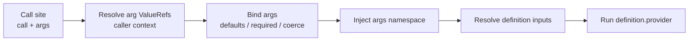

# Parameterized Calls Tutorial

This tutorial walks you through `spec.calls` -- reusable, argument-driven
provider requests. A call is defined once with typed arguments and invoked from
any resolve, transform, validate, or action step via `call:` + `args:` instead
of `provider:` + `inputs:`. You'll learn how to declare typed arguments, invoke
a definition from multiple call sites, reference arguments through the `args`
namespace, and enable opt-in de-duplication.

## Prerequisites

- scafctl installed and available in your PATH
- Basic familiarity with YAML syntax and solution files
- Understanding of [resolvers](resolver-tutorial.md) and the provider system
- Familiarity with [actions](actions-tutorial.md) for the workflow examples

## Table of Contents

1. [Why Calls](#why-calls)
2. [Anatomy of a Call](#anatomy-of-a-call)
3. [Your First Call](#your-first-call)
4. [Typed Arguments](#typed-arguments)
5. [The args Namespace](#the-args-namespace)
6. [Call Sites and ValueRefs](#call-sites-and-valuerefs)
7. [Calls in Validate Steps](#calls-in-validate-steps)
8. [Calls in Actions](#calls-in-actions)
9. [De-duplication](#de-duplication)
10. [Linting and Validation](#linting-and-validation)
11. [Common Patterns](#common-patterns)

---

## Why Calls

A single endpoint is often invoked repeatedly with different inputs -- a
validation or lookup endpoint hit once per item, group, or environment. Without
calls you must duplicate the entire provider configuration (URL, headers, body
template, auth, retry, timeout) for each distinct set of inputs, and every
change has to be applied to every copy.

Calls let you declare a request *shape* once and supply only the differing
arguments at each call site. The mechanism is provider-agnostic: HTTP is the
most common consumer, but any provider works.

---

## Anatomy of a Call

There are two halves:

| Half | Where | What it does |
|------|-------|--------------|
| **Call definition** | `spec.calls.<name>` | Declares typed `args`, a `provider`, and provider `inputs` that reference those args |
| **Call site** | `call:` + `args:` on a step or action | Invokes a definition, supplying argument values |

Inside a definition's inputs, arguments are read from the **`args` namespace**:
`_.args.x` in CEL and `{{ .args.x }}` in Go templates.



---

## Your First Call

Create `calls-demo.yaml`:

```yaml
apiVersion: scafctl.io/v1
kind: Solution
metadata:
  name: calls-demo
  version: 1.0.0

spec:
  calls:
    greet:
      provider: cel
      args:
        salutation:
          type: string
          default: Hello
        name:
          type: string
          required: true
      inputs:
        expression: '_.args.salutation + ", " + _.args.name + "!"'

  resolvers:
    english:
      type: string
      resolve:
        with:
          - call: greet
            args:
              name: World

    spanish:
      type: string
      resolve:
        with:
          - call: greet
            args:
              salutation: Hola
              name: Mundo
```

Run the resolvers:

```bash
scafctl run resolver -f calls-demo.yaml -o yaml
```

Output:

```yaml
english: Hello, World!
spanish: Hola, Mundo!
```

One definition, two call sites, two independent results. The `english` call site
omits `salutation`, so its declared default (`Hello`) applies; the `spanish`
call site overrides it.

---

## Typed Arguments

Each argument is declared with an `ArgDef`:

```yaml
args:
  count:
    type: int          # coerce the supplied value to this type
    default: 2         # applied when the call site omits the argument
  name:
    type: string
    required: true     # must be supplied at every call site
```

Rules:

- **`type`** is optional. Supplied values are coerced to it (`string`, `int`,
  `float`, `bool`, `array`, `object`). Omit it to pass the value through
  unchanged.
- **`required: true`** makes the argument mandatory. A required argument cannot
  also declare a `default`.
- **`default`** is applied only when the argument is omitted at a call site, and
  only when the argument is not required.
- Omitting a required argument, or supplying an argument the definition does not
  declare, is an error reported at the call site.

> Note: `description` is valid both on an individual argument's `ArgDef` and on
> the call definition itself.

---

## The args Namespace

Inside a definition's `inputs`, arguments live under the `args` key:

- **CEL** (`expr:` or a provider's expression input): `_.args.salutation`
- **Go template** (`tmpl:` or a template input): `{{ .args.name }}`

Bare `args.x` (a top-level CEL variable) is intentionally **not** supported --
arguments are always accessed under the `_` prefix, consistent with every other
CEL expression in scafctl.

Array and object arguments serialize into structured request bodies. In a Go
template use `{{ .args.items | toJson }}`; in CEL use `json.marshal(_.args.items)`.

```yaml
calls:
  groupCheck:
    provider: http
    args:
      user:
        type: string
        required: true
      groups:
        type: array
        required: true
    inputs:
      method: POST
      url: https://api.example.com/validate
      autoParseJson: true
      body:
        tmpl: |
          {
            "user": "{{ .args.user }}",
            "groups": {{ .args.groups | toJson }}
          }
```

---

## Call Sites and ValueRefs

Argument values at a call site are standard `ValueRef`s, so they can be literals
or computed:

```yaml
resolve:
  with:
    - call: greet
      args:
        salutation: Hey                 # bare scalar literal
        name:
          expr: _.requestor             # CEL against caller resolver data
        # tmpl: "{{ .requestor }}"      # or a Go template
        # rslvr: requestor              # or a direct resolver reference
```

Call-site arguments are resolved in the **host step's** context (the resolver or
action that contains the `call:`), then bound against the definition's argument
declarations before the definition's inputs run. Referencing another resolver in
a call-site argument automatically creates the correct dependency edge.

---

## Calls in Validate Steps

A call can be the validation rule itself, keeping a reusable check in one place:

```yaml
calls:
  nonEmpty:
    provider: validation
    args:
      value:
        type: string
        required: true
    inputs:
      value:
        expr: _.args.value
      match: '^[a-z][a-z0-9-]*$'
      message: 'value must be a non-empty lowercase token'

resolvers:
  environment:
    type: string
    resolve:
      with:
        - provider: cel
          inputs:
            expression: "'production'"
    validate:
      with:
        - call: nonEmpty
          args:
            value:
              expr: __self          # the value under validation
```

The special `__self` reference carries the current resolver value into the call
as an argument.

---

## Calls in Actions

Calls work on workflow actions exactly as they do on resolver steps. A single
definition can back multiple actions:

```yaml
spec:
  calls:
    announce:
      provider: static
      args:
        stage:
          type: string
          required: true
      inputs:
        value:
          tmpl: 'reached stage: {{ .args.stage }}'

  workflow:
    actions:
      build:
        call: announce
        args:
          stage: build

      deploy:
        dependsOn:
          - build
        call: announce
        args:
          stage: deploy
```

Run it:

```bash
scafctl run solution -f calls-demo.yaml
```

The call composes with the action's own `when`, `retry`, `timeout`, `forEach`,
and `dependsOn` -- those live on the host action, not on the call.

---

## De-duplication

Set `dedup: true` on a definition to collapse identical invocations within a
single run. When two call sites bind to the same argument values, the provider
executes once and both share the result:

```yaml
calls:
  lookup:
    dedup: true
    provider: http
    args:
      id:
        type: string
        required: true
    inputs:
      method: GET
      url:
        tmpl: 'https://api.example.com/items/{{ .args.id }}'
      autoParseJson: true
```

De-duplication is:

- **Opt-in** -- only active when the definition sets `dedup: true`.
- **Per-run and in-memory** -- reset at the start of each execution; never
  persisted to state and never shared across separate runs.
- **Keyed by bound arguments** -- defaults and coercion are applied before
  keying, so logically-equal argument sets collide regardless of ordering.

---

## Linting and Validation

`scafctl lint` reports call-specific problems:

| Rule | Severity | Meaning |
|------|----------|---------|
| `call-not-found` | error | `call:` references a definition that does not exist |
| `call-provider-exclusive` | error | a step sets both `provider:` and `call:` |
| `call-args-without-call` | error | `args:` is supplied without a `call:` |
| `call-missing-arg` | error | a required argument is not supplied at a call site |
| `call-unknown-arg` | error | a call site supplies an undeclared argument |
| `call-provider-not-found` | warning | a definition's provider is not registered |
| `call-definition-resolver-ref` | error | a definition input references a solution resolver by name (breaks isolation) |

A step must set **exactly one** of `provider:` or `call:`. Definitions are
strictly isolated: they may reference only their `args` (plus always-available
globals like `__params`). A definition input that references a solution resolver
by name is a validation error -- pass the value in as a declared argument
instead.

---

## Common Patterns

**Reuse one endpoint across environments**

```yaml
calls:
  healthCheck:
    provider: http
    args:
      host:
        type: string
        required: true
    inputs:
      method: GET
      url:
        tmpl: 'https://{{ .args.host }}/healthz'

resolvers:
  prodHealth:
    resolve:
      with:
        - call: healthCheck
          args: { host: prod.example.com }
  stagingHealth:
    resolve:
      with:
        - call: healthCheck
          args: { host: staging.example.com }
```

**Pass structured data**

```yaml
args:
  payload:
    type: object
    required: true
inputs:
  body:
    expr: json.marshal(_.args.payload)
```

**Keep a validation rule DRY** -- define it once (see
[Calls in Validate Steps](#calls-in-validate-steps)) and invoke it from every
resolver that needs it, passing `__self` as the argument.

---

## Next Steps

- Try the runnable examples in `examples/calls/`.
- Read the [Actions Tutorial](actions-tutorial.md) for the workflow features that
  compose with action calls.
- See the [CEL Tutorial](cel-tutorial.md) and
  [Go Templates Tutorial](go-templates-tutorial.md) for authoring definition
  inputs.
