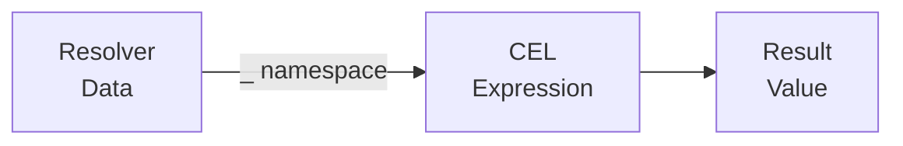

# CEL Expressions Tutorial

This tutorial covers using CEL (Common Expression Language) expressions in scafctl for data transformation, conditional logic, and dynamic configuration.

## Overview

CEL is used throughout scafctl for dynamic evaluation:

- **Resolver transforms** — Compute derived values from other resolvers
- **Action inputs** — Build dynamic commands and configurations
- **Conditions** — Conditionally skip actions with `when`
- **forEach** — Generate iteration lists dynamically



**Key principle:** In CEL expressions, all resolved values are available under the `_` namespace (e.g., `_.appName`, `_.config.port`).

> [!NOTE]
> **Hands-on:** Every section in this tutorial links to a runnable example file. Look for the **▶ Try it** callouts to run the examples yourself.

## Quick Start

### 1. Basic Expressions

Create a file called `cel-basics.yaml`:

```yaml
apiVersion: scafctl.io/v1
kind: Solution
metadata:
  name: cel-basics
  version: 1.0.0

spec:
  resolvers:
    greeting:
      type: string
      resolve:
        with:
          - provider: cel
            inputs:
              expression: "'Hello, World!'"
```

Run it:


{}
```bash
scafctl run resolver -f cel-basics.yaml -o json
```
{}
{}
```powershell
scafctl run resolver -f cel-basics.yaml -o json
```
{}


Output:

```json
{
  "greeting": "Hello, World!"
}
```

> [!NOTE]
> **Tip**: `run resolver -o json` outputs only resolver values by default. Pass `--show-execution` to include `__execution` metadata (phases, timing, provider info). See the [Run Resolver Tutorial](run-resolver-tutorial.md) for details.

{}
The complete example with more expressions is at [cel-basics.yaml](../../examples/resolvers/cel-basics.yaml)

```bash
scafctl run resolver -f examples/resolvers/cel-basics.yaml -o json
```
{}

String literals use single quotes inside the expression. Numbers, booleans, and lists are written normally:

```yaml
expression: "42"
expression: "true"
expression: "[1, 2, 3]"
expression: '{"key": "value"}'
```

### 2. Referencing Resolvers

Use `_` to access other resolver values. Create a file called `cel-refs.yaml`:

```yaml
apiVersion: scafctl.io/v1
kind: Solution
metadata:
  name: cel-refs
  version: 1.0.0

spec:
  resolvers:
    firstName:
      type: string
      resolve:
        with:
          - provider: static
            inputs:
              value: "Alice"

    lastName:
      type: string
      resolve:
        with:
          - provider: static
            inputs:
              value: "Smith"

    fullName:
      type: string
      dependsOn: [firstName, lastName]
      resolve:
        with:
          - provider: cel
            inputs:
              expression: "_.firstName + ' ' + _.lastName"
```

Run it:


{}
```bash
scafctl run resolver -f cel-refs.yaml -o json
```
{}
{}
```powershell
scafctl run resolver -f cel-refs.yaml -o json
```
{}


Output:

```json
{
  "firstName": "Alice",
  "fullName": "Alice Smith",
  "lastName": "Smith"
}
```

{}
This example is also in [cel-basics.yaml](../../examples/resolvers/cel-basics.yaml) — it includes operators, string operations, list comprehensions, and more.

{}

#### Bracket Notation for Hyphenated Names

CEL supports two syntaxes for accessing resolver values:

- **Dot notation:** `_.resolverName` -- works for camelCase and snake_case names
- **Bracket notation:** `_["resolver-name"]` -- works for all names, required for hyphens

Hyphens in resolver names conflict with the CEL minus operator, so dot notation
(`_.api-endpoint`) will not work. Use bracket notation instead:

~~~yaml
spec:
  resolvers:
    api-endpoint:
      type: string
      resolve:
        with:
          - provider: static
            inputs:
              value: "https://api.example.com"

    url:
      type: string
      dependsOn: [api-endpoint]
      resolve:
        with:
          - provider: cel
            inputs:
              # Bracket notation required for hyphenated names
              expression: '_["api-endpoint"] + "/v1/users"'
~~~

Both notations can be mixed in a single expression:

~~~yaml
expression: '_["api-endpoint"] + "/" + _.version'
~~~

> **Tip:** Prefer `camelCase` or `snake_case` for resolver names to use the simpler dot notation everywhere.

### 3. Using `expr` in Inputs

The `expr` field can be used on any provider input for dynamic values. For example, in your solution's `workflow.actions` section:

```yaml
workflow:
  actions:
    deploy:
      provider: exec
      inputs:
        command:
          expr: "'kubectl apply -f ' + _.outputDir + '/' + _.appName + '.yaml'"
```

## Built-in Variables

| Variable | Available In | Description |
|----------|-------------|-------------|
| `_` | Everywhere | Root data — all resolved values |
| `__self` | Transform/validate phases | Current value being processed |
| `__item` | forEach loops | Current iteration item |
| `__index` | forEach loops | Current iteration index (0-based) |
| `__actions` | Action phase | Results from completed actions |

## Language Basics

### Types

| Type | Examples |
|------|---------|
| String | `'hello'`, `"hello"` |
| Int | `42`, `-7` |
| Double | `3.14`, `-0.5` |
| Bool | `true`, `false` |
| List | `[1, 2, 3]`, `['a', 'b']` |
| Map | `{"key": "value", "n": 42}` |
| Null | `null` |
| Timestamp | `timestamp("2026-01-01T00:00:00Z")` |
| Duration | `duration("1h30m")` |

### Operators

```cel
// Arithmetic
1 + 2          // 3
10 - 3         // 7
4 * 5          // 20
10 / 3         // 3
10 % 3         // 1

// String concatenation
"hello" + " " + "world"   // "hello world"

// Comparison
x == y      x != y      x < y
x <= y      x > y       x >= y

// Logical
a && b      a || b      !a

// Ternary
x > 0 ? "positive" : "non-positive"

// Membership
"a" in ["a", "b", "c"]        // true
"key" in {"key": "val"}       // true
```

### List Operations

```cel
// Size
size([1, 2, 3])                       // 3

// Comprehensions
[1, 2, 3, 4].filter(x, x > 2)        // [3, 4]
[1, 2, 3].map(x, x * 2)              // [2, 4, 6]
[1, 2, 3].exists(x, x > 2)           // true
[1, 2, 3].all(x, x > 0)              // true
[1, 2, 3].exists_one(x, x == 2)      // true

// Built-in extensions (google/cel-go)
[1, 2, 2, 3].distinct()              // [1, 2, 3]
[3, 1, 2].sort()                     // [1, 2, 3]
[1, [2, 3], [4]].flatten()           // [1, 2, 3, 4]
[1, 2, 3, 4, 5].slice(1, 3)         // [2, 3]
[1, 2, 3].reverse()                  // [3, 2, 1]
lists.range(5)                        // [0, 1, 2, 3, 4]
["a", "b", "c"].join(",")            // "a,b,c"
```

### Map Operations

```cel
// Access
{"name": "Alice"}.name               // "Alice"
{"port": 8080}["port"]               // 8080

// Membership
"name" in {"name": "Alice"}          // true

// Size
size({"a": 1, "b": 2})              // 2
```

### String Operations

```cel
// Built-in
size("hello")                         // 5
"hello".contains("ell")              // true
"hello".startsWith("hel")           // true
"hello".endsWith("llo")             // true
"foo123".matches("^[a-z]+[0-9]+$")  // true

// String extensions (google/cel-go)
"hello".charAt(1)                     // "e"
"TacoCat".lowerAscii()               // "tacocat"
"TacoCat".upperAscii()               // "TACOCAT"
"  hello  ".trim()                   // "hello"
"hello hello".replace("he", "we")    // "wello wello"
"a,b,c".split(",")                   // ["a", "b", "c"]
"tacocat".substring(0, 4)           // "taco"
"hello".reverse()                    // "olleh"
"Hello %s, you are %d".format(["Alice", 30])  // "Hello Alice, you are 30"
```

{}
All the operators, string, list, and map operations above are runnable in [cel-builtins.yaml](../../examples/resolvers/cel-builtins.yaml)

```bash
scafctl run resolver -f examples/resolvers/cel-builtins.yaml -o json
```
{}

---

## Custom Extension Functions

scafctl extends CEL with project-specific functions for arrays, maps, strings, regex, filepath, GUID, sorting, time, marshalling, and debugging.

{}
All custom extension functions are demonstrated in a single runnable file — [cel-extensions.yaml](../../examples/resolvers/cel-extensions.yaml)

```bash
scafctl run resolver -f examples/resolvers/cel-extensions.yaml -o json
```
{}

### Arrays

Functions for manipulating string arrays.

```cel
// Append a string to a list
arrays.strings.add(["apple", "banana"], "cherry")
// → ["apple", "banana", "cherry"]

// Chain additions
arrays.strings.add(arrays.strings.add(["a"], "b"), "c")
// → ["a", "b", "c"]

// Deduplicate a list (preserves first occurrence order)
arrays.strings.unique(["apple", "banana", "apple", "cherry", "banana"])
// → ["apple", "banana", "cherry"]
```

**Use in a resolver:**

```yaml
tags:
  type: array
  dependsOn: [baseTags, environment]
  resolve:
    with:
      - provider: cel
        inputs:
          expression: >
            arrays.strings.unique(
              arrays.strings.add(_.baseTags, "env:" + _.environment)
            )
```

### Map

Functions for creating and transforming maps.

```cel
// Add or overwrite a key
map.add({"name": "John"}, "age", 30)
// → {"name": "John", "age": 30}

// Add only if key doesn't exist (safe default)
map.addIfMissing({"name": "John"}, "name", "Jane")
// → {"name": "John"}  — original value preserved

// Add and error if key already exists (strict mode)
map.addFailIfExists({"name": "John"}, "name", "Jane")
// → ERROR: key 'name' already exists

// Select specific keys
map.select({"name": "John", "age": 30, "city": "NYC"}, ["name", "city"])
// → {"name": "John", "city": "NYC"}

// Remove specific keys
map.omit({"name": "John", "age": 30, "password": "secret"}, ["password"])
// → {"name": "John", "age": 30}

// Merge two maps (second map wins on conflicts)
map.merge({"name": "John", "age": 30}, {"age": 31, "city": "NYC"})
// → {"name": "John", "age": 31, "city": "NYC"}

// Chain operations
map.omit(
  map.merge(_.defaults, _.overrides),
  ["internal", "debug"]
)
```

**`map.merge` in a resolver — overlay environment-specific config:**

```yaml
config:
  type: any
  dependsOn: [defaults, envOverrides]
  resolve:
    with:
      - provider: cel
        inputs:
          expression: "map.merge(_.defaults, _.envOverrides)"
```

**`map.select` — extract only the fields you need:**

```yaml
publicConfig:
  type: any
  dependsOn: [fullConfig]
  resolve:
    with:
      - provider: cel
        inputs:
          expression: >
            map.select(_.fullConfig, ["name", "version", "description"])
```

### Strings

Custom string manipulation functions.

```cel
// Clean — lowercase and remove hyphens, underscores, spaces
strings.clean("My-String_Name Test")
// → "mystringnametest"

strings.clean("HELLO-WORLD")
// → "helloworld"

// Title — convert to title case
strings.title("hello world")
// → "Hello World"

strings.title("the quick brown fox")
// → "The Quick Brown Fox"
```

**Use case — normalize identifiers:**

```yaml
normalizedName:
  type: string
  dependsOn: [rawName]
  resolve:
    with:
      - provider: cel
        inputs:
          expression: "strings.clean(_.rawName)"
```

### Regex

Regular expression functions using RE2 syntax.

```cel
// Test if a string matches a pattern
regex.match("^Hello", "Hello World")
// → true

regex.match("[0-9]+", "no digits")
// → false

// Replace all occurrences of a pattern
regex.replace("abc123def456", "[0-9]+", "#")
// → "abc#def#"

regex.replace("hello world foo", "\\s+", "-")
// → "hello-world-foo"

// Find all matches
regex.findAll("[0-9]+", "abc123def456")
// → ["123", "456"]

regex.findAll("[a-zA-Z]+", "hello 123 world")
// → ["hello", "world"]

// Split a string by a pattern
regex.split("\\s+", "hello   world   foo")
// → ["hello", "world", "foo"]

regex.split("[,;]+", "a,b;c,,d")
// → ["a", "b", "c", "d"]
```

**Use case — validate and sanitize input:**

```yaml
sanitizedName:
  type: string
  dependsOn: [rawInput]
  resolve:
    with:
      - provider: cel
        inputs:
          expression: 'regex.replace(_.rawInput, "[^a-zA-Z0-9-]", "")'

isValidEmail:
  type: bool
  dependsOn: [email]
  resolve:
    with:
      - provider: cel
        inputs:
          expression: 'regex.match("[a-zA-Z0-9._%+-]+@[a-zA-Z0-9.-]+\\.[a-zA-Z]{2,}", _.email)'
```

### Filepath

Functions for path manipulation and filesystem checks.

```cel
// Get parent directory
filepath.dir("/home/user/documents/file.txt")
// → "/home/user/documents"

// Normalize a path (resolve . and .., clean separators)
filepath.normalize("/home//user/../user/./documents")
// → "/home/user/documents"

// Check if a path exists on disk
filepath.exists("/etc/hosts")
// → true

// Join path segments
filepath.join("/var", "log", "app", "errors.log")
// → "/var/log/app/errors.log"

// Combine in expressions
filepath.exists(filepath.join(_.outputDir, "config.yaml"))
  ? "Config exists"
  : "Config missing"
```

**Use case — build output paths:**

```yaml
outputPath:
  type: string
  dependsOn: [baseDir, appName]
  resolve:
    with:
      - provider: cel
        inputs:
          expression: "filepath.join(_.baseDir, _.appName, 'config.yaml')"
```

### GUID

Generate unique identifiers.

```cel
// Generate a random UUID v4
guid.new()
// → "550e8400-e29b-41d4-a716-446655440000"

// With prefix
"resource-" + guid.new()
// → "resource-550e8400-e29b-41d4-a716-446655440000"

// Generate multiple
[guid.new(), guid.new(), guid.new()]
// → three unique UUIDs
```

**Use case — unique deployment ID:**

```yaml
deploymentId:
  type: string
  resolve:
    with:
      - provider: cel
        inputs:
          expression: "guid.new()"
```

### Sort

Sort lists of objects by a property.

```cel
// Sort ascending by property
sort.objects(
  [{"name": "Charlie", "age": 30}, {"name": "Alice", "age": 25}],
  "name"
)
// → [{"name": "Alice", ...}, {"name": "Charlie", ...}]

// Sort descending
sort.objectsDescending(
  [{"id": 1}, {"id": 3}, {"id": 2}],
  "id"
)
// → [{"id": 3}, {"id": 2}, {"id": 1}]
```

Items missing the sort property are placed at the end.

**Use case — sort services by priority:**

```yaml
orderedServices:
  type: array
  dependsOn: [services]
  resolve:
    with:
      - provider: cel
        inputs:
          expression: "sort.objects(_.services, 'priority')"
```

### Time

Functions for working with timestamps.

```cel
// Current time as CEL timestamp
time.now()

// Check if a deadline has passed
time.now() > timestamp("2026-01-01T00:00:00Z")

// Format current time with Go layout
time.nowFmt("2006-01-02")
// → "2026-02-09"

time.nowFmt("2006-01-02T15:04:05Z")
// → "2026-02-09T14:30:00Z"

time.nowFmt("January 2, 2006 at 3:04 PM")
// → "February 9, 2026 at 2:30 PM"
```

**Go time format reference:** Go uses a reference time of `Mon Jan 2 15:04:05 MST 2006` — use these exact numbers as placeholders.

**Use case — add a generation timestamp:**

```yaml
generatedAt:
  type: string
  resolve:
    with:
      - provider: cel
        inputs:
          expression: "time.nowFmt('2006-01-02T15:04:05Z')"
```

### Marshalling (JSON / YAML)

Convert between data structures and serialized strings.

```cel
// Serialize to compact JSON
json.marshal({"name": "John", "age": 30})
// → '{"age":30,"name":"John"}'

// Serialize to pretty-printed JSON
json.marshalPretty({"users": [{"name": "Alice"}, {"name": "Bob"}]})
// → formatted JSON with 2-space indentation

// Parse JSON string into data
json.unmarshal('{"user": {"name": "John"}}').user.name
// → "John"

// Serialize to YAML
yaml.marshal({"name": "John", "items": ["a", "b"]})
// → "items:\n- a\n- b\nname: John\n"

// Parse YAML string into data
yaml.unmarshal("name: John\nage: 30")
// → {"name": "John", "age": 30}
```

**Use case — embed JSON in a config file:**

```yaml
configJson:
  type: string
  dependsOn: [config]
  resolve:
    with:
      - provider: cel
        inputs:
          expression: "json.marshalPretty(_.config)"
```

**Use case — parse an HTTP response:**

```yaml
apiData:
  type: any
  dependsOn: [rawResponse]
  resolve:
    with:
      - provider: cel
        inputs:
          expression: "json.unmarshal(_.rawResponse.body)"
```

### Debug

Functions for debugging expressions during development.

```cel
// Print debug output and return null
debug.out("Checkpoint reached")
// prints: "CEL DEBUG OUTPUT: Checkpoint reached"

// Print and pass through a value (great for inspecting in pipelines)
debug.out("Processing", _.items)
// prints debug message, returns _.items

// Throw an error (halt evaluation)
value < 0 ? debug.throw("Value must be positive") : value * 2

// Sleep for N milliseconds (testing only!)
debug.sleep(1000)        // sleep 1s, returns 1000
debug.sleep(500, "Ready")  // sleep 500ms, returns "Ready"
```

**Use case — inspect intermediate values:**

```yaml
result:
  type: any
  dependsOn: [rawData]
  resolve:
    with:
      - provider: cel
        inputs:
          expression: >
            debug.out("Raw data", _.rawData.filter(x, x.enabled))
```

### Utility

```cel
// Discard a value, return null
out.nil(someExpression)
// → null (always)
```

---

## Encoders

```cel
// Base64 encode (requires bytes literal)
base64.encode(b"hello")
// -> "aGVsbG8="

// Base64 decode (returns bytes, wrap in string() to get text)
string(base64.decode("aGVsbG8="))
// -> "hello"
```

## Math

```cel
math.abs(-5)         // 5
math.ceil(1.2)       // 2.0
math.floor(1.8)      // 1.0
math.round(1.5)      // 2.0
math.sqrt(81)        // 9.0
math.least(5, 10)    // 5
math.greatest(5, 10) // 10
math.sign(-42)       // -1
```

## Optional Types

Safe navigation for potentially missing values:

```cel
// Safe field access (returns optional)
_.config.?database.?host

// Provide default
_.config.?database.?host.orValue("localhost")

// Chain optionals
{"a": 1}[?"b"].orValue(0)   // 0

// Optional map indexing
_.headers[?"Authorization"].orValue("none")

// First/last element
[1, 2, 3].first()    // optional.of(1)
[].first()            // optional.none()
```

## Sets

```cel
// Check if all elements are contained
sets.contains([1, 2, 3, 4], [2, 3])    // true

// Check set equality (ignoring order and duplicates)
sets.equivalent([1, 2, 3], [3, 2, 1])  // true

// Check for any common element
sets.intersects([1, 2, 3], [3, 4, 5])  // true
```

## Bindings

Use `cel.bind` for local variables to avoid repeating computations:

```cel
// Bind a computed value
cel.bind(fullName, _.firstName + " " + _.lastName,
  fullName + " (" + size(fullName).toString() + " chars)"
)

// Nested bindings
cel.bind(base, _.host + ":" + string(_.port),
  cel.bind(url, "https://" + base,
    url + "/api/v1"
  )
)
```

{}
Encoders, math, optionals, sets, and bindings are all runnable in [cel-builtins.yaml](../../examples/resolvers/cel-builtins.yaml)

```bash
scafctl run resolver -f examples/resolvers/cel-builtins.yaml -o json
```
{}

---

## Common Patterns

{}
All the patterns below are combined into one runnable file — [cel-common-patterns.yaml](../../examples/resolvers/cel-common-patterns.yaml)

```bash
scafctl run resolver -f examples/resolvers/cel-common-patterns.yaml -o json
```
{}

### Conditional Configuration

```yaml
replicas:
  type: integer
  dependsOn: [environment]
  resolve:
    with:
      - provider: cel
        inputs:
          expression: >
            _.environment == "production" ? 5 :
            _.environment == "staging" ? 2 : 1
```

### Build a Map Dynamically

```yaml
labels:
  type: any
  dependsOn: [appName, version, environment]
  resolve:
    with:
      - provider: cel
        inputs:
          expression: >
            {
              "app": _.appName,
              "version": _.version,
              "env": _.environment,
              "managed-by": "scafctl"
            }
```

### Filter and Transform Lists

```yaml
enabledServices:
  type: array
  dependsOn: [services]
  resolve:
    with:
      - provider: cel
        inputs:
          expression: >
            _.services
              .filter(s, s.enabled)
              .map(s, s.name)
              .sort()
```

### String Interpolation with `format`

```yaml
connectionString:
  type: string
  dependsOn: [dbHost, dbPort, dbName]
  resolve:
    with:
      - provider: cel
        inputs:
          expression: >
            "postgres://%s:%d/%s".format([_.dbHost, _.dbPort, _.dbName])
```

### Merge Defaults with Overrides

```yaml
finalConfig:
  type: any
  dependsOn: [defaults, userConfig]
  resolve:
    with:
      - provider: cel
        inputs:
          expression: >
            map.merge(
              map.merge(_.defaults, _.userConfig),
              {"generatedAt": time.nowFmt("2006-01-02T15:04:05Z")}
            )
```

### Generate a List of Resources

```yaml
deployments:
  type: array
  dependsOn: [services, environment]
  resolve:
    with:
      - provider: cel
        inputs:
          expression: >
            _.services.map(svc, {
              "name": svc.name,
              "image": svc.image + ":" + svc.version,
              "replicas": _.environment == "production" ? svc.prodReplicas : 1,
              "id": guid.new()
            })
```

{}
For more data transformation patterns (filtering, aggregation, enrichment, serialization), see [cel-transforms.yaml](../../examples/resolvers/cel-transforms.yaml)

```bash
scafctl run resolver -f examples/resolvers/cel-transforms.yaml -o json
```
{}

## Function Reference

### Custom Functions (scafctl)

| Function | Description |
|----------|-------------|
| `arrays.strings.add(list, str)` | Append string to list |
| `arrays.strings.unique(list)` | Deduplicate string list |
| `debug.out(msg)` | Print debug output, return null |
| `debug.out(msg, val)` | Print debug output, return val |
| `debug.throw(msg)` | Halt with error |
| `debug.sleep(ms)` | Pause for N milliseconds |
| `filepath.dir(path)` | Get parent directory |
| `filepath.normalize(path)` | Clean path separators |
| `filepath.exists(path)` | Check if path exists |
| `filepath.join(a, b, ...)` | Join path segments (2-10 args) |
| `guid.new()` | Generate UUID v4 |
| `json.marshal(val)` | Serialize to compact JSON |
| `json.marshalPretty(val)` | Serialize to pretty JSON |
| `json.unmarshal(str)` | Parse JSON string |
| `yaml.marshal(val)` | Serialize to YAML |
| `yaml.unmarshal(str)` | Parse YAML string |
| `map.add(m, key, val)` | Add/overwrite key |
| `map.addIfMissing(m, key, val)` | Add only if missing |
| `map.addFailIfExists(m, key, val)` | Add or error if exists |
| `map.select(m, keys)` | Keep only specified keys |
| `map.omit(m, keys)` | Remove specified keys |
| `map.merge(a, b)` | Merge maps (b wins) |
| `map.recurse(list, ids, idField, depsField)` | Resolve transitive deps |
| `out.nil(val)` | Discard value, return null |
| `regex.match(pattern, input)` | Test if input matches regex pattern (RE2) |
| `regex.replace(input, pattern, replacement)` | Replace all regex matches |
| `regex.findAll(pattern, input)` | Find all regex matches as list |
| `regex.split(pattern, input)` | Split string by regex pattern |
| `sort.objects(list, prop)` | Sort objects ascending |
| `sort.objectsDescending(list, prop)` | Sort objects descending |
| `strings.clean(str)` | Lowercase + remove separators |
| `strings.title(str)` | Convert to title case |
| `time.now()` | Current timestamp |
| `time.nowFmt(layout)` | Formatted current time |

### Built-in Functions (google/cel-go)

| Category | Key Functions |
|----------|--------------|
| **Strings** | `charAt`, `format`, `indexOf`, `join`, `lowerAscii`, `upperAscii`, `replace`, `reverse`, `split`, `substring`, `trim` |
| **Lists** | `distinct`, `flatten`, `sort`, `sortBy`, `slice`, `reverse`, `lists.range` |
| **Math** | `math.abs`, `math.ceil`, `math.floor`, `math.round`, `math.sqrt`, `math.least`, `math.greatest` |
| **Encoders** | `base64.encode`, `base64.decode` |
| **Sets** | `sets.contains`, `sets.equivalent`, `sets.intersects` |
| **Bindings** | `cel.bind` |
| **Optional** | `optional.of`, `optional.none`, `.orValue()`, `.?` chaining, `first`, `last` |

## Examples

| Example | Description | Run |
|---------|-------------|-----|
| [cel-basics.yaml](../../examples/resolvers/cel-basics.yaml) | Literals, resolver refs, operators, strings, lists | `scafctl run resolver -f examples/resolvers/cel-basics.yaml -o json` |
| [cel-builtins.yaml](../../examples/resolvers/cel-builtins.yaml) | Math, encoders, sets, optionals, bindings, string/list ops | `scafctl run resolver -f examples/resolvers/cel-builtins.yaml -o json` |
| [cel-common-patterns.yaml](../../examples/resolvers/cel-common-patterns.yaml) | Conditionals, map building, filtering, merging, resource generation | `scafctl run resolver -f examples/resolvers/cel-common-patterns.yaml -o json` |
| [cel-extensions.yaml](../../examples/resolvers/cel-extensions.yaml) | All custom CEL extension functions (arrays, map, strings, etc.) | `scafctl run resolver -f examples/resolvers/cel-extensions.yaml -o json` |
| [cel-transforms.yaml](../../examples/resolvers/cel-transforms.yaml) | Data transformation patterns (filter, aggregate, enrich) | `scafctl run resolver -f examples/resolvers/cel-transforms.yaml -o json` |

## Next Steps

- [Go Templates Tutorial](go-templates-tutorial.md) — When to use `tmpl` vs `expr`
- [Catalog Tutorial](catalog-tutorial.md) — Store and manage solutions in your local catalog
- [Resolver Tutorial](resolver-tutorial.md) — Use CEL in resolver pipelines
- [Actions Tutorial](actions-tutorial.md) — Dynamic inputs with `expr`
- [Provider Reference](provider-reference.md) — The `cel` provider
