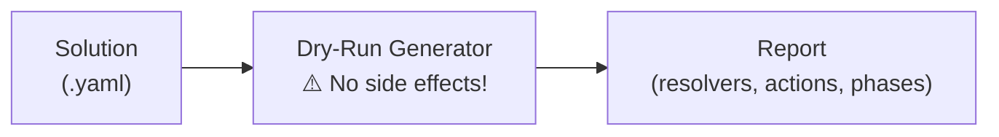

# Dry-Run Tutorial

This tutorial covers using `--dry-run` to preview what a solution execution would do without performing any side effects.

## Overview

Dry-run mode resolves all values and builds an action execution plan, but never executes actions. This gives you a complete picture of what *would* happen:



## When to Use Dry-Run

| Use Case | Scenario |
|----------|----------|
| **Pre-flight check** | Verify all resolvers produce expected values before executing actions |
| **Action plan review** | See the execution order, phases, and dependencies before running |
| **CI validation** | Assert resolver outputs in a pipeline without side effects |
| **Debugging** | Understand why a solution behaves unexpectedly by inspecting resolved values |
| **Documentation** | Generate a report of what a solution does for review or audit |

## CLI Usage

### Dry-Run a Full Solution


{}
```bash
scafctl run solution -f solution.yaml --dry-run
```
{}
{}
```powershell
scafctl run solution -f solution.yaml --dry-run
```
{}


This resolves all values and shows the action plan without executing any actions.

### Dry-Run with JSON Output


{}
```bash
scafctl run solution -f solution.yaml --dry-run -o json
```
{}
{}
```powershell
scafctl run solution -f solution.yaml --dry-run -o json
```
{}


Returns a structured JSON report with resolver values, action plan, phases, and warnings.

### Dry-Run with Verbose Output


{}
```bash
scafctl run solution -f solution.yaml --dry-run --verbose
```
{}
{}
```powershell
scafctl run solution -f solution.yaml --dry-run --verbose
```
{}


Adds materialized inputs to each action in the report, showing exactly what values were resolved for each provider.

## Example Walkthrough

### Step 1: Inspect the Example Solution

```bash
cat examples/dryrun/basic-dryrun.yaml
```

This solution has four resolvers (`greeting`, `target`, `port`, `endpoint`) and two actions (`greet`, `deploy`).

### Step 2: Run Dry-Run


{}
```bash
scafctl run solution -f examples/dryrun/basic-dryrun.yaml --dry-run
```
{}
{}
```powershell
scafctl run solution -f examples/dryrun/basic-dryrun.yaml --dry-run
```
{}


The output shows:
- **WhatIf messages** — Each action's provider-generated description of what it would do (e.g., `Would execute command echo Hello via bash`)
- **Action Plan** — Execution order (`greet` in phase 1, `deploy` in phase 2 after `greet`)
- **No side effects** — The `echo` commands are never executed

### Step 3: JSON Output for Automation


{}
```bash
scafctl run solution -f examples/dryrun/basic-dryrun.yaml --dry-run -o json | jq .
```
{}
{}
```powershell
scafctl run solution -f examples/dryrun/basic-dryrun.yaml --dry-run -o json | ConvertFrom-Json
```
{}


The JSON report contains:

```json
{
  "dryRun": true,
  "solution": "dryrun-demo",
  "version": "1.0.0",
  "hasWorkflow": true,
  "actionPlan": [
    {
      "name": "greet",
      "provider": "exec",
      "wouldDo": "Would execute command echo Hello, World! via bash",
      "phase": 1,
      "section": "actions"
    },
    {
      "name": "deploy",
      "provider": "exec",
      "wouldDo": "Would execute command ./deploy.sh via bash",
      "phase": 2,
      "section": "actions",
      "dependencies": ["greet"]
    }
  ],
  "totalActions": 2,
  "totalPhases": 2
}
```

### Step 4: Conditional Actions


{}
```bash
scafctl run solution -f examples/dryrun/conditional-dryrun.yaml --dry-run -o json
```
{}
{}
```powershell
scafctl run solution -f examples/dryrun/conditional-dryrun.yaml --dry-run -o json
```
{}


This example shows how dry-run reports conditional (`when`) actions and `finally` blocks. The action plan includes the `when` expression so you can see which conditions will be evaluated at runtime.

## Dry-Run Report Structure

| Field | Description |
|-------|-------------|
| `dryRun` | Always `true` |
| `solution` | Solution name from metadata |
| `version` | Solution version |
| `hasWorkflow` | Whether the solution defines a workflow |
| `actionPlan` | Ordered list of WhatIf actions with phase, provider, whatIf message, dependencies |
| `totalActions` | Total number of actions |
| `totalPhases` | Total execution phases |
| `warnings` | Issues like graph build failures |

### WhatIf Action Fields

| Field | Description |
|-------|-------------|
| `name` | Action name |
| `provider` | Provider name |
| `wouldDo` | Provider-generated description of what this action would do |
| `phase` | Execution phase number |
| `section` | Workflow section (`actions` or `finally`) |
| `description` | Action description (if set) |
| `dependencies` | Actions this depends on |
| `when` | Conditional expression (if set) |
| `materializedInputs` | Resolved inputs (only with `--verbose`) |
| `deferredInputs` | Inputs deferred until runtime |

## Using with Snapshots

Dry-run shows what *would* happen; snapshots capture what *did* happen. Combine them:


{}
```bash
# Preview what will happen
scafctl run solution -f solution.yaml --dry-run -o json > plan.json

# Execute and capture the result
scafctl run resolver -f solution.yaml --snapshot --snapshot-file=actual.json

# Compare plan vs actual if needed
```
{}
{}
```powershell
# Preview what will happen
scafctl run solution -f solution.yaml --dry-run -o json > plan.json

# Execute and capture the result
scafctl run resolver -f solution.yaml --snapshot --snapshot-file=actual.json

# Compare plan vs actual if needed
```
{}


## CI Pipeline Integration

Use dry-run in CI to validate solutions without side effects:


{}
```bash
# Verify all resolvers resolve successfully
output=$(scafctl run solution -f solution.yaml --dry-run -o json)
warnings=$(echo "$output" | jq '.warnings | length')

if [ "$warnings" -gt 0 ]; then
  echo "Dry-run reported warnings:"
  echo "$output" | jq '.warnings[]'
  exit 1
fi
```
{}
{}
```powershell
# Verify all resolvers resolve successfully
$output = scafctl run solution -f solution.yaml --dry-run -o json
$parsed = $output | ConvertFrom-Json
$warnings = $parsed.warnings.Count

if ($warnings -gt 0) {
  Write-Output "Dry-run reported warnings:"
  $parsed.warnings
  exit 1
}
```
{}


## Working Directory Override

Use `--cwd` (`-C`) to run a dry-run against a solution in a different directory:


{}
```bash
# Dry-run a solution from another directory
scafctl --cwd /path/to/project dryrun -f solution.yaml

# Short form
scafctl -C /path/to/project dryrun -f solution.yaml -o json
```
{}
{}
```powershell
# Dry-run a solution from another directory
scafctl --cwd /path/to/project dryrun -f solution.yaml

# Short form
scafctl -C /path/to/project dryrun -f solution.yaml -o json
```
{}


All relative paths in the solution (file references, templates, etc.) resolve against the `--cwd` directory.

## See Also

- [Snapshots Tutorial]() — Capture and compare runtime execution state
- [Solution Diff Tutorial]() — Structural comparison of solution files
- [examples/dryrun/](https://github.com/oakwood-commons/scafctl/tree/main/examples/dryrun) — Example solution files for dry-run
