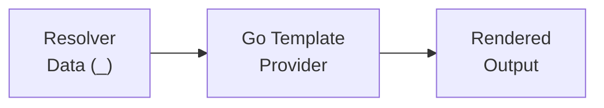

# Go Templates Tutorial

This tutorial walks you through using Go templates in scafctl to generate structured text output like configuration files, documentation, and code scaffolding. You'll start with a simple template and progressively learn conditionals, loops, whitespace control, file-based templates, custom delimiters, and multi-file generation.

## Prerequisites

- scafctl installed and available in your PATH
- Basic familiarity with YAML syntax
- Completion of the [Resolver Tutorial](resolver-tutorial.md) and [Actions Tutorial](actions-tutorial.md)

## Table of Contents

1. [Your First Template](#your-first-template)
2. [Using Conditionals](#using-conditionals)
3. [Iterating Over Lists](#iterating-over-lists)
4. [Iterating Over Maps](#iterating-over-maps)
5. [Controlling Whitespace](#controlling-whitespace)
6. [Loading Templates from Files](#loading-templates-from-files)
7. [Handling Missing Keys](#handling-missing-keys)
8. [Injecting Additional Data](#injecting-additional-data)
9. [Using Custom Delimiters](#using-custom-delimiters)
10. [Using `tmpl` for Dynamic Inputs](#using-tmpl-for-dynamic-inputs)
11. [Generating Multiple Files with ForEach](#generating-multiple-files-with-foreach)
12. [Rendering Template Directories](#rendering-template-directories)
13. [Putting It All Together: README Generator](#putting-it-all-together-readme-generator)
14. [Using Sprig Functions](#using-sprig-functions)
15. [Converting Data to HCL with toHcl](#converting-data-to-hcl-with-tohcl)
16. [Serializing and Parsing YAML with toYaml / fromYaml](#serializing-and-parsing-yaml-with-toyaml--fromyaml)
17. [DNS-Safe Strings with slugify / toDnsString](#dns-safe-strings-with-slugify--todnsstring)
18. [Filtering Lists with where / selectField](#filtering-lists-with-where--selectfield)
19. [Inline CEL with cel](#inline-cel-with-cel)
20. [Debugging Template Type Errors](#debugging-template-type-errors)
21. [Discovering Available Functions](#discovering-available-functions)

---

## Overview

scafctl supports Go templates in two ways:

1. **`go-template` provider** — Render templates in resolvers and actions
2. **`tmpl` field** — Use Go template syntax in provider inputs (alternative to `expr`)



**When to use Go templates vs CEL:**
- **Go templates** — Multi-line text generation, file rendering, structured output
- **CEL expressions** — Data transformation, conditionals, single-value computation

---

## Your First Template

Let's start by rendering a simple greeting with the `go-template` provider.

### Step 1: Create the Solution File

Create a file called `template-basics.yaml`:

```yaml
apiVersion: scafctl.io/v1
kind: Solution
metadata:
  name: template-basics
  version: 1.0.0

spec:
  resolvers:
    name:
      type: string
      resolve:
        with:
          - provider: static
            inputs:
              value: "World"

    greeting:
      type: string
      dependsOn: [name]
      resolve:
        with:
          - provider: go-template
            inputs:
              name: "greeting"
              template: "Hello, {{ .name }}!"
```

### Step 2: Run It


{}
```bash
scafctl run resolver -f template-basics.yaml -e _.greeting -o yaml
```
{}
{}
```powershell
scafctl run resolver -f template-basics.yaml -e _.greeting -o yaml
```
{}


### Step 3: Check the Output

```yaml
Hello, World!
```

### What Happened

- The `name` resolver produced the value `"World"`.
- The `greeting` resolver used the `go-template` provider to render a template.
- Inside the template, `{{ .name }}` pulled in the resolved value of `name`.
- All resolver values are available at the template root — access them with `{{ .resolverName }}`.
- The `-e _.greeting` flag filters the output to just the `greeting` resolver, and `-o yaml` renders it cleanly.

> [!NOTE]
> **Key point:** The `go-template` provider requires two inputs: `name` (an identifier for the template) and `template` (the Go template string to render).

---

## Using Conditionals

Templates can branch based on data values using `{{ if }}`, `{{ else if }}`, and `{{ else }}`. In this tutorial you'll use a `parameter` provider so you can change the environment from the command line and see how the output adapts — without editing the file each time.

### Step 1: Create the Solution File

Create a file called `template-conditionals.yaml`:

```yaml
apiVersion: scafctl.io/v1
kind: Solution
metadata:
  name: template-conditionals
  version: 1.0.0

spec:
  resolvers:
    environment:
      type: string
      resolve:
        with:
          - provider: parameter
            inputs:
              key: env
          - provider: static
            inputs:
              value: "development"

    app_name:
      type: string
      resolve:
        with:
          - provider: static
            inputs:
              value: "my-service"

    deployment_config:
      type: string
      dependsOn: [environment, app_name]
      resolve:
        with:
          - provider: go-template
            inputs:
              name: "deploy-config"
              template: |
                # Deployment config for {{ .app_name }}
                environment: {{ .environment }}
                {{ if eq .environment "production" }}
                replicas: 5
                logging: warn
                resources:
                  cpu: "2"
                  memory: "4Gi"
                {{ else if eq .environment "staging" }}
                replicas: 2
                logging: info
                resources:
                  cpu: "1"
                  memory: "2Gi"
                {{ else }}
                replicas: 1
                logging: debug
                resources:
                  cpu: "500m"
                  memory: "512Mi"
                {{ end }}
```

The `environment` resolver tries the `parameter` provider first (looking for a `-r env=<value>` flag). If no parameter is supplied, it falls back to the `static` provider and defaults to `"development"`.

### Step 2: Run with the Default Environment

Run without passing any parameters — the environment defaults to `development`:


{}
```bash
scafctl run resolver -f template-conditionals.yaml -e _.deployment_config -o yaml
```
{}
{}
```powershell
scafctl run resolver -f template-conditionals.yaml -e _.deployment_config -o yaml
```
{}


> [!NOTE]
> **Tip:** The `-e _.deployment_config` flag filters the output to just the `deployment_config` resolver, and `-o yaml` renders it cleanly.

Output:

```yaml
# Deployment config for my-service
environment: development

replicas: 1
logging: debug
resources:
  cpu: "500m"
  memory: "512Mi"
```

Since `"development"` doesn't match `"production"` or `"staging"`, the `{{ else }}` branch is used.

### Step 3: Switch to Staging

Pass `-r env=staging` to override the environment:


{}
```bash
scafctl run resolver -f template-conditionals.yaml -r env=staging -e _.deployment_config -o yaml
```
{}
{}
```powershell
scafctl run resolver -f template-conditionals.yaml -r env=staging -e _.deployment_config -o yaml
```
{}


Output:

```yaml
# Deployment config for my-service
environment: staging

replicas: 2
logging: info
resources:
  cpu: "1"
  memory: "2Gi"
```

The `{{ else if eq .environment "staging" }}` branch is now active.

### Step 4: Switch to Production


{}
```bash
scafctl run resolver -f template-conditionals.yaml -r env=production -e _.deployment_config -o yaml
```
{}
{}
```powershell
scafctl run resolver -f template-conditionals.yaml -r env=production -e _.deployment_config -o yaml
```
{}


Output:

```yaml
# Deployment config for my-service
environment: production

replicas: 5
logging: warn
resources:
  cpu: "2"
  memory: "4Gi"
```

The `{{ if eq .environment "production" }}` branch is now active — more replicas, stricter logging, and larger resource limits.

### What You Learned

- `{{ if eq .field "value" }}` compares a field to a string.
- `{{ else if }}` and `{{ else }}` provide fallback branches.
- `{{ end }}` closes each `if` block.
- Go templates support comparison functions like `eq`, `ne`, `lt`, `gt`, `le`, `ge`.
- Using the `parameter` provider lets you change values from the command line with `-r key=value`, making it easy to test different branches without editing the file.
- The `-e _.resolverName -o yaml` flags are a convenient way to inspect a single resolver's rendered output.

---

## Iterating Over Lists

Use `{{ range }}` to loop over arrays. Inside the loop, `.` refers to the current item.

### Step 1: Create the Solution File

Create a file called `template-loops.yaml`:

```yaml
apiVersion: scafctl.io/v1
kind: Solution
metadata:
  name: template-loops
  version: 1.0.0

spec:
  resolvers:
    services:
      type: array
      resolve:
        with:
          - provider: static
            inputs:
              value:
                - name: api
                  port: 8080
                  healthy: true
                - name: worker
                  port: 9090
                  healthy: true
                - name: scheduler
                  port: 9100
                  healthy: false

    service_report:
      type: string
      dependsOn: [services]
      resolve:
        with:
          - provider: go-template
            inputs:
              name: "service-report"
              template: |
                Service Status Report
                =====================
                {{ range .services }}
                - {{ .name }} (port {{ .port }}): {{ if .healthy }}UP{{ else }}DOWN{{ end }}
                {{ end }}
                Total services: {{ len .services }}
```

### Step 2: Run It


{}
```bash
scafctl run resolver -f template-loops.yaml -e _.service_report -o yaml
```
{}
{}
```powershell
scafctl run resolver -f template-loops.yaml -e _.service_report -o yaml
```
{}


### Step 3: Check the Output

```yaml
Service Status Report
=====================

- api (port 8080): UP

- worker (port 9090): UP

- scheduler (port 9100): DOWN

Total services: 3
```

Notice the extra blank lines — we'll fix that in the [Controlling Whitespace](#controlling-whitespace) section.

### Step 4: Add an Index

If you need the iteration index, assign both the index and item to variables. Replace the `template` in the resolver above with:

```yaml
              template: |
                Service Status Report
                =====================
                {{ range $i, $svc := .services }}
                {{ $i }}. {{ $svc.name }} (port {{ $svc.port }})
                {{ end }}
```

This produces numbered output:

```
Service Status Report
=====================

0. api (port 8080)

1. worker (port 9090)

2. scheduler (port 9100)
```

### What You Learned

- `{{ range .list }}` iterates over an array; `.` becomes the current item inside the loop.
- `{{ range $i, $item := .list }}` gives you both the index and the item.
- You can nest `{{ if }}` inside `{{ range }}` to conditionally render per item.
- `{{ len .list }}` returns the length of a list.

---

## Iterating Over Maps

Use `{{ range $key, $value := .map }}` to iterate over key-value pairs.

### Step 1: Create the Solution File

Create a file called `template-maps.yaml`:

```yaml
apiVersion: scafctl.io/v1
kind: Solution
metadata:
  name: template-maps
  version: 1.0.0

spec:
  resolvers:
    features:
      type: any
      resolve:
        with:
          - provider: static
            inputs:
              value:
                enable_metrics: true
                enable_tracing: true
                enable_cache: false
                enable_auth: true

    feature_summary:
      type: string
      dependsOn: [features]
      resolve:
        with:
          - provider: go-template
            inputs:
              name: "feature-summary"
              template: |
                Feature Flags
                =============
                {{ range $feature, $enabled := .features }}
                {{ $feature }}: {{ if $enabled }}ON{{ else }}OFF{{ end }}
                {{ end }}
```

### Step 2: Run It


{}
```bash
scafctl run resolver -f template-maps.yaml -e _.feature_summary -o yaml
```
{}
{}
```powershell
scafctl run resolver -f template-maps.yaml -e _.feature_summary -o yaml
```
{}


### Step 3: Check the Output

```yaml
Feature Flags
=============

enable_auth: ON

enable_cache: OFF

enable_metrics: ON

enable_tracing: ON
```

> [!NOTE]
> **Note:** Map iteration order is sorted alphabetically by key in Go templates.

### What You Learned

- `{{ range $key, $value := .map }}` iterates over a map's entries.
- You can combine map iteration with conditionals to format values dynamically.

---

## Controlling Whitespace

You may have noticed extra blank lines in the previous examples. Go templates preserve all whitespace literally — including newlines around `{{ }}` tags. Use `{{-` and `-}}` to trim adjacent whitespace.

### Step 1: Create the Solution File

Create a file called `template-whitespace.yaml`:

```yaml
apiVersion: scafctl.io/v1
kind: Solution
metadata:
  name: template-whitespace
  version: 1.0.0

spec:
  resolvers:
    services:
      type: array
      resolve:
        with:
          - provider: static
            inputs:
              value:
                - name: api
                  port: 8080
                - name: worker
                  port: 9090
                - name: scheduler
                  port: 9100

    without_trim:
      type: string
      dependsOn: [services]
      resolve:
        with:
          - provider: go-template
            inputs:
              name: "no-trim"
              template: |
                services:
                {{ range .services }}
                  - {{ .name }}
                {{ end }}

    with_trim:
      type: string
      dependsOn: [services]
      resolve:
        with:
          - provider: go-template
            inputs:
              name: "trimmed"
              template: |
                services:
                {{- range .services }}
                  - {{ .name }}
                {{- end }}
```

### Step 2: Run It

First, check the untrimmed version:


{}
```bash
scafctl run resolver -f template-whitespace.yaml -e _.without_trim -o yaml
```
{}
{}
```powershell
scafctl run resolver -f template-whitespace.yaml -e _.without_trim -o yaml
```
{}


Then compare with the trimmed version:


{}
```bash
scafctl run resolver -f template-whitespace.yaml -e _.with_trim -o yaml
```
{}
{}
```powershell
scafctl run resolver -f template-whitespace.yaml -e _.with_trim -o yaml
```
{}


### Step 3: Compare the Outputs

**`without_trim`** has extra blank lines:

```
services:

  - api

  - worker

  - scheduler
```

**`with_trim`** is clean:

```
services:
  - api
  - worker
  - scheduler
```

### What You Learned

- `{{-` trims all whitespace (including newlines) **before** the tag.
- `-}}` trims all whitespace **after** the tag.
- Use trimming judiciously — over-trimming can collapse lines you want to keep separate.
- A good rule of thumb: use `{{-` on `range` and `end` tags that sit on their own line.

---

## Loading Templates from Files

For larger templates, store them in separate files and load them at runtime with the `file` provider.

### Step 1: Create the Template File

Create the file `templates/config.yaml.tmpl`:

```gotmpl
# Generated Configuration
# Application: {{ .app_name }}
# Environment: {{ .environment }}

server:
  host: {{ .server.host }}
  port: {{ .server.port }}
  {{- if .server.tls_enabled }}
  tls:
    enabled: true
  {{- end }}

database:
  host: {{ .database.host }}
  port: {{ .database.port }}
  name: {{ .database.name }}
  {{- if eq .environment "production" }}
  pool_size: 20
  {{- else }}
  pool_size: 5
  {{- end }}

features:
{{- range $key, $value := .features }}
  {{ $key }}: {{ $value }}
{{- end }}
```

### Step 2: Create the Solution File

Create `template-from-file.yaml`:

```yaml
apiVersion: scafctl.io/v1
kind: Solution
metadata:
  name: template-from-file
  version: 1.0.0

spec:
  resolvers:
    app_name:
      type: string
      resolve:
        with:
          - provider: static
            inputs:
              value: "my-service"

    environment:
      type: string
      resolve:
        with:
          - provider: static
            inputs:
              value: "staging"

    server:
      type: any
      resolve:
        with:
          - provider: static
            inputs:
              value:
                host: "0.0.0.0"
                port: 8080
                tls_enabled: true

    database:
      type: any
      resolve:
        with:
          - provider: static
            inputs:
              value:
                host: "db.example.com"
                port: 5432
                name: "myservice_db"

    features:
      type: any
      resolve:
        with:
          - provider: static
            inputs:
              value:
                enable_metrics: true
                enable_tracing: true
                enable_cache: false

    # Read the template from the filesystem
    template_content:
      type: any
      resolve:
        with:
          - provider: file
            inputs:
              operation: "read"
              path: "templates/config.yaml.tmpl"

    # Render the template using all resolved data
    rendered_config:
      type: string
      dependsOn:
        - template_content
        - app_name
        - environment
        - server
        - database
        - features
      resolve:
        with:
          - provider: go-template
            inputs:
              name: "config-yaml"
              template:
                expr: "_.template_content.content"
              missingKey: "error"

  workflow:
    actions:
      write-config:
        description: Write rendered config to filesystem
        provider: file
        inputs:
          operation: "write"
          path: "/tmp/scafctl-demo/config.yaml"
          content:
            expr: "_.rendered_config"
          createDirs: true

      verify-output:
        description: Show the generated file
        provider: exec
        dependsOn:
          - write-config
        inputs:
          command: "cat /tmp/scafctl-demo/config.yaml"
```

### Step 3: Run It


{}
```bash
scafctl run solution -f template-from-file.yaml
```
{}
{}
```powershell
scafctl run solution -f template-from-file.yaml
```
{}


### Step 4: Verify the Output


{}
```bash
cat /tmp/scafctl-demo/config.yaml
```
{}
{}
```powershell
cat /tmp/scafctl-demo/config.yaml
```
{}


You should see:

```yaml
# Generated Configuration
# Application: my-service
# Environment: staging

server:
  host: 0.0.0.0
  port: 8080
  tls:
    enabled: true

database:
  host: db.example.com
  port: 5432
  name: myservice_db
  pool_size: 5

features:
  enable_cache: false
  enable_metrics: true
  enable_tracing: true
```

### What Happened

1. The `template_content` resolver used `provider: file` with `operation: "read"` to load the `.tmpl` file. The result is an object with a `content` field containing the file text.
2. The `rendered_config` resolver passed `template: expr: "_.template_content.content"` to the `go-template` provider, which evaluates the CEL expression to get the raw template string.
3. All other resolvers (`app_name`, `environment`, `server`, etc.) are automatically available as `{{ .resolverName }}` inside the template.
4. Setting `missingKey: "error"` ensures the render fails if any referenced variable is missing — catching typos early.
5. The workflow action wrote the rendered output to disk.

> [!NOTE]
> **Tip:** See [template-render.yaml](../../examples/actions/template-render.yaml) for a more comprehensive file-based template example with timestamps and dynamic output paths.

---

## Handling Missing Keys

By default, templates silently render `<no value>` when you reference a nested key that doesn't exist in the data. This can lead to broken output that's hard to debug. The `missingKey` option controls this behavior — and setting it to `"error"` is the best way to catch mistakes early.

> [!NOTE]
> **Note:** The `missingKey` option applies to keys missing *within* the data passed to the template (e.g., a map field that doesn't exist). It does not apply to missing resolvers — scafctl validates resolver references at build time and will reject the solution if a referenced resolver doesn't exist.

### Step 1: Create the Solution File

Create a file called `template-missing-keys.yaml`. The `app` resolver is a map with `name` but no `owner` field — the template references `{{ .app.owner }}` to trigger the missing key behavior:

```yaml
apiVersion: scafctl.io/v1
kind: Solution
metadata:
  name: template-missing-keys
  version: 1.0.0

spec:
  resolvers:
    app:
      type: any
      resolve:
        with:
          - provider: static
            inputs:
              value:
                name: "my-app"
                # Note: no "owner" field here

    # Default mode — missing keys are silently ignored
    silent_mode:
      type: string
      dependsOn: [app]
      resolve:
        with:
          - provider: go-template
            inputs:
              name: "silent-mode"
              template: "App: {{ .app.name }}, Owner: {{ .app.owner }}"

    # Error mode — missing keys cause a failure
    strict_mode:
      type: string
      dependsOn: [app]
      resolve:
        with:
          - provider: go-template
            inputs:
              name: "strict-mode"
              missingKey: "error"
              template: "App: {{ .app.name }}, Owner: {{ .app.owner }}"
```

### Step 2: See the Silent Default

First, comment out or remove the `strict_mode` resolver (it will cause a failure, which we'll explore in the next step). Then run:


{}
```bash
scafctl run resolver -f template-missing-keys.yaml -e _.silent_mode -o yaml
```
{}
{}
```powershell
scafctl run resolver -f template-missing-keys.yaml -e _.silent_mode -o yaml
```
{}


Output:

```yaml
App: my-app, Owner: <no value>
```

The template rendered successfully, but the missing `owner` key silently became `<no value>`. In a real config file, this would produce invalid output with no warning.

### Step 3: See the Error Mode

Now add back the `strict_mode` resolver and run:


{}
```bash
scafctl run resolver -f template-missing-keys.yaml -e _.strict_mode -o yaml
```
{}
{}
```powershell
scafctl run resolver -f template-missing-keys.yaml -e _.strict_mode -o yaml
```
{}


This time the command **fails** with an error telling you exactly which key is missing. Instead of silently producing broken output, `missingKey: "error"` catches the problem immediately.

### Step 4: Fix the Error

Add the `owner` field to the `app` resolver's value:

```yaml
    app:
      type: any
      resolve:
        with:
          - provider: static
            inputs:
              value:
                name: "my-app"
                owner: "platform-team"
```

Re-run and both resolvers now succeed:


{}
```bash
scafctl run resolver -f template-missing-keys.yaml -e _.strict_mode -o yaml
```
{}
{}
```powershell
scafctl run resolver -f template-missing-keys.yaml -e _.strict_mode -o yaml
```
{}


```yaml
App: my-app, Owner: platform-team
```

### What You Learned

| Mode | Behavior | Best For |
|------|----------|----------|
| `default` | Missing keys silently render as `<no value>` | Quick prototyping |
| `zero` | Missing keys silently render as the zero value | Lenient templates |
| `error` | Missing keys cause a failure | Production use (recommended) |

- Without `missingKey: "error"`, a typo like `{{ .app.ownr }}` would silently produce `<no value>` instead of failing — making bugs hard to find.
- Always use `missingKey: "error"` in production templates to catch issues early.

---

## Injecting Additional Data

Sometimes you need extra values in a template without creating separate resolvers. The `data` input lets you merge ad-hoc values into the template context.

### Step 1: Create the Solution File

Create a file called `template-extra-data.yaml`:

```yaml
apiVersion: scafctl.io/v1
kind: Solution
metadata:
  name: template-extra-data
  version: 1.0.0

spec:
  resolvers:
    app_name:
      type: string
      resolve:
        with:
          - provider: static
            inputs:
              value: "my-service"

    version:
      type: string
      resolve:
        with:
          - provider: static
            inputs:
              value: "2.1.0"

    release_notes:
      type: string
      dependsOn: [app_name, version]
      resolve:
        with:
          - provider: go-template
            inputs:
              name: "release-notes"
              template: |
                Release: {{ .app_name }} v{{ .version }}
                Build: #{{ .build_number }}
                Branch: {{ .branch }}
                Maintainer: {{ .maintainer }}
              data:
                build_number: "1547"
                branch: "main"
                maintainer: "platform-team"
```

### Step 2: Run It


{}
```bash
scafctl run resolver -f template-extra-data.yaml -e _.release_notes -o yaml
```
{}
{}
```powershell
scafctl run resolver -f template-extra-data.yaml -e _.release_notes -o yaml
```
{}


### Step 3: Check the Output

```yaml
Release: my-service v2.1.0
Build: #1547
Branch: main
Maintainer: platform-team
```

### What You Learned

- The `data` input merges key-value pairs into the template context alongside resolver values.
- If a key in `data` conflicts with a resolver name, `data` takes precedence.
- This is useful for build metadata, constants, or values that don't warrant their own resolver.

---

## Using Custom Delimiters

When generating files that already contain `{{` and `}}` — such as Helm charts, Jinja templates, or GitHub Actions workflows — you need to change the template delimiters so scafctl doesn't try to evaluate the literal braces.

### Step 1: Create the Solution File

Create a file called `template-delimiters.yaml`:

```yaml
apiVersion: scafctl.io/v1
kind: Solution
metadata:
  name: template-delimiters
  version: 1.0.0

spec:
  resolvers:
    image:
      type: string
      resolve:
        with:
          - provider: static
            inputs:
              value: "nginx"

    tag:
      type: string
      resolve:
        with:
          - provider: static
            inputs:
              value: "1.25-alpine"

    helm_values:
      type: string
      dependsOn: [image, tag]
      resolve:
        with:
          - provider: go-template
            inputs:
              name: "helm-values"
              leftDelim: "<%"
              rightDelim: "%>"
              template: |
                # Helm values.yaml
                # The {{ and }} below are literal Helm template syntax
                image:
                  repository: <% .image %>
                  tag: <% .tag %>
                annotations:
                  checksum/config: "{{ include \"mychart.checksum\" . }}"
                  version: "{{ .Chart.AppVersion }}"
```

### Step 2: Run It


{}
```bash
scafctl run resolver -f template-delimiters.yaml -e _.helm_values -o yaml
```
{}
{}
```powershell
scafctl run resolver -f template-delimiters.yaml -e _.helm_values -o yaml
```
{}


### Step 3: Check the Output

```yaml
# Helm values.yaml
# The {{ and }} below are literal Helm template syntax
image:
  repository: nginx
  tag: 1.25-alpine
annotations:
  checksum/config: "{{ include "mychart.checksum" . }}"
  version: "{{ .Chart.AppVersion }}"
```

Notice how `<% .image %>` and `<% .tag %>` were replaced with actual values, while `{{ include ... }}` and `{{ .Chart.AppVersion }}` were left as literal text for Helm to process later.

### What You Learned

- `leftDelim` and `rightDelim` change the template delimiters from the default `{{`/`}}`.
- This lets you generate files that contain `{{` and `}}` as literal content.
- Pick delimiters that don't conflict with your target file format (e.g., `<%`/`%>`, `<<`/`>>`).

---

## Using `tmpl` for Dynamic Inputs

So far you've used the `go-template` provider to render multi-line text. But you can also use Go template syntax directly in any provider input with the `tmpl` field — as a more readable alternative to `expr` (CEL) for string interpolation.

### Step 1: Create the Solution File

Create a file called `template-tmpl-field.yaml`:

```yaml
apiVersion: scafctl.io/v1
kind: Solution
metadata:
  name: template-tmpl-field
  version: 1.0.0

spec:
  resolvers:
    project:
      type: string
      resolve:
        with:
          - provider: static
            inputs:
              value: "my-app"

    environment:
      type: string
      resolve:
        with:
          - provider: static
            inputs:
              value: "staging"

  workflow:
    actions:
      # Using tmpl — clean string interpolation
      deploy-tmpl:
        description: Deploy with tmpl
        provider: exec
        inputs:
          command:
            tmpl: "echo 'Deploying {{ .project }} to {{ .environment }}'"

      # The equivalent using expr (CEL) — more verbose
      deploy-expr:
        description: Deploy with expr
        provider: exec
        inputs:
          command:
            expr: "'echo Deploying ' + _.project + ' to ' + _.environment"
```

### Step 2: Run It


{}
```bash
scafctl run solution -f template-tmpl-field.yaml
```
{}
{}
```powershell
scafctl run solution -f template-tmpl-field.yaml
```
{}


### Step 3: Observe the Output

Both actions produce the same result:

```
Deploying my-app to staging
```

### What You Learned

| Field | Syntax | Best For |
|-------|--------|----------|
| `tmpl` | `"kubectl apply -f {{ .output_dir }}/{{ .app_name }}.yaml"` | String interpolation, readability |
| `expr` | `"'kubectl apply -f ' + _.output_dir + '/' + _.app_name + '.yaml'"` | Computed values, conditionals, data transformation |

- In `tmpl`, resolver values are accessed as `{{ .resolverName }}` (no `_` prefix).
- In `expr`, resolver values are accessed as `_.resolverName`.
- Use `tmpl` when you're building a string from parts. Use `expr` when you need logic, math, or function calls.

---

## Generating Multiple Files with ForEach

Combine `tmpl` with `forEach` to generate a different file for each item in a list. The iteration variable is available inside `tmpl` expressions.

### Step 1: Create the Solution File

Create a file called `template-foreach.yaml`:

```yaml
apiVersion: scafctl.io/v1
kind: Solution
metadata:
  name: template-foreach
  version: 1.0.0

spec:
  resolvers:
    team:
      type: string
      resolve:
        with:
          - provider: static
            inputs:
              value: "platform"

    services:
      type: array
      resolve:
        with:
          - provider: static
            inputs:
              value:
                - name: api
                  port: 8080
                  replicas: 3
                - name: worker
                  port: 9090
                  replicas: 2
                - name: gateway
                  port: 443
                  replicas: 4

  workflow:
    actions:
      generate-configs:
        description: Generate a config file per service
        provider: file
        forEach:
          in:
            expr: "_.services"
          item: svc
        inputs:
          operation: "write"
          path:
            tmpl: "/tmp/scafctl-demo/services/{{ .svc.name }}.yaml"
          content:
            tmpl: |
              # Auto-generated service config
              # Team: {{ .team }}
              name: {{ .svc.name }}
              port: {{ .svc.port }}
              replicas: {{ .svc.replicas }}
          createDirs: true

      verify-output:
        description: Show all generated files
        provider: exec
        dependsOn:
          - generate-configs
        inputs:
          command: "echo '--- Generated files ---' && ls /tmp/scafctl-demo/services/ && echo '--- api.yaml ---' && cat /tmp/scafctl-demo/services/api.yaml && echo '--- worker.yaml ---' && cat /tmp/scafctl-demo/services/worker.yaml && echo '--- gateway.yaml ---' && cat /tmp/scafctl-demo/services/gateway.yaml"
```

### Step 2: Run It


{}
```bash
scafctl run solution -f template-foreach.yaml
```
{}
{}
```powershell
scafctl run solution -f template-foreach.yaml
```
{}


### Step 3: Verify the Output


{}
```bash
ls /tmp/scafctl-demo/services/
```
{}
{}
```powershell
ls /tmp/scafctl-demo/services/
```
{}


You'll see three files: `api.yaml`, `worker.yaml`, `gateway.yaml`. Each contains its own config:


{}
```bash
cat /tmp/scafctl-demo/services/api.yaml
```
{}
{}
```powershell
cat /tmp/scafctl-demo/services/api.yaml
```
{}


```yaml
# Auto-generated service config
# Team: platform
name: api
port: 8080
replicas: 3
```

### What You Learned

- `forEach.in` defines the list to iterate over (here, via a CEL expression).
- `forEach.item` names the iteration variable (here, `svc`).
- Inside `tmpl`, the iteration variable is accessed as `{{ .svc.name }}`.
- Both `path` and `content` can use `tmpl` — making it easy to generate unique filenames and content per item.
- Other resolvers (like `team`) remain accessible alongside the iteration variable.

---

## Rendering Template Directories

While `forEach` generates files from a list, the `render-tree` operation lets you
render an **entire directory** of Go template files in one step. This is ideal
for scaffolding complete projects where each template file retains its directory
structure.

The pattern uses three providers in sequence:

1. **`directory`** — reads all template files and their content
2. **`go-template` (render-tree)** — batch-renders every template
3. **`file` (write-tree)** — writes the rendered files preserving structure

### Step 1: Create Template Files

Create a `templates/` directory with `.tpl` files:

```
templates/
├── README.md.tpl
└── k8s/
    └── deployment.yaml.tpl
```

`templates/k8s/deployment.yaml.tpl`:

```yaml
apiVersion: apps/v1
kind: Deployment
metadata:
  name: {{ .appName }}
spec:
  replicas: {{ .replicas }}
```

### Step 2: Create the Solution

```yaml
apiVersion: scafctl.io/v1
kind: Solution
metadata:
  name: render-tree-demo
  version: 1.0.0

spec:
  resolvers:
    vars:
      type: any
      resolve:
        with:
          - provider: static
            inputs:
              value:
                appName: myapp
                replicas: 3

    templateFiles:
      type: any
      resolve:
        with:
          - provider: directory
            inputs:
              operation: list
              path: ./templates
              recursive: true
              filterGlob: "*.tpl"
              includeContent: true

    rendered:
      type: any
      resolve:
        with:
          - provider: go-template
            inputs:
              operation: render-tree
              entries:
                expr: '_.templateFiles.entries'
              data:
                rslvr: vars

  workflow:
    actions:
      write-output:
        provider: file
        inputs:
          operation: write-tree
          basePath: ./output
          entries:
            rslvr: rendered
          outputPath: >-
            {{ if .__fileDir }}{{ .__fileDir }}/{{ end }}{{ .__fileStem }}
```

### Step 3: Run It


{}
```bash
scafctl run solution -f solution.yaml
```
{}
{}
```powershell
scafctl run solution -f solution.yaml
```
{}


Result:
- `templates/k8s/deployment.yaml.tpl` → `output/k8s/deployment.yaml` (rendered, `.tpl` stripped)
- `templates/README.md.tpl` → `output/README.md`

### What You Learned

- `render-tree` batch-renders an array of `{path, content}` entries
- `write-tree` writes them to disk preserving directory structure
- `outputPath` is a Go template for transforming output paths (variables: `__filePath`, `__fileName`, `__fileStem`, `__fileExtension`, `__fileDir`)
- Use `expr: '_.resolver.entries'` to feed directory provider results into render-tree

For a complete walkthrough with advanced patterns, see the
[Template Directory Rendering]() tutorial.

---

## Putting It All Together: README Generator

This final tutorial combines everything you've learned — conditionals, loops, maps, whitespace control, extra data, and file output — into a realistic README generator.

### Step 1: Create the Solution File

Create a file called `template-readme-generator.yaml`:

```yaml
apiVersion: scafctl.io/v1
kind: Solution
metadata:
  name: readme-generator
  version: 1.0.0

spec:
  resolvers:
    project_name:
      type: string
      resolve:
        with:
          - provider: static
            inputs:
              value: "my-project"

    language:
      type: string
      resolve:
        with:
          - provider: static
            inputs:
              value: "Go"

    features:
      type: array
      resolve:
        with:
          - provider: static
            inputs:
              value:
                - title: "REST API"
                  enabled: true
                - title: "GraphQL"
                  enabled: false
                - title: "WebSocket"
                  enabled: true
                - title: "gRPC"
                  enabled: true

    contributors:
      type: array
      resolve:
        with:
          - provider: static
            inputs:
              value:
                - "Alice"
                - "Bob"
                - "Charlie"

    readme_content:
      type: string
      dependsOn: [project_name, language, features, contributors]
      resolve:
        with:
          - provider: go-template
            inputs:
              name: "readme"
              missingKey: "error"
              template: |
                # {{ .project_name }}

                A {{ .language }} project.

                ## Features

                | Feature | Status |
                |---------|--------|
                {{- range $item := .features }}
                | {{ $item.title }} | {{ if $item.enabled }}✅ Enabled{{ else }}❌ Disabled{{ end }} |
                {{- end }}

                ## Contributors
                {{- range $c := .contributors }}
                - {{ $c }}
                {{- end }}

                ## Quick Start

                ```bash
                {{- if eq .language "Go" }}
                go run .
                {{- else if eq .language "Node" }}
                npm start
                {{- else }}
                echo "See docs for setup instructions"
                {{- end }}
                ```

                ---
                *Generated by scafctl ({{ .generator_version }})*
              data:
                generator_version: "1.0.0"

  workflow:
    actions:
      write-readme:
        description: Write generated README to disk
        provider: file
        inputs:
          operation: "write"
          path: "/tmp/scafctl-demo/README.md"
          content:
            expr: "_.readme_content"
          createDirs: true

      show-readme:
        description: Display the generated README
        provider: exec
        dependsOn:
          - write-readme
        inputs:
          command: "cat /tmp/scafctl-demo/README.md"
```

### Step 2: Run It


{}
```bash
scafctl run solution -f template-readme-generator.yaml
```
{}
{}
```powershell
scafctl run solution -f template-readme-generator.yaml
```
{}


### Step 3: View the Result


{}
```bash
cat /tmp/scafctl-demo/README.md
```
{}
{}
```powershell
cat /tmp/scafctl-demo/README.md
```
{}


Output:

````markdown
# my-project

A Go project.

## Features

| Feature | Status |
|---------|--------|
| REST API | ✅ Enabled |
| GraphQL | ❌ Disabled |
| WebSocket | ✅ Enabled |
| gRPC | ✅ Enabled |

## Contributors
- Alice
- Bob
- Charlie

## Quick Start

```bash
go run .
```

---
*Generated by scafctl (1.0.0)*
````

### What You Practiced

- **Conditionals:** The Quick Start section adapts the command based on the language.
- **Loops:** Features are rendered as a markdown table; contributors as a bulleted list.
- **Whitespace control:** `{{-` keeps the table and list items tightly formatted.
- **Extra data:** The `generator_version` value came from `data`, not a resolver.
- **Error mode:** `missingKey: "error"` ensures the template fails fast on typos.
- **Workflow:** The action writes the rendered output to a file on disk.

---

## Using Sprig Functions

scafctl includes [Sprig v3](https://masterminds.github.io/sprig/) — a library of 100+ utility functions for Go templates. These are available automatically in all `go-template` provider invocations.

### Step 1: Create the Solution File

Create a file called `template-sprig.yaml`:

```yaml
apiVersion: scafctl.io/v1
kind: Solution
metadata:
  name: template-sprig
  version: 1.0.0

spec:
  resolvers:
    greeting:
      type: string
      resolve:
        with:
          - provider: go-template
            inputs:
              name: sprig-demo
              template: |
                {{ "hello world" | upper | trunc 5 }}
              data:
                unused: placeholder

    config:
      type: string
      resolve:
        with:
          - provider: go-template
            inputs:
              name: sprig-dict
              template: |
                {{- $defaults := dict "port" 3000 "debug" false -}}
                {{- $overrides := dict "port" 8080 "tls" true -}}
                {{- $merged := merge $overrides $defaults -}}
                port={{ $merged.port }}, tls={{ $merged.tls }}, debug={{ $merged.debug }}

    formatted:
      type: string
      resolve:
        with:
          - provider: go-template
            inputs:
              name: sprig-string
              template: |
                {{ "my-app-service" | camelcase }}
```

### Step 2: Run It


{}
```bash
scafctl run resolver -f template-sprig.yaml -e _.greeting -o yaml
```
{}
{}
```powershell
scafctl run resolver -f template-sprig.yaml -e _.greeting -o yaml
```
{}


### Step 3: Check the Output

```
HELLO
```

The `upper` function uppercases the string, and `trunc 5` truncates it to 5 characters.

Try the other resolvers:


{}
```bash
scafctl run resolver -f template-sprig.yaml -e _.config -o yaml
```
{}
{}
```powershell
scafctl run resolver -f template-sprig.yaml -e _.config -o yaml
```
{}


```
port=8080, tls=true, debug=false
```


{}
```bash
scafctl run resolver -f template-sprig.yaml -e _.formatted -o yaml
```
{}
{}
```powershell
scafctl run resolver -f template-sprig.yaml -e _.formatted -o yaml
```
{}


```
MyAppService
```

### What You Learned

- **Sprig is built in** — All Sprig v3 functions work in `go-template` templates with no extra configuration.
- **Piping** — Use `|` to chain functions: `{{ "text" | upper | trunc 5 }}`.
- **`dict` and `merge`** — Create and merge maps for configuration defaults.
- **String helpers** — `camelcase`, `snakecase`, `kebabcase`, `title`, `upper`, `lower`, `trim`, `replace`, and many more.

> [!NOTE]
> **Tip:** See the [Sprig documentation](https://masterminds.github.io/sprig/) for the full list of available functions grouped by category: strings, math, dates, lists, dicts, crypto, encoding, and more.

---

## Converting Data to HCL with toHcl

scafctl provides a custom `toHcl` function that converts Go data structures into HashiCorp Configuration Language (HCL) format. This is useful for generating Terraform configurations.

### Step 1: Create the Solution File

Create a file called `template-tohcl.yaml`:

```yaml
apiVersion: scafctl.io/v1
kind: Solution
metadata:
  name: template-tohcl
  version: 1.0.0

spec:
  resolvers:
    config:
      type: any
      resolve:
        with:
          - provider: static
            inputs:
              value:
                name: my-bucket
                region: us-east-1
                tags:
                  environment: production
                  team: platform

    hclOutput:
      description: Generate HCL from structured data
      type: string
      dependsOn: [config]
      resolve:
        with:
          - provider: go-template
            inputs:
              name: hcl-gen
              template: |
                resource "aws_s3_bucket" "main" {
                  {{ toHcl .config | indent 2 }}
                }
```

### Step 2: Run It


{}
```bash
scafctl run resolver -f template-tohcl.yaml -e _.hclOutput -o yaml
```
{}
{}
```powershell
scafctl run resolver -f template-tohcl.yaml -e _.hclOutput -o yaml
```
{}


### Step 3: Check the Output

```hcl
resource "aws_s3_bucket" "main" {
  name   = "my-bucket"
  region = "us-east-1"
  tags = {
    environment = "production"
    team        = "platform"
  }
}
```

### What You Learned

- **`toHcl`** — Converts maps, lists, and primitives into HCL syntax.
- **Nested structures** — Maps within maps render as nested HCL blocks.
- **Combined with Sprig** — Use `indent` (from Sprig) to properly nest the generated HCL.
- **Terraform workflows** — Generate provider blocks, resource definitions, and variable files from structured data.

---

## Serializing and Parsing YAML with toYaml / fromYaml

scafctl provides custom `toYaml`, `fromYaml`, `mustToYaml`, and `mustFromYaml` functions for YAML serialization and deserialization. These fill the gap left by Sprig v3.3.0, which removed its YAML functions.

### Step 1: Create the Solution File

Create a file called `template-yaml.yaml`:

```yaml
apiVersion: scafctl.io/v1
kind: Solution
metadata:
  name: template-yaml
  version: 1.0.0

spec:
  resolvers:
    config:
      type: any
      resolve:
        with:
          - provider: static
            inputs:
              value:
                name: my-service
                port: 8080
                tags:
                  env: production
                  team: platform

    yamlOutput:
      description: Encode data as YAML
      type: string
      dependsOn: [config]
      resolve:
        with:
          - provider: go-template
            inputs:
              name: yaml-gen
              template: |
                {{ toYaml .config }}

    roundTrip:
      description: Parse YAML and access fields
      type: string
      resolve:
        with:
          - provider: go-template
            inputs:
              name: yaml-roundtrip
              template: |
                {{- $parsed := fromYaml "name: myapp\nport: 8080" -}}
                name={{ $parsed.name }}, port={{ $parsed.port }}
```

### Step 2: Run It


{}
```bash
scafctl run resolver -f template-yaml.yaml -e _.yamlOutput -o yaml
```
{}
{}
```powershell
scafctl run resolver -f template-yaml.yaml -e _.yamlOutput -o yaml
```
{}


### Step 3: Check the Output

```yaml
name: my-service
port: 8080
tags:
    env: production
    team: platform
```

### Available YAML Functions

| Function | Description |
|----------|-------------|
| `toYaml` | Encodes a value as a YAML string |
| `fromYaml` | Decodes a YAML string into a `map[string]any` |
| `mustToYaml` | Same as `toYaml` (errors propagate in Go templates) |
| `mustFromYaml` | Same as `fromYaml` (errors propagate in Go templates) |

### What You Learned

- **`toYaml`** — Encodes any Go value (maps, lists, structs, primitives) as YAML.
- **`fromYaml`** — Parses a YAML string back into a map for field access.
- **Round-trips** — Combine `toYaml` and `fromYaml` for data transformation pipelines.
- **`must*` variants** — Exist for Helm naming convention compatibility; behavior is identical in Go templates.

---

## DNS-Safe Strings with slugify / toDnsString

scafctl provides two functions for converting arbitrary strings into DNS-safe labels (RFC 1123):

- **`slugify`** — Converts a string to lowercase, replaces non-alphanumeric characters with hyphens, collapses consecutive hyphens, and trims leading/trailing hyphens. Max 63 characters.
- **`toDnsString`** — Alias for `slugify` with the same behavior. Use whichever name reads better in your template.

### Example

```yaml
spec:
  resolvers:
    project-name:
      type: static
      from:
        value: "My Cool Project! (v2)"

    dns-label:
      type: go-template
      dependsOn: [project-name]
      transform:
        template: '{{ slugify .project-name }}'
        name: slugify-demo
```


{}
```bash
scafctl run resolver -f slugify-demo.yaml -e _.dns-label
# Output: my-cool-project-v2
```
{}
{}
```powershell
scafctl run resolver -f slugify-demo.yaml -e _.dns-label
# Output: my-cool-project-v2
```
{}


### Key behaviors

- Unicode letters are transliterated where possible, others become hyphens
- Leading/trailing hyphens are trimmed
- Consecutive hyphens are collapsed to one
- Empty result returns `"unnamed"`
- Output is truncated to 63 characters (DNS label limit)

---

## Filtering Lists with where / selectField

Two collection functions let you filter and project lists of maps without CEL:

- **`where key value list`** — Returns items where `item[key] == value`
- **`selectField key list`** — Returns a list of `item[key]` values (like SQL SELECT)

### Filtering with where

```yaml
spec:
  resolvers:
    services:
      type: static
      from:
        value:
          - name: api
            active: true
          - name: legacy
            active: false
          - name: web
            active: true

    active-only:
      type: go-template
      dependsOn: [services]
      transform:
        template: '{{ where "active" true .services | toYaml }}'
        name: where-demo
```

Result: only `api` and `web` items are returned.

### Projecting with selectField

```yaml
    service-names:
      type: go-template
      dependsOn: [services]
      transform:
        template: '{{ selectField "name" .services | toYaml }}'
        name: select-demo
```

Result: `["api", "legacy", "web"]`

### Combining with pipes

```yaml
    active-names:
      type: go-template
      dependsOn: [services]
      transform:
        template: '{{ where "active" true .services | selectField "name" | toYaml }}'
        name: combined-demo
```

Result: `["api", "web"]`

---

## Inline CEL with cel

The `cel` function lets you evaluate a CEL expression directly inside a Go template. This is useful when you need CEL's powerful list operations alongside Go template's text rendering.

**Syntax:** `{{ cel "expression" data }}`

The data argument becomes `_` in the CEL expression (same as the `expr` field convention).

### Example

```yaml
spec:
  resolvers:
    services:
      type: static
      from:
        value:
          - name: api
            port: 8080
            active: true
          - name: legacy
            port: 9090
            active: false

    summary:
      type: go-template
      dependsOn: [services]
      transform:
        template: |
          Active services: {{ cel "size(_.services.filter(s, s.active == true))" . }}
          Total ports: {{ cel "_.services.map(s, s.port).reduce(a, b, a + b)" . }}
        name: cel-in-template
```

### When to use cel vs pure Go template

- Use `cel` when you need list filtering, mapping, or aggregation that would be verbose in Go templates
- Use pure Go template for text formatting, conditionals, and simple iteration
- The `cel` function returns a string — use it for interpolation, not for complex data structures

---

## Debugging Template Type Errors

When a Go template fails at execution time, scafctl provides **diagnostic hints** to help you identify the root cause quickly. Instead of raw Go stack traces, you get:

- **What went wrong** — a plain-language explanation of the error category
- **Data context** — the Go type and available top-level keys of the template data
- **Actionable fix** — what to check or change

### Common Error Categories

| Error | Diagnostic Hint |
|-------|----------------|
| Nil pointer dereference | "A value used in the template is nil. Check that all referenced resolver fields have been resolved before this template runs." |
| Range over non-iterable | "The 'range' action received a non-iterable value. Ensure the variable is a list/slice or map, not a string or number." |
| Missing field | "A referenced field does not exist on the data object. Double-check field names and casing." |
| Undefined function | "A template function is not registered. Available custom functions: slugify, toDnsString, where, selectField, cel, toHcl, toYaml, fromYaml." |
| Wrong number of args | "A function or method was called with the wrong number of arguments. Check the function signature." |
| Missing map key | "A map key was not found. Use 'index' to safely access map keys, or set missingKey to 'zero' or 'default'." |

### Example Error Output

Say you have a template that tries to range over a string:

```yaml
resolvers:
  greeting:
    type: go-template
    transform:
      template: '{{ range .name }}{{ . }}{{ end }}'
      name: bad-range
```

If `.name` resolves to the string `"Alice"` instead of a list, the error output includes:

```
execution error: template: bad-range:1:9: executing "bad-range" at <.name>:
  range can't iterate over Alice
Hints: The 'range' action received a non-iterable value. Ensure the variable
  is a list/slice or map, not a string or number. |
  Template data type: map[string]interface {} |
  Available top-level keys: name
```

### Tips

- Set `missingKey: "error"` to catch typos in field names at execution time instead of silently rendering empty strings
- Use `{{ printf "%T" .myField }}` to inspect the type of a value at runtime
- Check `dependsOn` to ensure all upstream resolvers are resolved before the template runs

---

## Discovering Available Functions

scafctl provides tools to explore all available Go template functions — both Sprig and custom.

### Using the CLI

List all available functions:


{}
```bash
scafctl get go-template-functions
```
{}
{}
```powershell
scafctl get go-template-functions
```
{}


Filter to custom functions only:


{}
```bash
scafctl get go-template-functions --custom
```
{}
{}
```powershell
scafctl get go-template-functions --custom
```
{}


Filter to Sprig functions only:


{}
```bash
scafctl get go-template-functions --sprig
```
{}
{}
```powershell
scafctl get go-template-functions --sprig
```
{}


Get details for a specific function:


{}
```bash
scafctl get go-template-functions toHcl
```
{}
{}
```powershell
scafctl get go-template-functions toHcl
```
{}


Output as JSON:


{}
```bash
scafctl get go-template-functions -o json
```
{}
{}
```powershell
scafctl get go-template-functions -o json
```
{}


### Using the MCP Server

If you use an AI agent with the scafctl MCP server, you can ask:

> [!NOTE]
> **You:** "What Go template functions are available for data formatting?"

The AI calls `list_go_template_functions` and returns a curated list of matching functions with descriptions and examples.

### What You Learned

- **CLI discovery** — `scafctl get go-template-functions` lists all available functions with `--custom`, `--sprig`, and `-o json` flags.
- **MCP discovery** — The `list_go_template_functions` tool lets AI agents search and filter functions.
- **Function detail** — Pass a function name as an argument to see its full description, signature, and examples.

---

## Ignored Blocks

When templates contain syntax that conflicts with Go template delimiters (e.g., Terraform `${}`, Helm double braces, GitHub Actions `${{ }}`, or PromQL), you can preserve those sections literally using `ignoredBlocks`.

### Start/End Mode (Multi-line)

Define pairs of start/end markers. Content between matched markers passes through without template processing:

```yaml
transform:
  with:
    - provider: go-template
      inputs:
        name: terraform-module
        template: |
          resource "aws_instance" "main" {
            ami           = "{{ .ami }}"
            instance_type = "{{ .instanceType }}"
            /*scafctl:ignore:start*/
            tags = {
              Name = "${var.name}-${var.env}"
            }
            /*scafctl:ignore:end*/
          }
        ignoredBlocks:
          - start: "/*scafctl:ignore:start*/"
            end: "/*scafctl:ignore:end*/"
```

The markers themselves are preserved in the output. The content between them — including Go template-like syntax, interpolations, and special characters — passes through unchanged.

### Line Mode (Single-line)

When only a single line needs to be preserved, use `line` instead of wrapping it in start/end markers. Every line containing the marker substring is preserved literally:

```yaml
transform:
  with:
    - provider: go-template
      inputs:
        name: github-workflow
        template: |
          name: Deploy {{ .appName }}
          on: [push]
          jobs:
            deploy:
              runs-on: ubuntu-latest
              steps:
                - run: echo ${{ secrets.TOKEN }}  # scafctl:ignore
                - run: echo ${{ github.sha }}  # scafctl:ignore
                - run: echo "deployed"
        ignoredBlocks:
          - line: "# scafctl:ignore"
```

Append the marker as an inline comment on any line that should be ignored. Only those lines are protected — the rest of the template renders normally.

> [!NOTE]
> **Note:** `line` and `start`/`end` are mutually exclusive within a single entry. Different entries can use different modes.

### Multiple Ignored Blocks

You can define multiple marker pairs and use them multiple times in a single template:

```yaml
ignoredBlocks:
  - start: "# BEGIN TERRAFORM"
    end: "# END TERRAFORM"
  - start: "{{/* skip:start */}}"
    end: "{{/* skip:end */}}"
```

### Use Cases

- **Terraform/OpenTofu** — Preserve `${var.name}` interpolations
- **Helm** — Preserve Helm `{{ .Values.x }}` while processing outer scafctl templates
- **PromQL** — Preserve `rate(metric{label="x"}[5m])` in monitoring configs
- **Pre-existing templates** — Mix scafctl template logic with other template engines in the same file

---

## Template Caching

scafctl includes a built-in **LRU cache for compiled Go templates** that avoids re-parsing the same template content across evaluations. This is especially beneficial when multiple resolvers or actions use identical or similar templates.

### How It Works

- Each template's content + configuration (delimiters, missingKey, functions) is hashed with SHA-256
- Compiled templates are stored in a bounded LRU cache
- Identical templates share cache entries — even across different resolvers
- The cache is thread-safe and returns clones so concurrent evaluations are safe

### Configuration

The cache size is controlled in your application config:

```yaml
# ~/.config/scafctl/config.yaml
goTemplate:
  cacheSize: 10000     # Max compiled templates to cache (default: 10000)
  enableMetrics: true  # Enable per-template hit tracking
```

### Checking Cache Performance

You can inspect cache statistics anytime:


{}
```bash
# View cache stats via the CLI
scafctl get config -e 'cfg.goTemplate'
```
{}
{}
```powershell
# View cache stats via the CLI
scafctl get config -e 'cfg.goTemplate'
```
{}


Programmatically (for provider or plugin developers):

```go
stats := gotmpl.GetDefaultCache().Stats()
fmt.Printf("Cache: %d/%d entries, %.1f%% hit rate\n",
    stats.Size, stats.MaxSize, stats.HitRate)
```

### When Caching Helps Most

- Solutions with many resolvers that use templates with the same structure
- Repeated `run resolver` invocations during development
- Actions that render multiple files from templates in a loop

The cache is transparent — no solution YAML changes are required. It's enabled by default.

---

## Provider Reference

For a quick reference of all `go-template` provider inputs:

| Field | Type | Required | Description |
|-------|------|:--------:|-------------|
| `template` | string | ✅ | The Go template string (max 65536 chars) |
| `name` | string | ✅ | Template name (max 255 chars) |
| `missingKey` | string | ❌ | How to handle missing keys: `default`, `zero`, `error` |
| `leftDelim` | string | ❌ | Custom left delimiter (default: `{{`) |
| `rightDelim` | string | ❌ | Custom right delimiter (default: `}}`) |
| `data` | any | ❌ | Additional data merged into template context |
| `ignoredBlocks` | array | ❌ | Blocks to pass through literally. Each entry: `{ start, end }` markers OR `{ line }` marker |

---

## Examples

| Example | Description | Run |
|---------|-------------|-----|
| [template-render.yaml](../../examples/actions/template-render.yaml) | File-based template rendering | `scafctl run solution -f examples/actions/template-render.yaml` |
| [go-template-inline.yaml](../../examples/actions/go-template-inline.yaml) | Inline template with loops and conditionals | `scafctl run solution -f examples/actions/go-template-inline.yaml` |

## Next Steps

- [Catalog Tutorial](catalog-tutorial.md) — Store and manage solutions in your local catalog
- [Snapshots Tutorial](snapshots-tutorial.md) — Capture and compare execution snapshots
- [Actions Tutorial](actions-tutorial.md) — Use templates in action workflows
- [Provider Reference](provider-reference.md) — Full `go-template` provider documentation
- [Sprig Functions Reference](https://masterminds.github.io/sprig/) — Complete Sprig v3 function documentation
- [MCP Server Tutorial](mcp-server-tutorial.md) — Use `list_go_template_functions` via AI agents
