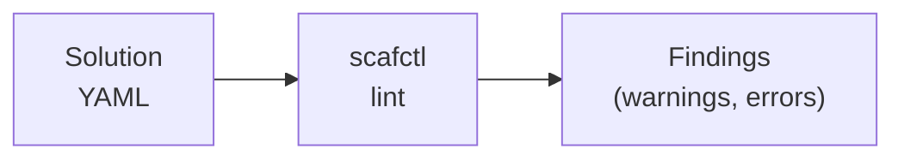

# Linting Tutorial

This tutorial covers using scafctl's lint commands to validate solution files, explore available lint rules, and understand how to fix issues.

## Overview

scafctl includes a built-in linter that checks solution YAML files for:

- **Schema violations** — Invalid field names, wrong types, missing required fields
- **Best practices** — Missing descriptions, unused resolvers, naming conventions
- **Correctness** — Broken resolver references, invalid CEL expressions, circular dependencies



## 1. Linting a Solution

### Basic Lint


{}
```bash
scafctl lint -f solution.yaml
```
{}
{}
```powershell
scafctl lint -f solution.yaml
```
{}


If your solution file is in a well-known location (`solution.yaml`, `scafctl.yaml`, etc. in the current directory or `scafctl/`/`.scafctl/` subdirectories), you can omit `-f`:


{}
```bash
scafctl lint
```
{}
{}
```powershell
scafctl lint
```
{}


Output shows findings in a table with severity, rule, message, and location.

### JSON Output

Get structured results for CI/CD integration:


{}
```bash
scafctl lint -f solution.yaml -o json
```
{}
{}
```powershell
scafctl lint -f solution.yaml -o json
```
{}


```json
{
  "file": "solution.yaml",
  "errorCount": 1,
  "warnCount": 2,
  "infoCount": 0,
  "findings": [
    {
      "rule": "invalid-resolver-ref",
      "severity": "error",
      "message": "Resolver 'config' references undefined resolver 'settings'",
      "location": "spec.resolvers.config"
    }
  ]
}
```

### Quiet Mode

For scripts and CI pipelines — exit code only:


{}
```bash
if scafctl lint -f solution.yaml -o quiet; then
  echo "Lint passed"
else
  echo "Lint failed"
  exit 1
fi
```
{}
{}
```powershell
if (scafctl lint -f solution.yaml -o quiet) {
  Write-Output "Lint passed"
} else {
  Write-Output "Lint failed"
  exit 1
}
```
{}


## 2. Exploring Lint Rules

### List All Rules

See all available lint rules:


{}
```bash
scafctl lint rules
```
{}
{}
```powershell
scafctl lint rules
```
{}


This shows:

| ID | Severity | Category | Description |
|----|----------|----------|-------------|
| missing-description | warning | best-practice | Solution should have a description |
| unused-resolver | warning | correctness | Resolver is defined but never referenced |
| ... | ... | ... | ... |

### Filter by Format


{}
```bash
# JSON output for tooling
scafctl lint rules -o json

# YAML output
scafctl lint rules -o yaml
```
{}
{}
```powershell
# JSON output for tooling
scafctl lint rules -o json

# YAML output
scafctl lint rules -o yaml
```
{}


## 3. Understanding a Rule

Get detailed information about any lint rule:


{}
```bash
scafctl lint explain <rule-id>
```
{}
{}
```powershell
scafctl lint explain <rule-id>
```
{}


For example:


{}
```bash
scafctl lint explain missing-description
```
{}
{}
```powershell
scafctl lint explain missing-description
```
{}


This shows:

- **Description** — What the rule checks
- **Severity** — Error, warning, or info
- **Category** — Which category (e.g., best-practice, correctness, schema)
- **Why it matters** — Why this rule exists
- **How to fix** — Step-by-step fix instructions
- **Examples** — Before/after YAML showing the fix

### JSON Output


{}
```bash
scafctl lint explain missing-description -o json
```
{}
{}
```powershell
scafctl lint explain missing-description -o json
```
{}


## 4. Linting in CI/CD

### GitHub Actions Example

```yaml
- name: Lint solutions
  run: |
    find . -name 'solution.yaml' | while read -r file; do
      if ! scafctl lint -f "$file" -o quiet; then
        echo "FAIL: $file"
        scafctl lint -f "$file"
        exit 1
      fi
    done
```

### Pre-commit Hook


{}
```bash
#!/bin/bash
# .git/hooks/pre-commit
git diff --cached --name-only --diff-filter=ACM | grep 'solution.yaml$' | while read -r file; do
  scafctl lint -f "$file" -o quiet || exit 1
done
```
{}
{}
```powershell
# PowerShell equivalent
# .git/hooks/pre-commit
git diff --cached --name-only --diff-filter=ACM |
  Select-String 'solution.yaml$' |
  ForEach-Object {
    scafctl lint -f $_.Line -o quiet
    if ($LASTEXITCODE -ne 0) { exit 1 }
  }
```
{}


### Task Runner Integration

The project's `taskfile.yaml` includes a `lint:solutions` task that lints all solution examples and integration test solutions:

```bash
task lint:solutions
```

## 5. Common Lint Findings and Fixes

### Missing Description

```yaml
# Before (triggers warning)
metadata:
  name: my-solution
  version: 1.0.0

# After (fixed)
metadata:
  name: my-solution
  version: 1.0.0
  description: "Collects configuration from multiple sources"
```

### Invalid Resolver Reference

```yaml
# Before (triggers error — 'settings' doesn't exist)
resolvers:
  config:
    type: string
    resolve:
      with:
        - provider: cel
          inputs:
            expression: '_.settings.key'

# After (add the missing resolver)
resolvers:
  settings:
    type: object
    resolve:
      with:
        - provider: static
          inputs:
            value:
              key: "value"
  config:
    type: string
    resolve:
      with:
        - provider: cel
          inputs:
            expression: '_.settings.key'
```

### Unknown Fields

```yaml
# Before (triggers error — 'deps' is not a valid field)
resolvers:
  greeting:
    type: string
    deps: [config]  # Wrong! Use 'dependsOn'
    resolve:
      with:
        - provider: static
          inputs:
            value: "hello"

# After (use correct field name)
resolvers:
  greeting:
    type: string
    dependsOn: [config]
    resolve:
      with:
        - provider: static
          inputs:
            value: "hello"
```

### Unreachable Test Path

```yaml
# Before (triggers warning — file doesn't exist)
testing:
  cases:
    my-test:
      files:
        - testdata/config.json   # this file doesn't exist
      command: [render, solution]
      assertions:
        - expression: __exitCode == 0

# After (use correct path, glob, or directory)
testing:
  cases:
    my-test:
      files:
        - testdata/config.yaml     # exact file that exists
        - templates/*.yaml          # glob pattern matching files
        - data/                     # entire directory
      command: [render, solution]
      assertions:
        - expression: __exitCode == 0
```

The `unreachable-test-path` rule detects `files` entries in test cases that reference paths not found on disk and don't match any files via glob expansion. This catches typos and stale references before they cause confusing sandbox setup failures.

For more details:


{}
```bash
scafctl lint explain unreachable-test-path
```
{}
{}
```powershell
scafctl lint explain unreachable-test-path
```
{}


## 6. Using Lint with the MCP Server

When using AI agents (VS Code Copilot, Claude, Cursor), the MCP server exposes lint functionality through:

- **`lint_solution` tool** — Same as `scafctl lint` but returns structured JSON to the AI
- **`explain_lint_rule` tool** — Same as `scafctl lint explain`
- **`validate_expressions` tool** — Validate CEL expressions without running them

The AI agent can lint your solution as part of its workflow — for example, the `debug_solution` and `update_solution` prompts automatically include linting steps.

## Next Steps

- [Eval Tutorial](eval-tutorial.md) — Validate and test expressions
- [Functional Testing Tutorial](functional-testing.md) — Automated solution testing
- [MCP Server Tutorial](mcp-server-tutorial.md) — AI-assisted development with linting
