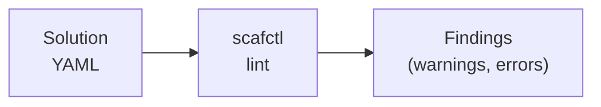

# Linting Tutorial

This tutorial covers using scafctl's lint commands to validate solution files, explore available lint rules, and understand how to fix issues.

## Overview

scafctl includes a built-in linter that checks solution YAML files for:

- **Schema violations** -- Invalid field names, wrong types, missing required fields
- **Best practices** -- Missing descriptions, unused resolvers, naming conventions
- **Correctness** -- Broken resolver references, invalid CEL expressions, circular dependencies


```mermaid
flowchart LR
  A["Solution<br/>YAML"] --> B["scafctl<br/>lint"] --> C["Findings<br/>(warnings, errors)"]
```

> **`lint` is the advisory subset of `validate`.** `scafctl lint` reports
> authoring findings but is not itself the pass/fail gate. When you want a
> single pass/fail gate for CI or pre-commit, use `scafctl validate solution`
> (which runs lint internally: errors fail, warnings surface, `--strict` makes
> warnings fatal). See the [Validation Patterns tutorial](../validation-patterns-tutorial/#the-validate-gate)
> for the gate commands.

## 1. Linting a Solution

### Basic Lint


{}
```bash
scafctl lint -f solution.yaml
```
{}
{}
```powershell
scafctl lint -f solution.yaml
```
{}


If your solution file is in a well-known location (`solution.yaml`, `scafctl.yaml`, etc. in the current directory or `scafctl/`/`.scafctl/` subdirectories), you can omit `-f`:


{}
```bash
scafctl lint
```
{}
{}
```powershell
scafctl lint
```
{}


Output shows findings in a table with severity, rule, message, and location.

### JSON Output

Get structured results for CI/CD integration:


{}
```bash
scafctl lint -f solution.yaml -o json
```
{}
{}
```powershell
scafctl lint -f solution.yaml -o json
```
{}


```json
{
  "file": "solution.yaml",
  "errorCount": 1,
  "warnCount": 2,
  "infoCount": 0,
  "findings": [
    {
      "rule": "invalid-resolver-ref",
      "severity": "error",
      "message": "Resolver 'config' references undefined resolver 'settings'",
      "location": "spec.resolvers.config"
    }
  ]
}
```

### Quiet Mode

For scripts and CI pipelines -- exit code only:


{}
```bash
if scafctl lint -f solution.yaml -o quiet; then
  echo "Lint passed"
else
  echo "Lint failed"
  exit 1
fi
```
{}
{}
```powershell
if (scafctl lint -f solution.yaml -o quiet) {
  Write-Output "Lint passed"
} else {
  Write-Output "Lint failed"
  exit 1
}
```
{}


## 2. Exploring Lint Rules

### List All Rules

See all available lint rules:


{}
```bash
scafctl lint rules
```
{}
{}
```powershell
scafctl lint rules
```
{}


This shows:

| ID | Severity | Category | Description |
|----|----------|----------|-------------|
| missing-description | warning | best-practice | Solution should have a description |
| unused-resolver | warning | correctness | Resolver is defined but never referenced |
| parameter-numeric-matches | warning | type-inference | Numeric `parameter` default without an explicit `type` is used with `matches()`, which fails at runtime because inference coerces it to an integer |
| deferred-validation-not-fail-fast | info | validation | Resolver has a cross-resolver validation rule that runs in the deferred phase rather than failing fast |
| ... | ... | ... | ... |

### Filter by Format


{}
```bash
# JSON output for tooling
scafctl lint rules -o json

# YAML output
scafctl lint rules -o yaml
```
{}
{}
```powershell
# JSON output for tooling
scafctl lint rules -o json

# YAML output
scafctl lint rules -o yaml
```
{}


## 3. Understanding a Rule

Get detailed information about any lint rule:


{}
```bash
scafctl lint rule <rule-id>
```
{}
{}
```powershell
scafctl lint rule <rule-id>
```
{}


For example:


{}
```bash
scafctl lint rule missing-description
```
{}
{}
```powershell
scafctl lint rule missing-description
```
{}


> **Migration note:** the older `scafctl lint explain <rule-id>` command still
> works as a hidden, deprecated alias for `scafctl lint rule <rule-id>`. Prefer
> `lint rule` in new scripts.

This shows:

- **Description** -- What the rule checks
- **Severity** -- Error, warning, or info
- **Category** -- Which category (e.g., best-practice, correctness, schema)
- **Why it matters** -- Why this rule exists
- **How to fix** -- Step-by-step fix instructions
- **Examples** -- Before/after YAML showing the fix

### JSON Output


{}
```bash
scafctl lint rule missing-description -o json
```
{}
{}
```powershell
scafctl lint rule missing-description -o json
```
{}


### Example: Catching `.orValue()` on a Concrete Value

Some rules catch subtle bugs that pass a plain syntax check but fail at runtime.
The `orvalue-on-non-optional` rule (severity: error) flags `.orValue(...)` calls on
a provably non-optional receiver, such as a plain identifier or a field-access chain:

```yaml
# Triggers orvalue-on-non-optional: __self is concrete, not optional.
transform:
  with:
    - provider: cel
      inputs:
        expression: '__self.orValue([])'
```

`orValue()` only has an overload on CEL optional types, so calling it on a concrete
value has no matching overload and fails at runtime even though the expression parses.
This commonly happens when an optional marker (`.?`) is dropped during editing. Fix it
by making the receiver optional, or by removing `.orValue(...)` and supplying the
fallback another way:

```yaml
# Fixed: optional access makes orValue() apply.
transform:
  with:
    - provider: cel
      inputs:
        expression: '_.?items.orValue([])'
```

Explain the rule for full guidance:


{}
```bash
scafctl lint rule orvalue-on-non-optional
```
{}
{}
```powershell
scafctl lint rule orvalue-on-non-optional
```
{}


### Example: Catching Deprecated Fields

The linter also flags fields that have been superseded by a newer field. The
`deprecated-field` rule (severity: warning) reports each deprecated field still
in use and names its replacement, while `deprecated-field-conflict` (severity:
error) fires when both the deprecated field and its replacement are set on the
same object.

For example, the `onError` enum on resolver sources, transforms, and actions is
deprecated in favor of `continueOnError`:

```yaml
# Triggers deprecated-field: onError is deprecated, use continueOnError.
resolve:
  with:
    - provider: http
      onError: continue
      inputs:
        url: https://config.example.com/settings
    - provider: static
      inputs:
        value: { debug: false }
```

Migrate `onError: continue` to `continueOnError: true` and `onError: fail` to
`continueOnError: false`:

```yaml
# Fixed: continueOnError replaces the deprecated onError enum.
resolve:
  with:
    - provider: http
      continueOnError: true
      inputs:
        url: https://config.example.com/settings
    - provider: static
      inputs:
        value: { debug: false }
```

Setting both at once triggers the `deprecated-field-conflict` error. At runtime
`continueOnError` wins and the deprecated `onError` is silently ignored, so the
linter forces you to remove one:

```yaml
# Triggers deprecated-field-conflict: remove onError, keep continueOnError.
- provider: http
  onError: continue
  continueOnError: true
  inputs:
    url: https://config.example.com/settings
```

Explain either rule for full guidance:


{}
```bash
scafctl lint rule deprecated-field
scafctl lint rule deprecated-field-conflict
```
{}
{}
```powershell
scafctl lint rule deprecated-field
scafctl lint rule deprecated-field-conflict
```
{}


## 4. Linting in CI/CD

### GitHub Actions Example

```yaml
- name: Lint solutions
  run: |
    find . -name 'solution.yaml' | while read -r file; do
      if ! scafctl lint -f "$file" -o quiet; then
        echo "FAIL: $file"
        scafctl lint -f "$file"
        exit 1
      fi
    done
```

### Pre-commit Hook


{}
```bash
#!/bin/bash
# .git/hooks/pre-commit
git diff --cached --name-only --diff-filter=ACM | grep 'solution.yaml$' | while read -r file; do
  scafctl lint -f "$file" -o quiet || exit 1
done
```
{}
{}
```powershell
# PowerShell equivalent
# .git/hooks/pre-commit
git diff --cached --name-only --diff-filter=ACM |
  Select-String 'solution.yaml$' |
  ForEach-Object {
    scafctl lint -f $_.Line -o quiet
    if ($LASTEXITCODE -ne 0) { exit 1 }
  }
```
{}


### Task Runner Integration

The project's `taskfile.yaml` includes a `lint:solutions` task that lints all solution examples and integration test solutions:

```bash
task lint:solutions
```

## 5. Common Lint Findings and Fixes

### Missing Description

```yaml
# Before (triggers warning)
metadata:
  name: my-solution
  version: 1.0.0

# After (fixed)
metadata:
  name: my-solution
  version: 1.0.0
  description: "Collects configuration from multiple sources"
```

### Invalid Resolver Reference

```yaml
# Before (triggers error -- 'settings' doesn't exist)
resolvers:
  config:
    type: string
    resolve:
      with:
        - provider: cel
          inputs:
            expression: '_.settings.key'

# After (add the missing resolver)
resolvers:
  settings:
    type: object
    resolve:
      with:
        - provider: static
          inputs:
            value:
              key: "value"
  config:
    type: string
    resolve:
      with:
        - provider: cel
          inputs:
            expression: '_.settings.key'
```

### Unknown Fields

```yaml
# Before (triggers error -- 'deps' is not a valid field)
resolvers:
  greeting:
    type: string
    deps: [config]  # Wrong! Use 'dependsOn'
    resolve:
      with:
        - provider: static
          inputs:
            value: "hello"

# After (use correct field name)
resolvers:
  greeting:
    type: string
    dependsOn: [config]
    resolve:
      with:
        - provider: static
          inputs:
            value: "hello"
```

### Unreachable Test Path

```yaml
# Before (triggers warning -- file doesn't exist)
testing:
  cases:
    my-test:
      files:
        - testdata/config.json   # this file doesn't exist
      command: [render, solution]
      assertions:
        - expression: __exitCode == 0

# After (use correct path, glob, or directory)
testing:
  cases:
    my-test:
      files:
        - testdata/config.yaml     # exact file that exists
        - templates/*.yaml          # glob pattern matching files
        - data/                     # entire directory
      command: [render, solution]
      assertions:
        - expression: __exitCode == 0
```

The `unreachable-test-path` rule detects `files` entries in test cases that reference paths not found on disk and don't match any files via glob expansion. This catches typos and stale references before they cause confusing sandbox setup failures.

For more details:


{}
```bash
scafctl lint rule unreachable-test-path
```
{}
{}
```powershell
scafctl lint rule unreachable-test-path
```
{}


## 6. Hyphenated Resolver Names

The `hyphenated-name` rule warns when resolver names contain hyphens. While valid YAML, hyphens require quoting in CEL expressions:

```yaml
# WARNING: hyphenated names require quoting in CEL
spec:
  resolvers:
    my-service-name:
      resolve:
        with:
          - provider: static
            inputs:
              value: hello

    otherResolver:
      dependsOn: [my-service-name]
      resolve:
        with:
          - provider: cel
            inputs:
              # Must quote: _["my-service-name"] instead of _.my_service_name
              expression: '_["my-service-name"]'
```

**Fix**: Use camelCase for CEL-friendly access:

```yaml
spec:
  resolvers:
    myServiceName:  # Can use _.myServiceName in CEL
      resolve:
        with:
          - provider: static
            inputs:
              value: hello
```

This is a **warning**-level finding (not an error) because hyphenated names are valid -- they just require bracket notation in CEL expressions.

## 7. Redundant dependsOn

The `redundant-depends-on` rule detects when a resolver's `dependsOn` entries are already auto-inferred from value references. scafctl automatically infers dependencies from `expr:`, `rslvr:`, and `tmpl:` references -- explicit `dependsOn` is only needed for pure ordering dependencies (where a resolver must wait for another without referencing its value).

```yaml
# INFO: dependsOn is redundant -- all listed dependencies are already inferred
spec:
  resolvers:
    registry:
      resolve:
        with:
          - provider: static
            inputs:
              value: docker.io

    namespace:
      resolve:
        with:
          - provider: static
            inputs:
              value: myteam

    imageRef:
      dependsOn: [registry, namespace]  # Redundant! Inferred from expr below
      resolve:
        with:
          - provider: cel
            inputs:
              expression:
                expr: '_.registry + "/" + _.namespace + "/app"'
```

**Fix**: Remove the `dependsOn` field -- the dependencies are already inferred from the `expr:` reference to `_.registry` and `_.namespace`:

```yaml
    imageRef:
      resolve:
        with:
          - provider: cel
            inputs:
              expression:
                expr: '_.registry + "/" + _.namespace + "/app"'
```

Only keep explicit `dependsOn` for ordering without a data dependency:

```yaml
    deploy:
      dependsOn: [setup]  # Must wait for setup, but doesn't read its value
      resolve:
        with:
          - provider: exec
            inputs:
              command: deploy.sh
```

## 8. Missing Fallback Source

The `missing-fallback-source` rule warns when all sources in a resolver's `resolve.with` have `when` conditions, leaving no unconditional fallback. If none of the conditions are met at runtime, the resolver fails with "no sources produced a value".

```yaml
# WARNING: all resolve sources have 'when' conditions with no unconditional fallback
spec:
  resolvers:
    endpoint:
      resolve:
        with:
          - provider: static
            when:
              expr: '_.environment == "prod"'
            inputs:
              value: https://api.prod.example.com
          - provider: static
            when:
              expr: '_.environment == "staging"'
            inputs:
              value: https://api.staging.example.com
```

If `_.environment` is `"dev"`, neither condition matches and the resolver fails.

**Fix**: Add an unconditional source as a fallback (typically at the end):

```yaml
    endpoint:
      resolve:
        with:
          - provider: static
            when:
              expr: '_.environment == "prod"'
            inputs:
              value: https://api.prod.example.com
          - provider: static
            when:
              expr: '_.environment == "staging"'
            inputs:
              value: https://api.staging.example.com
          - provider: static
            inputs:
              value: https://api.dev.example.com
```

The unconditional source acts as a default when no other condition is satisfied.

## 9. Transform Shape Mismatch

The `transform-shape-mismatch` rule warns when a transform step accesses provider-specific fields (like `__self.body`) but the resolve chain includes a fallback that produces a different shape. When the fallback path is taken at runtime, the transform will fail because the expected fields don't exist.

```yaml
# WARNING: transform accesses '__self.body' but static fallback produces []
spec:
  resolvers:
    api_data:
      description: Fetch data from API with empty fallback
      resolve:
        with:
          - provider: http
            when:
              expr: 'has(_.credentials)'
            inputs:
              url: https://api.example.com/data
          - provider: static
            inputs:
              value: []
      transform:
        with:
          - provider: cel
            inputs:
              expression: '__self.body.items'
```

When `_.credentials` is not set, the static fallback returns `[]` (an array). The transform then tries to access `__self.body` on an array, which fails.

**Fix**: Add a `when` guard to the transform step so it only runs when the structured shape is present:

```yaml
      transform:
        with:
          - provider: cel
            when:
              expr: 'type(__self) != list_type'
            inputs:
              expression: '__self.body.items'
```

Or use `has()` to check for the field:

```yaml
      transform:
        with:
          - provider: cel
            when:
              expr: 'type(__self) == map_type && has(__self.body)'
            inputs:
              expression: '__self.body.items'
```

For more details:


{}
```bash
scafctl lint rule transform-shape-mismatch
```
{}
{}
```powershell
scafctl lint rule transform-shape-mismatch
```
{}


## 10. Resolver Cycles

The `resolver-cycle` rule detects circular dependencies in the resolver dependency graph. Cycles prevent the DAG scheduler from ordering resolvers and always cause runtime failures.

```yaml
# ERROR: circular dependency detected
spec:
  resolvers:
    alpha:
      dependsOn: [beta]
      resolve:
        with:
          - provider: static
            inputs:
              value: a

    beta:
      dependsOn: [alpha]
      resolve:
        with:
          - provider: static
            inputs:
              value: b
```

The cycle `alpha -> beta -> alpha` means neither resolver can run first.

**Fix**: Break the cycle by reordering or removing one of the dependencies so the
references flow in one direction.

```yaml
spec:
  resolvers:
    alpha:
      resolve:
        with:
          - provider: parameter
            inputs:
              key: inputA

    beta:
      dependsOn: [alpha]
      resolve:
        with:
          - provider: cel
            inputs:
              expression:
                expr: '_.alpha + "-derived"'
```

> **Note**: Only `resolve`, `transform`, and `when:` references create resolution
> edges. A cross-resolver reference inside a `validate` block no longer causes a
> cycle -- it is handled by [deferred validation](../design/two-phase-validation.md).
> The old workaround of extracting cross-resolver validation into a dedicated
> "sink" resolver is no longer needed.

This is an **error**-level finding because cycles always prevent execution.

For more details:


{}
```bash
scafctl lint rule resolver-cycle
```
{}
{}
```powershell
scafctl lint rule resolver-cycle
```
{}


## 11. Missing Template Dependencies

The `missing-template-dependency` rule checks render-tree resolvers that process external template files. If a template file references a resolver name (e.g., `{{ .appName }}`) that isn't in the render-tree resolver's dependency graph, the lint warns you. Discovery is **role-based, not extension-based**: any file reached via `bundle.include` or a directory provider is treated as a go-template source, so references inside non-standard extensions (`.tf`, `.yaml`, and others -- not just `.tpl`/`.tmpl`/`.gotmpl`) are still detected.

```yaml
# WARNING: render-tree resolver 'rendered' uses template files that reference
# resolver 'port', but 'port' is not in its dependency graph
spec:
  resolvers:
    appName:
      resolve:
        with:
          - provider: static
            inputs:
              value: my-app

    port:
      resolve:
        with:
          - provider: static
            inputs:
              value: "8080"

    templateFiles:
      resolve:
        with:
          - provider: directory
            inputs:
              operation: list
              path: templates
              recursive: true
              filterGlob: "*.tpl"
              includeContent: true

    rendered:
      dependsOn: [templateFiles, appName]  # Missing 'port'!
      resolve:
        with:
          - provider: go-template
            inputs:
              operation: render-tree
              entries:
                expr: '_.templateFiles.entries'
              data:
                rslvr: _
```

If `templates/main.tpl` contains `{{ .appName }} on port {{ .port }}`, the `port` resolver may not be resolved before the template renders, causing a "map has no entry for key" error at runtime.

**Fix**: Add the missing resolver to `dependsOn`:

```yaml
    rendered:
      dependsOn: [templateFiles, appName, port]
      resolve:
        with:
          - provider: go-template
            inputs:
              operation: render-tree
              entries:
                expr: '_.templateFiles.entries'
              data:
                rslvr: _
```

This is a **warning**-level finding. The linter scans template files on disk to discover references that the DAG cannot auto-detect from the solution YAML alone.

For more details:


{}
```bash
scafctl lint rule missing-template-dependency
```
{}
{}
```powershell
scafctl lint rule missing-template-dependency
```
{}


## 12. Suppressing Findings

When a finding is a deliberate, reviewed exception, you can suppress it with an
inline YAML comment directive instead of disabling the rule globally. Directives
are read directly from the solution file, so they travel with the code they
annotate.

### Ignore a Single Location

`# scafctl-lint-ignore` suppresses findings on the next line. Placed as an inline
comment, it suppresses findings on its own line:

```yaml
spec:
  resolvers:
    # scafctl-lint-ignore: missing-description
    api_data:
      resolve:
        with:
          - provider: http
            inputs:
              url: https://api.example.com/data # scafctl-lint-ignore: insecure-url
```

Without a rule list (`# scafctl-lint-ignore`) the directive suppresses **all**
rules at that location. With a comma-separated list
(`# scafctl-lint-ignore: rule-a, rule-b`) it only suppresses the named rules.

### Block-Scoped Suppression

When the directive annotates a YAML block key (such as `transform:`), it
suppresses matching findings anywhere inside that block -- even when the
finding's reported line is deeper than the directive. This is handy for rules
like `transform-shape-mismatch` whose finding points at a nested step:

```yaml
spec:
  resolvers:
    api_data:
      resolve:
        with:
          - provider: http
            inputs:
              url: https://api.example.com/data
          - provider: static
            inputs:
              value: []
      # scafctl-lint-ignore: transform-shape-mismatch
      transform:
        with:
          - provider: cel
            inputs:
              expression: '__self.body.items'
```

The same works inline on the block key:

```yaml
      transform: # scafctl-lint-ignore: transform-shape-mismatch
```

### Disable a Range or a Whole File

Use a `disable`/`enable` pair to suppress findings across a range of lines, or
`disable-file` to suppress them for the entire file:

```yaml
# scafctl-lint-disable: missing-description
spec:
  resolvers:
    a: { resolve: { with: [{ provider: static, inputs: { value: 1 } }] } }
    b: { resolve: { with: [{ provider: static, inputs: { value: 2 } }] } }
# scafctl-lint-enable: missing-description
```

```yaml
# scafctl-lint-disable-file: unused-resolver
```

| Directive | Scope |
|-----------|-------|
| `# scafctl-lint-ignore[: rules]` | Next line (or current line when inline); block-scoped when on a block key |
| `# scafctl-lint-disable[: rules]` | From this line until a matching `enable` (or end of file) |
| `# scafctl-lint-enable[: rules]` | Ends a preceding `disable` block |
| `# scafctl-lint-disable-file[: rules]` | The entire file |

> **Tip:** Prefer a narrow `scafctl-lint-ignore` on the exact line or block over
> `disable-file`. Targeted suppressions keep the rest of the file linted and make
> the intent obvious to reviewers.

## 13. Using Lint with the MCP Server

When using AI agents (VS Code Copilot, Claude, Cursor), the MCP server exposes lint functionality through:

- **`lint_solution` tool** -- Same as `scafctl lint` but returns structured JSON to the AI
- **`explain_lint_rule` tool** -- Same as `scafctl lint rule`
- **`validate_expressions` tool** -- Validate CEL expressions without running them

The AI agent can lint your solution as part of its workflow -- for example, the `debug_solution` and `update_solution` prompts automatically include linting steps.

## Next Steps

- [Eval Tutorial](eval-tutorial.md) -- Validate and test expressions
- [Functional Testing Tutorial](functional-testing.md) -- Automated solution testing
- [MCP Server Tutorial](mcp-server-tutorial.md) -- AI-assisted development with linting
