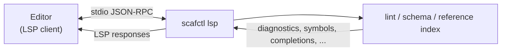

# Language Server (LSP) Tutorial

This tutorial covers `scafctl lsp`, which runs a Language Server Protocol (LSP)
server so editors get a full authoring experience for solution files -- live
diagnostics, navigation, rename, an outline, hover, completion, signature help,
and quick fixes -- all consistent with the `scafctl` CLI.

## Overview

`scafctl lsp` speaks LSP over stdin/stdout. An editor / LSP client launches it,
sends the documents you open and edit, and the server answers requests. It is
not meant to be run interactively -- stdout is the JSON-RPC channel.



Everything the server surfaces comes from the same sources the CLI already uses
-- the `lint` engine, the positioned reference index (`refindex`), the generated
solution schema, and the built-in function registries -- so the editor never
disagrees with `scafctl lint`, `scafctl refactor`, or the schema. The bundled VS
Code extension is a thin client over this server; the gestures below are written
for it, but any LSP client exposes the same capabilities.

## Diagnostics

On open/change/save the server lints the in-memory document and reports each
finding (severity, message, rule name) at its source location, using the same
engine as `scafctl lint` -- so what you see in the editor matches the CLI.

_Try:_ reference an undefined resolver in a `_.` expression; the unknown-resolver
diagnostic appears inline as you type, exactly as `scafctl lint` would report it.

## Navigation and rename

Resolver, action, call, and function references are navigable and support
renaming, reusing the same reference index and rename engine as
`scafctl refactor rename`:

- **Go to definition** on a reference jumps to where it is defined.
- **Find all references** lists every use of a resolver, action, call, or function.
- **Rename** updates a symbol's definition and every reference in one edit. If any
  reference cannot be located, the rename is refused (the editor shows the error)
  rather than applying a partial, solution-breaking change.

_Try:_ put the cursor on a resolver name and press F2 (Rename) -- every `_.name`,
`rslvr: name`, and `dependsOn` entry updates together; or F12 (Go to Definition)
on a reference to jump to its declaration.

## Outline

`textDocument/documentSymbol` returns a hierarchy -- a `spec` root whose children
are the `resolvers`, `actions`, `calls`, and `functions` groups, each listing its
symbols.

_Try:_ open the Outline pane, or press Cmd/Ctrl+Shift+O to fuzzy-jump to any
resolver, action, call, or function; the breadcrumb bar tracks your position.

## Hover

Hovering a symbol shows contextual markdown pulled from the sources the CLI
already knows about -- no separate documentation to maintain:

- **Resolver / action / call / function reference** -> its kind, name, and
  `description` from the solution.
- **Provider name** (a `provider:` value) -> the provider's description and a
  summary of its input schema (each input's name, type, whether it is required,
  and its doc), straight from the provider descriptor.
- **CEL / template function** -> the function's signature (CEL), description, and
  a usage example, from the built-in function registries (the same catalog
  `scafctl` uses everywhere else).
- **Mapping key** -> the schema documentation for that field, plus a related
  concept summary when one matches.

Hover degrades gracefully: on an unknown target, a parse error, or whitespace it
simply returns nothing, so it never interrupts editing.

_Try:_ hover a `provider:` value to read its inputs, or a `_.name` reference to
read the target resolver's description.

## Completion

As you type, the server offers completions from the schema and the reference
index:

- **Keys** -- typing a key under a known path offers the valid child keys from the
  generated solution schema (e.g. under a resolver: `description`, `resolve`,
  `dependsOn`, ...; under a provider entry: `provider`, `inputs`, `onError`, ...),
  filtered by what you have typed. Each suggestion carries its type and field
  documentation.
- **Enum values** -- an enum-valued field (`onError`, `backoff`,
  `resultSchemaMode`, `scope`) offers its allowed values.
- **Functions** -- inside a CEL expression the server offers CEL functions (with
  their signatures); inside a `{{ }}` template it offers Go-template functions and
  the solution's own author-defined helpers (`spec.functions`). Each is inserted
  as a call snippet with the cursor at the first argument, using the syntax valid
  for that context: a parenthesized call in CEL (`name($0)`) and a space-separated
  call in templates (`name $0`, since `name()` is not valid template syntax).
- **Symbols** -- scafctl-specific name completion no generic YAML tool can offer,
  drawn from the document's reference index: after `_.` (CEL) or `._.` (template)
  it offers **resolver** names (and `__actions.` / `.__actions.` offers **action**
  names); a `call:` value offers **call** names; a `rslvr:` value offers
  **resolver** names; and a `dependsOn:` list item offers **resolver** names (in a
  resolver) or **action** names (in an action). An action `dependsOn` is scoped to
  the action's own workflow section -- an `actions` entry offers only `actions`
  names and a `finally` entry only `finally` names -- matching what validation
  allows, so a suggestion never produces a cross-section error. Only defined
  symbols are suggested.

Completion is triggered on `.`, `:`, and space. Structural key, enum-value, and
CEL/template function completion work mid-edit even while the document does not
yet parse (the container is inferred from indentation). Symbol completion is
sourced from the reference index, so it becomes available once the solution model
builds; while the document does not yet parse it simply offers nothing rather
than erroring.

_Try:_ on a new line under a resolver, type `de` and accept `description`; or in a
`value:` expression type `_.` to pick a resolver by name.

## Signature help

While typing a call's arguments the server shows the declared parameters and
highlights the one at the cursor:

- **CEL function** (`arrays.groupBy(...)`) -- the function's signature, with the
  active parameter tracking the comma-separated position.
- **Go-template function** (`{{ greet ... }}`) -- an author-defined helper's
  declared parameters (`spec.functions[name].params`), tracked by space-separated
  position; a built-in template function shows its name and description.
- **Call args** -- inside a call invocation's `args:` block, the invoked call's
  declared arguments (`spec.calls[name].args`), highlighting the argument on the
  current line.

Signature help is triggered on `(` and space, and re-triggered on `,` so the
highlighted parameter follows the cursor as you move between CEL arguments.

_Try:_ type `arrays.groupBy(` in a `value:` expression -- the parameter list pops
up and the active parameter advances as you type past each comma.

## Quick fixes

`textDocument/codeAction` turns certain lint diagnostics into one-click fixes (the
editor's lightbulb), reusing the same fix logic (`lint.QuickFixFor`) so the
applied edit always matches what the linter would recommend:

- **deprecated field** -- replaces the deprecated `onError` field with its
  successor `continueOnError`, translating the value (`onError: continue` becomes
  `continueOnError: true`, and `onError: fail` becomes `continueOnError: false`).
- **redundant dependsOn** -- removes the redundant `dependsOn` entry (or the whole
  `dependsOn:` block when every listed dependency is already inferred from value
  references).
- **unused resolver** -- removes the entire unreferenced resolver block.

For example, given a resolve source with the deprecated field:

~~~yaml
resolve:
  with:
    - provider: parameter
      onError: continue   # deprecated-field diagnostic here
      inputs:
        value: dev
~~~

invoking the quick fix rewrites just that line to `continueOnError: true`, leaving
surrounding formatting and comments untouched.

_Try:_ place the cursor on a line with a fixable diagnostic and trigger Quick Fix
(Cmd/Ctrl+.); accept the suggested edit.

## Non-goals

Some editor capabilities are deliberately **not** provided by `scafctl lsp`,
because a solution file is YAML and the ecosystem already handles them well.
Layering on top of the built-in YAML support (rather than owning the buffer) is
the same approach GitHub Actions and other YAML-based tools take:

- **Formatting** (`textDocument/formatting`) -- left to the Red Hat YAML extension
  or Prettier. The server never rewrites whitespace/layout wholesale; its edits
  (rename, quick fixes) are surgical and preserve surrounding formatting.
- **Folding ranges** -- the editor's generic YAML support already folds by
  indentation.
- **Semantic tokens** -- the YAML grammar already colors the file; scafctl's value
  is semantic _navigation and validation_, not re-coloring tokens.
- **Inlay hints** -- omitted to avoid visual noise; the same information (types,
  parameters, descriptions) is available on demand via hover and signature help.

These are intentional: keeping them out preserves the other extensions' features
on the same file and keeps the server focused on what only scafctl can know.

## Generative actions & commands

Beyond quick fixes, `textDocument/codeAction` also offers **generative and
refactor actions**. Two of them are backed by the server's
`workspace/executeCommand` infrastructure: the code action carries a _command_
(not an inline edit); the editor collects a little input, then invokes the
server command, which computes the source-preserving edit and applies it via a
`workspace/applyEdit` request.

- **Create missing resolver** (quick fix) -- offered on an
  `unknown-resolver-reference` diagnostic (e.g. a `_.doesNotExist` reference with
  no matching resolver). It inserts a minimal stub resolver of that name under
  `spec.resolvers` as a direct edit (no prompt):

  ~~~yaml
  doesNotExist:
    resolve:
      with:
        - provider: static
          inputs:
            value: ""
  ~~~

- **Extract to call...** (refactor.extract) -- offered when the cursor is inside a
  direct provider step (a `resolve`/`transform`/`validate` `with[i]` step that is
  not already a `call:`). The editor prompts for a new call name, then runs the
  `scafctl.applyExtractCall` server command, which delegates to the
  `refactor.ExtractCall` engine to hoist the step into a reusable `spec.calls`
  definition and rewrite the step to `call: <name>`.

- **Add resolver...** (source) -- always available on a parsed document. The
  editor prompts for a resolver name and a provider (quick-pick), then runs the
  `scafctl.applyAddResolver` server command, which inserts a stub resolver under
  `spec.resolvers`.

The server advertises the two server-side commands
(`scafctl.applyExtractCall`, `scafctl.applyAddResolver`) in its
`executeCommandProvider` capability. The editor extension registers the two
client-side prompt commands (`scafctl.extractToCall`, `scafctl.addResolver`)
that the refactor/source code actions reference. The split keeps user
interaction (prompts, quick-picks) in the editor while all edit computation
stays in the server.

## Trying it by hand

You normally never run the server directly, but you can confirm it starts:

```bash
scafctl lsp --help
```

An LSP client drives it with framed JSON-RPC messages (`initialize`, then
`textDocument/didOpen`, `didChange`, `didClose`, and requests like
`textDocument/hover` or `textDocument/completion`). On `didOpen`/`didChange` the
server responds with a `textDocument/publishDiagnostics` notification containing
any lint findings for that document.

## Configuring an editor

The exact steps depend on the editor's LSP client, but the shape is always the
same:

1. Point the client at the `scafctl lsp` command (the server process). Clients
   that pass a transport flag by convention can use `scafctl lsp --stdio`; it is
   accepted as a no-op since stdio is the only transport.
2. Attach it to the solution files scafctl recognizes. To avoid hardcoding a file
   list that drifts from CLI discovery, ask the binary which files it
   auto-discovers:

   ~~~bash
   scafctl lsp document-selectors -o json
   ~~~

   This reports the recognized file names partitioned by editor language --
   `solution.{yaml,yml,json}`, `<binary>.{yaml,yml,json}`, `taskfile.{yaml,yml}`,
   and `actions.{yaml,yml}` -- along with the effective binary name. JSON
   solutions are listed separately so the client attaches them as JSON (not YAML)
   documents.
3. Open a `solution.yaml` (or `solution.json`, `taskfile.yaml`, ...) -- diagnostics
   appear inline and the other features activate as you edit.

The bundled VS Code extension does this automatically: it queries
`scafctl lsp document-selectors` at startup and builds its document selector from
the result, so it always matches CLI auto-discovery -- including any embedder
binary name. Users can add globs for non-standard file names via the
`scafctl.solutionFilePatterns` setting.

Because the server reuses the CLI's `lint` engine, schema, and reference index, no
separate configuration is needed to keep the editor and CLI consistent.

## What's next

The server covers resolvers, actions, functions, and calls across diagnostics,
navigation, rename, outline, hover, completion (keys, enum values, functions, and
symbols), signature help, and quick fixes. Candidate future additions -- e.g. code
lens (run/preview affordances) and generative code actions -- would build on the
same reference index and cursor resolver; the deliberate exclusions are recorded
in [Non-goals](#non-goals).

## See also

- [Linting Tutorial](linting-tutorial.md) -- the diagnostics engine behind the server
- [Refactoring Tutorial](refactor-tutorial.md) -- the reference index and rename engine the server reuses
