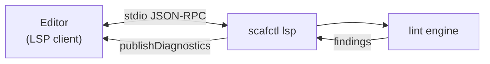

# Language Server (LSP) Tutorial

This tutorial covers `scafctl lsp`, which runs a Language Server Protocol (LSP)
server so editors can surface solution diagnostics as you type.

## Overview

`scafctl lsp` speaks LSP over stdin/stdout. An editor / LSP client launches it,
sends the documents you open and edit, and the server replies with diagnostics.
It is not meant to be run interactively -- stdout is the JSON-RPC channel.



Today the server publishes **lint diagnostics**: on open/change/save it lints
the in-memory document and reports each finding (severity, message, rule name)
at its source location, using the same engine as `scafctl lint` -- so what you
see in the editor matches the CLI.

It also supports resolver, action, call, and function **navigation and rename**,
reusing the same reference index and rename engine as `scafctl refactor rename`:

- **Go to definition** on a resolver, action, call, or function reference jumps
  to where it is defined.
- **Find all references** lists every use of a resolver, action, call, or
  function.
- **Rename** any of them updates its definition and every reference in one edit.
  If any reference cannot be located, the rename is refused (the editor shows the
  error) rather than applying a partial, solution-breaking change.

## Trying it by hand

You normally never run the server directly, but you can confirm it starts:

```bash
scafctl lsp --help
```

An LSP client drives it with framed JSON-RPC messages (`initialize`, then
`textDocument/didOpen`, `didChange`, `didClose`). On `didOpen`/`didChange` the
server responds with a `textDocument/publishDiagnostics` notification containing
any lint findings for that document.

## Configuring an editor

The exact steps depend on the editor's LSP client, but the shape is always the
same:

1. Point the client at the `scafctl lsp` command (the server process).
2. Associate it with the solution file language (YAML).
3. Open a `solution.yaml` -- diagnostics appear inline as you edit.

Because the server reuses the CLI's `lint` engine, no separate configuration is
needed to keep editor and CLI diagnostics consistent.

## What's next

Navigation and rename currently cover resolvers. Planned additions extend the
same reference index to actions, functions, and calls, and add hover and
completion.

## See also

- [Linting Tutorial](linting-tutorial.md) -- the diagnostics engine behind the server
- [Refactoring Tutorial](refactor-tutorial.md) -- the reference index future LSP features will reuse
