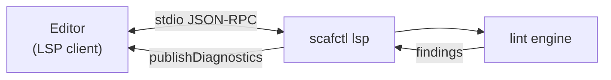

# Language Server (LSP) Tutorial

This tutorial covers `scafctl lsp`, which runs a Language Server Protocol (LSP)
server so editors can surface solution diagnostics as you type.

## Overview

`scafctl lsp` speaks LSP over stdin/stdout. An editor / LSP client launches it,
sends the documents you open and edit, and the server replies with diagnostics.
It is not meant to be run interactively -- stdout is the JSON-RPC channel.



Today the server publishes **lint diagnostics**: on open/change/save it lints
the in-memory document and reports each finding (severity, message, rule name)
at its source location, using the same engine as `scafctl lint` -- so what you
see in the editor matches the CLI.

It also supports resolver, action, call, and function **navigation and rename**,
reusing the same reference index and rename engine as `scafctl refactor rename`:

- **Go to definition** on a resolver, action, call, or function reference jumps
  to where it is defined.
- **Find all references** lists every use of a resolver, action, call, or
  function.
- **Rename** any of them updates its definition and every reference in one edit.
  If any reference cannot be located, the rename is refused (the editor shows the
  error) rather than applying a partial, solution-breaking change.

It also provides a **document outline**. `textDocument/documentSymbol` returns a
hierarchy -- a `spec` root whose children are the `resolvers`, `actions`,
`calls`, and `functions` groups, each listing its symbols -- so the editor's
Outline pane and breadcrumbs populate and **Go to Symbol in File**
(Cmd/Ctrl+Shift+O) fuzzy-jumps to any resolver, action, call, or function.

## Hover

Hovering the cursor over a symbol shows contextual markdown pulled from the same
sources the CLI already knows about -- no separate documentation to maintain:

- **Resolver / action / call / function reference** -> its kind, name, and
  `description` from the solution.
- **Provider name** (a `provider:` value) -> the provider's description and a
  summary of its input schema (each input's name, type, whether it is required,
  and its doc), straight from the provider descriptor.
- **CEL / template function** -> the function's signature (CEL), description, and
  a usage example, from the built-in function registries (the same set the
  `list_cel_functions` / `list_go_template_functions` MCP tools report).
- **Mapping key** -> the schema documentation for that field, plus a related
  concept summary when one matches.

Hover degrades gracefully: on an unknown target, a parse error, or whitespace it
simply returns nothing, so it never interrupts editing.

## Completion

As you type, the server offers **schema-driven structural completions**:

- **Keys** -- typing a key under a known path offers the valid child keys from the
  generated solution schema (e.g. under a resolver: `description`, `resolve`,
  `dependsOn`, ...; under a provider entry: `provider`, `inputs`, `onError`, ...),
  filtered by what you have typed. Each suggestion carries its type and field
  documentation.
- **Enum values** -- an enum-valued field (`onError`, `backoff`,
  `resultSchemaMode`, `scope`) offers its allowed values.
- **Functions** -- inside a CEL expression the server offers CEL functions (with
  their signatures); inside a `{{ }}` template it offers Go-template functions and
  the solution's own author-defined helpers (`spec.functions`). Each is inserted
  as a call snippet with the cursor at the first argument, using the syntax valid
  for that context: a parenthesized call in CEL (`name($0)`) and a space-separated
  call in templates (`name $0`, since `name()` is not valid template syntax).
- **Symbols** -- scafctl-specific name completion no generic YAML tool can offer,
  drawn from the document's reference index and filtered by what you have typed:
  after `_.` (CEL) or `._.` (template) it offers **resolver** names (and
  `__actions.` / `.__actions.` offers **action** names); a `call:` value offers
  **call** names; a `rslvr:` value offers **resolver** names; and a `dependsOn:`
  list item offers **resolver** names (in a resolver) or **action** names (in an
  action). Only defined symbols are suggested.

Completion is triggered on `.`, `:`, and space. Structural key, enum-value, and
CEL/template function completion work mid-edit even while the document does not
yet parse (the container is inferred from indentation). Symbol completion is
sourced from the reference index, so it becomes available once the solution
model builds successfully -- while the document does not yet parse it simply
offers nothing rather than erroring.

## Quick fixes

It also offers **quick fixes**. `textDocument/codeAction` turns certain lint
diagnostics into one-click fixes (the editor's lightbulb), reusing the same fix
logic (`lint.QuickFixFor`) so the applied edit always matches what the linter
would recommend:

- **deprecated field** -- replaces the deprecated `onError` field with its
  successor `continueOnError`, translating the value (`onError: continue` becomes
  `continueOnError: true`, and `onError: fail` becomes `continueOnError: false`).
- **redundant dependsOn** -- removes the redundant `dependsOn` entry (or the
  whole `dependsOn:` block when every listed dependency is already inferred from
  value references).
- **unused resolver** -- removes the entire unreferenced resolver block.

For example, given a resolve source with the deprecated field:

~~~yaml
resolve:
  with:
    - provider: parameter
      onError: continue   # deprecated-field diagnostic here
      inputs:
        value: dev
~~~

invoking the quick fix rewrites just that line to `continueOnError: true`,
leaving surrounding formatting and comments untouched.

## Trying it by hand

You normally never run the server directly, but you can confirm it starts:

```bash
scafctl lsp --help
```

An LSP client drives it with framed JSON-RPC messages (`initialize`, then
`textDocument/didOpen`, `didChange`, `didClose`). On `didOpen`/`didChange` the
server responds with a `textDocument/publishDiagnostics` notification containing
any lint findings for that document.

## Configuring an editor

The exact steps depend on the editor's LSP client, but the shape is always the
same:

1. Point the client at the `scafctl lsp` command (the server process). Clients
   that pass a transport flag by convention can use `scafctl lsp --stdio`; it is
   accepted as a no-op since stdio is the only transport.
2. Attach it to the solution files scafctl recognizes. To avoid hardcoding a
   file list that drifts from CLI discovery, ask the binary which files it
   auto-discovers:

   ~~~bash
   scafctl lsp document-selectors -o json
   ~~~

   This reports the recognized file names partitioned by editor language --
   `solution.{yaml,yml,json}`, `<binary>.{yaml,yml,json}`, `taskfile.{yaml,yml}`,
   and `actions.{yaml,yml}` -- along with the effective binary name. JSON
   solutions are listed separately so the client attaches them as JSON (not
   YAML) documents.
3. Open a `solution.yaml` (or `solution.json`, `taskfile.yaml`, ...) --
   diagnostics appear inline as you edit.

The bundled VS Code extension does this automatically: it queries
`scafctl lsp document-selectors` at startup and builds its document selector
from the result, so it always matches CLI auto-discovery -- including any
embedder binary name. Users can add globs for non-standard file names via the
`scafctl.solutionFilePatterns` setting.

Because the server reuses the CLI's `lint` engine, no separate configuration is
needed to keep editor and CLI diagnostics consistent.

## What's next

Navigation, rename, hover, and completion (structural keys, enum values, and
CEL/template functions) cover resolvers, actions, functions, and calls. Planned
additions extend the same completion dispatch to symbol references (after `_.` /
`call:` / `dependsOn`).

## See also

- [Linting Tutorial](linting-tutorial.md) -- the diagnostics engine behind the server
- [Refactoring Tutorial](refactor-tutorial.md) -- the reference index future LSP features will reuse
