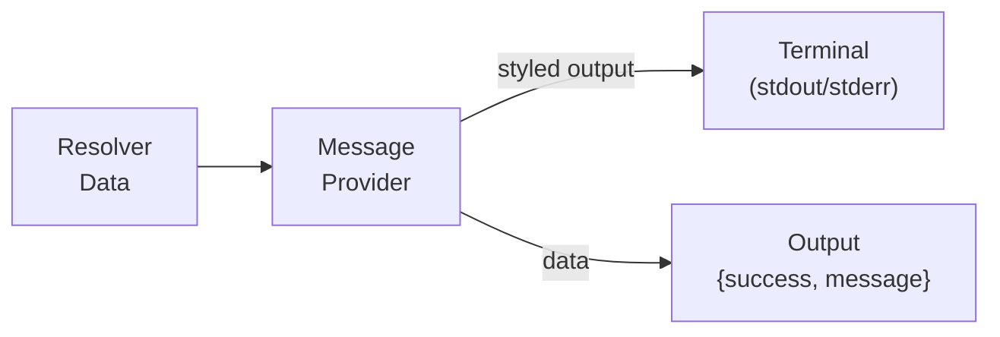

# Message Provider Tutorial

This tutorial covers using the **message** provider for rich terminal output during solution execution — styled messages with icons, colors, dynamic interpolation via `tmpl:`/`expr:` ValueRefs, and quiet-mode control.

## Overview

The message provider replaces awkward `exec` + `echo` patterns with first-class terminal messaging that integrates with scafctl's `--quiet`, `--no-color`, and `--dry-run` flags.



**Key features:**
- Built-in message types: `success`, `warning`, `error`, `info`, `debug`, `plain`
- Custom styling: colors (hex or named), bold, italic, custom icons/emoji
- Contextual labels: dimmed `[label]` prefixes for step tracking (e.g., `[step 2/5]`, `[deploy]`)
- Dynamic interpolation via framework `tmpl:` and `expr:` ValueRefs (with automatic dependency detection)
- Per-message `--quiet` mode control: `respect`, `force`, `silent`
- Trailing newline control via the `newline` field
- Dry-run awareness via `--dry-run`

## Quick Start

### 1. Basic Messages

```yaml
apiVersion: scafctl.io/v1
kind: Solution
metadata:
  name: message-basics
  version: 1.0.0

spec:
  resolvers:
    hello:
      resolve:
        with:
          - provider: message
            inputs:
              message: "Hello from the message provider!"
              type: info
```

Run it:

```bash
scafctl run resolver -f ./message-basics.yaml
```

Output:
```
💡 Hello from the message provider!
```

### 2. Message Types

Each type has a default icon and color:

| Type | Icon | Color |
|------|------|-------|
| `success` | ✅ | Green |
| `warning` | ⚠️ | Yellow |
| `error` | ❌ | Red |
| `info` | 💡 | Cyan |
| `debug` | 🐛 | Magenta |
| `plain` | — | None |

```yaml
resolvers:
  step1:
    resolve:
      with:
        - provider: message
          inputs:
            message: "Build succeeded"
            type: success

  step2:
    dependsOn: [step1]
    resolve:
      with:
        - provider: message
          inputs:
            message: "3 deprecation warnings found"
            type: warning
```

> **▶ Try it:** Run [examples/providers/message-types.yaml](../../examples/providers/message-types.yaml) to see all types.

## Custom Styling

Customize the appearance with the `style` object. Style fields **merge on top of** the `type` defaults — only the fields you specify are overridden, and the rest are inherited from the type:

```yaml
resolvers:
  deploy-start:
    resolve:
      with:
        - provider: message
          inputs:
            message: "Starting deployment pipeline"
            type: success
            style:
              icon: "🚀"  # override icon; color and bold inherited from success
```

For fully custom styling (no type base), use `type: plain`:

```yaml
resolvers:
  custom:
    resolve:
      with:
        - provider: message
          inputs:
            message: "Starting deployment pipeline"
            type: plain
            style:
              color: "#FF5733"
              bold: true
              icon: "🚀"
```

### Style Options

| Field | Type | Description |
|-------|------|-------------|
| `color` | string | ANSI color name (`green`, `red`) or hex (`#FF5733`) |
| `bold` | bool | Bold text |
| `italic` | bool | Italic text |
| `icon` | string | Emoji or character prefix (`🚀`, `📦`, `→`) |

When `style` is set and `--no-color` is **not** active, style fields merge on top of the type's defaults. Only the fields you specify are overridden — unset fields keep their type defaults. Set `icon: ""` to explicitly disable the type's default icon.

> **▶ Try it:** Run [examples/providers/message-custom-style.yaml](../../examples/providers/message-custom-style.yaml).

## Labels

Add contextual prefix labels to messages with the `label` field. Labels are rendered as dimmed `[label]` text between the icon and the message:

```yaml
resolvers:
  step1:
    resolve:
      with:
        - provider: message
          inputs:
            message: "Installing dependencies"
            type: info
            label: "step 1/3"
```

Output: `💡 [step 1/3] Installing dependencies`

Labels support `tmpl:` and `expr:` ValueRef for dynamic content:

```yaml
label:
  tmpl: "{{ .config.appName }}"
```

## Dynamic Messages

The message provider accepts a plain `message` string. For dynamic interpolation, use the framework's standard `tmpl:` or `expr:` ValueRef on the `message` input. This is the same mechanism available to all providers, and the framework automatically detects resolver dependencies — no `dependsOn` needed.

### Go Templates via `tmpl:`

```yaml
resolvers:
  config:
    resolve:
      with:
        - provider: static
          inputs:
            value:
              appName: my-service
              version: 2.0.0

  deploy-msg:
    resolve:
      with:
        - provider: message
          inputs:
            message:
              tmpl: "Deploying {{ .config.appName }} v{{ .config.version }}"
            type: info
```

### CEL Expressions via `expr:`

```yaml
resolvers:
  items:
    resolve:
      with:
        - provider: static
          inputs:
            value: [a, b, c, d, e]

  status:
    resolve:
      with:
        - provider: message
          inputs:
            message:
              expr: "'Processed ' + string(size(_.items)) + ' items successfully'"
            type: success
```

> **▶ Try it:** Run [examples/providers/message-dynamic.yaml](../../examples/providers/message-dynamic.yaml).

## Quiet Mode Control

The `quiet` field controls per-message behavior with `--quiet`:

| Value | Behavior |
|-------|----------|
| `respect` (default) | Suppressed in quiet mode |
| `force` | Always shown, even with `--quiet` |
| `silent` | Never written to terminal; only in output data |

```yaml
resolvers:
  info-msg:
    resolve:
      with:
        - provider: message
          inputs:
            message: "Starting batch processing..."
            quiet: respect  # hidden with --quiet

  critical-msg:
    resolve:
      with:
        - provider: message
          inputs:
            message: "CRITICAL: Database migration required"
            type: error
            quiet: force  # always visible
            destination: stderr

  data-only:
    resolve:
      with:
        - provider: message
          inputs:
            message: "Internal checkpoint reached"
            quiet: silent  # only in output data
```

## Destination Control

Direct messages to `stdout` (default) or `stderr`:

```yaml
resolvers:
  error-log:
    resolve:
      with:
        - provider: message
          inputs:
            message: "Connection failed: timeout after 30s"
            type: error
            destination: stderr
```

## Newline Control

The `newline` field (default: `true`) is folded into the rendered output via lipgloss, so the terminal writer does a single `fmt.Fprint` unconditionally:

```yaml
resolvers:
  inline:
    resolve:
      with:
        - provider: message
          inputs:
            message: "Status: "
            type: plain
            newline: false
        - provider: message
          inputs:
            message: "READY"
            style:
              color: green
              bold: true
```

## Output Data

The message provider returns its rendered text in the output, making it accessible to downstream resolvers:

```json
{
  "success": true,
  "message": "Deploying my-service v2.0.0"
}
```

## Dry-Run Support

With `--dry-run`, the message provider does not write to the terminal. Instead, it returns a description of what would happen:

```bash
scafctl run resolver -f ./solution.yaml --dry-run -o json
```

Output includes:
```json
{
  "success": true,
  "message": "[dry-run] Would output info message to stdout: Deploying my-service"
}
```

## Complete Example

See [examples/solutions/message-demo/solution.yaml](../../examples/solutions/message-demo/solution.yaml) for a complete solution workflow using the message provider with actions, resolvers, templates, and quiet-mode control.

## CLI Reference

```bash
# Run message provider directly
scafctl run provider message --input message="Hello" --input type=success

# Run with JSON output
scafctl run provider message --input message="Hello" -o json

# Dry-run
scafctl run provider message --input message="Hello" --dry-run
```
