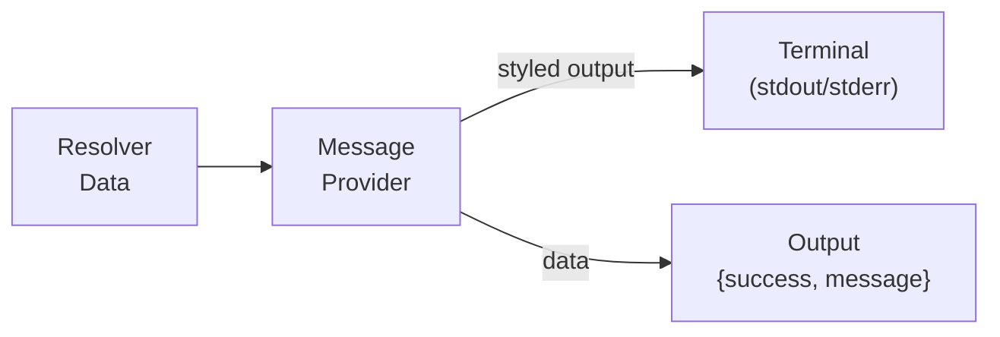

# Message Provider Tutorial

This tutorial covers using the **message** provider for rich terminal output during solution execution — styled messages with icons, colors, and dynamic interpolation via `tmpl:`/`expr:` ValueRefs.

## Overview

The message provider replaces awkward `exec` + `echo` patterns with first-class terminal messaging that integrates with scafctl's `--quiet`, `--no-color`, and `--dry-run` flags.



**Key features:**
- Built-in message types: `success`, `warning`, `error`, `info`, `debug`, `plain`
- Custom styling: colors (hex or named), bold, italic, custom icons/emoji
- Contextual labels: dimmed `[label]` prefixes for step tracking (e.g., `[step 2/5]`, `[deploy]`)
- Dynamic interpolation via framework `tmpl:` and `expr:` ValueRefs (with automatic dependency detection)
- Respects `--quiet` flag (messages suppressed in quiet mode)
- Trailing newline control via the `newline` field
- Dry-run awareness via `--dry-run`

## Quick Start

### Step 1: Create the Solution File

Create a file called `message-basics.yaml`:

```yaml
apiVersion: scafctl.io/v1
kind: Solution
metadata:
  name: message-basics
  version: 1.0.0

spec:
  resolvers:
    hello:
      resolve:
        with:
          - provider: message
            inputs:
              message: "Hello from the message provider!"
              type: info
```

### Step 2: Run It

```bash
scafctl run resolver -f ./message-basics.yaml
```

The message provider outputs the styled message to the terminal and returns the result as resolver data. You should see the message displayed with the info icon and styling, along with a table showing the resolver output containing `{"message":"Hello from the message provider!","success":true}`.

### 3. Message Types

Each type has a default icon and color:

| Type | Icon | Color |
|------|------|-------|
| `success` | ✅ | Green |
| `warning` | ⚠️ | Yellow |
| `error` | ❌ | Red |
| `info` | 💡 | Cyan |
| `debug` | 🐛 | Magenta |
| `plain` | — | None |

Create a file called `message-types.yaml` and add the following:

```yaml
apiVersion: scafctl.io/v1
kind: Solution
metadata:
  name: message-types
  version: 1.0.0

spec:
  resolvers:
    step1:
      resolve:
        with:
          - provider: message
            inputs:
              message: "Build succeeded"
              type: success

    step2:
      dependsOn: [step1]
      resolve:
        with:
          - provider: message
            inputs:
              message: "3 deprecation warnings found"
              type: warning
```

Run it:

```bash
scafctl run resolver -f ./message-types.yaml
```

You should see the styled messages followed by a table with resolver output data:

```
✅ Build succeeded
⚠️  3 deprecation warnings found
```

> **▶ Try it:** Run [examples/providers/message-types.yaml](../../examples/providers/message-types.yaml) to see all types.

## Custom Styling

Customize the appearance with the `style` object. Style fields **merge on top of** the `type` defaults — only the fields you specify are overridden, and the rest are inherited from the type.

Create a file called `message-style.yaml`:

```yaml
apiVersion: scafctl.io/v1
kind: Solution
metadata:
  name: message-style
  version: 1.0.0

spec:
  resolvers:
    deploy-start:
      resolve:
        with:
          - provider: message
            inputs:
              message: "Starting deployment pipeline"
              type: success
              style:
                icon: "🚀"  # override icon; color and bold inherited from success
```

For fully custom styling (no type base), use `type: plain`:

```yaml
apiVersion: scafctl.io/v1
kind: Solution
metadata:
  name: message-custom
  version: 1.0.0

spec:
  resolvers:
    custom:
      resolve:
        with:
          - provider: message
            inputs:
              message: "Starting deployment pipeline"
              type: plain
              style:
                color: "#FF5733"
                bold: true
                icon: "🚀"
```

### Style Options

| Field | Type | Description |
|-------|------|-------------|
| `color` | string | ANSI color name (`green`, `red`) or hex (`#FF5733`) |
| `bold` | bool | Bold text |
| `italic` | bool | Italic text |
| `icon` | string | Emoji or character prefix (`🚀`, `📦`, `→`) |

When `style` is set and `--no-color` is **not** active, style fields merge on top of the type's defaults. Only the fields you specify are overridden — unset fields keep their type defaults. Set `icon: ""` to explicitly disable the type's default icon.

> **▶ Try it:** Run [examples/providers/message-custom-style.yaml](../../examples/providers/message-custom-style.yaml).

## Labels

Add contextual prefix labels to messages with the `label` field. Labels are rendered as dimmed `[label]` text between the icon and the message:

```yaml
apiVersion: scafctl.io/v1
kind: Solution
metadata:
  name: message-labels
  version: 1.0.0

spec:
  resolvers:
    step1:
      resolve:
        with:
          - provider: message
            inputs:
              message: "Installing dependencies"
              type: info
              label: "step 1/3"
```

Output: `💡 [step 1/3] Installing dependencies`

Labels support `tmpl:` and `expr:` ValueRef for dynamic content:

```yaml
label:
  tmpl: "{{ .config.appName }}"
```

## Dynamic Messages

The message provider accepts a plain `message` string. For dynamic interpolation, use the framework's standard `tmpl:` or `expr:` ValueRef on the `message` input. This is the same mechanism available to all providers, and the framework automatically detects resolver dependencies — no `dependsOn` needed.

### Go Templates via `tmpl:`

Create a file called `message-template.yaml`:

```yaml
apiVersion: scafctl.io/v1
kind: Solution
metadata:
  name: message-template
  version: 1.0.0

spec:
  resolvers:
    config:
      resolve:
        with:
          - provider: static
            inputs:
              value:
                appName: my-service
                version: 2.0.0

    deploy-msg:
      resolve:
        with:
          - provider: message
            inputs:
              message:
                tmpl: "Deploying {{ .config.appName }} v{{ .config.version }}"
              type: info
```

Output: `💡 Deploying my-service v2.0.0`

> **Note:** Go templates access resolver data directly with `{{ .resolverName }}`. In CEL expressions, use the `_` prefix: `_.resolverName` (dot notation) or `_["resolver-name"]` (bracket notation, required for hyphenated names).

### CEL Expressions via `expr:`

Create a file called `message-cel.yaml`:

```yaml
apiVersion: scafctl.io/v1
kind: Solution
metadata:
  name: message-cel
  version: 1.0.0

spec:
  resolvers:
    items:
      resolve:
        with:
          - provider: static
            inputs:
              value: [a, b, c, d, e]

    status:
      resolve:
        with:
          - provider: message
            inputs:
              message:
                expr: "'Processed ' + string(size(_.items)) + ' items successfully'"
              type: success
```

Output: `✅ Processed 5 items successfully`

> **▶ Try it:** Run [examples/providers/message-dynamic.yaml](../../examples/providers/message-dynamic.yaml).

## Quiet Mode

The message provider respects the `--quiet` flag. When `--quiet` is passed, all messages are suppressed from terminal output. The rendered message text is still available in the resolver output data, so downstream resolvers can use it.

```bash
# Messages are displayed normally
scafctl run resolver -f ./message-basics.yaml

# Messages are suppressed with --quiet
scafctl run resolver -f ./message-basics.yaml --quiet
```

## Destination Control

Direct messages to `stdout` (default) or `stderr`. Create a file called `message-stderr.yaml`:

```yaml
apiVersion: scafctl.io/v1
kind: Solution
metadata:
  name: message-stderr
  version: 1.0.0

spec:
  resolvers:
    error-log:
      resolve:
        with:
          - provider: message
            inputs:
              message: "Connection failed: timeout after 30s"
              type: error
              destination: stderr
```

## Newline Control

The `newline` field (default: `true`) appends a trailing newline to the rendered output, so the terminal writer does a single `fmt.Fprint` unconditionally.

Create a file called `message-newline.yaml`:

```yaml
apiVersion: scafctl.io/v1
kind: Solution
metadata:
  name: message-newline
  version: 1.0.0

spec:
  resolvers:
    inline:
      resolve:
        with:
          - provider: message
            inputs:
              message: "Status: "
              type: plain
              newline: false
          - provider: message
            inputs:
              message: "READY"
              style:
                color: green
                bold: true
```

## Output Data

The message provider returns its rendered text in the output, making it accessible to downstream resolvers:

```json
{
  "success": true,
  "message": "Deploying my-service v2.0.0"
}
```

## Dry-Run Support

With `--dry-run`, the message provider does not write to the terminal. Instead, it returns a description of what would happen:

```bash
scafctl run resolver -f ./solution.yaml --dry-run -o json
```

Output includes:
```json
{
  "success": true,
  "message": "[dry-run] Would output info message to stdout: Deploying my-service"
}
```

## Complete Example

See [examples/solutions/message-demo/solution.yaml](../../examples/solutions/message-demo/solution.yaml) for a complete solution workflow using the message provider with actions, resolvers, and templates.

## CLI Reference

```bash
# Run message provider directly
scafctl run provider message --input message="Hello" --input type=success

# Run with JSON output
scafctl run provider message --input message="Hello" -o json

# Dry-run
scafctl run provider message --input message="Hello" --dry-run
```

## Shell Eval / Piping

Solutions that produce shell-eval output work cleanly with `run solution` — action
output is never prefixed with labels, so it's always pipe-safe:

```bash
eval "$(scafctl run solution -f ./proxy.yaml)"
scafctl run solution -f ./proxy.yaml | Invoke-Expression   # PowerShell
```

For debugging multi-action workflows, use `--progress` to see action
start/complete events or `--show-execution` for full metadata.

> **Note:** When using structured output modes (`-o json`, `-o yaml`, `-o quiet`),
> terminal messages are redirected to stderr so they don't corrupt the structured
> envelope on stdout.
