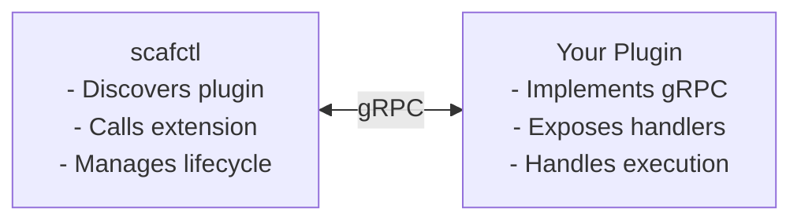

# Plugin Development Guide

> [!NOTE]
> **This page is an overview.** Detailed plugin development instructions are now part of each extension type's development guide.

## What is a Plugin?

A plugin is a standalone executable that extends scafctl by communicating over gRPC using [hashicorp/go-plugin](https://github.com/hashicorp/go-plugin). Plugins run in separate processes, providing crash isolation and independent distribution.

scafctl supports two types of plugins:

| Plugin Type | Artifact Kind | Interface | Guide |
|-------------|---------------|-----------|-------|
| **Provider Plugin** | `provider` | `plugin.ProviderPlugin` (3 methods) | [Provider Development Guide — Delivering as a Plugin](provider-development.md#delivering-as-a-plugin) |
| **Auth Handler Plugin** | `auth-handler` | `plugin.AuthHandlerPlugin` (7 methods) | [Auth Handler Development Guide — Delivering as a Plugin](auth-handler-development.md#delivering-as-a-plugin) |

## Architecture



Each plugin binary exposes **one** extension type (provider OR auth handler). The handshake cookie determines which type the host expects.

## Plugin Discovery

scafctl resolves plugins through two mechanisms:

1. **Catalog Auto-Fetch (Recommended)** — Declare plugins in `bundle.plugins` and scafctl fetches, caches, and loads them automatically:

   ```yaml
   spec:
     bundle:
       plugins:
         - name: my-plugin
           kind: provider          # or "auth-handler"
           version: ">=1.0.0"
   ```

2. **Directory Scanning** — For local development, place plugin binaries in the plugin cache:


{}
```bash
   mkdir -p "$(scafctl paths cache)/plugins"
   cp my-plugin "$(scafctl paths cache)/plugins/"
```
{}
{}
```powershell
   $pluginDir = "$(scafctl paths cache)/plugins"
   New-Item -ItemType Directory -Force -Path $pluginDir
   Copy-Item my-plugin $pluginDir
```
{}


## Plugin CLI Commands


{}
```bash
# Pre-fetch plugins declared in a solution
scafctl plugins install -f my-solution.yaml

# List cached plugin binaries
scafctl plugins list

# Push to a remote registry
scafctl catalog push my-plugin@1.0.0 --catalog ghcr.io/myorg
```
{}
{}
```powershell
# Pre-fetch plugins declared in a solution
scafctl plugins install -f my-solution.yaml

# List cached plugin binaries
scafctl plugins list

# Push to a remote registry
scafctl catalog push my-plugin@1.0.0 --catalog ghcr.io/myorg
```
{}


## Next Steps

- [Extension Concepts](extension-concepts.md) — Provider vs Auth Handler vs Plugin terminology
- [Provider Development Guide](provider-development.md) — Build providers (builtin + plugin)
- [Auth Handler Development Guide](auth-handler-development.md) — Build auth handlers (builtin + plugin)
- [Plugin Auto-Fetching Tutorial](plugin-auto-fetch-tutorial.md) — Catalog-based distribution
