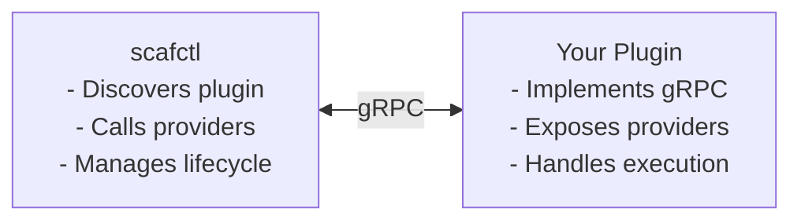

# Provider Development Guide

This guide explains how to create custom providers for scafctl. Providers are the building blocks that perform operations like fetching data, transforming values, validating inputs, and executing actions.

Providers can be delivered in two ways:

| | **Builtin** | **Plugin** |
|---|---|---|
| **Where it lives** | Compiled into the scafctl binary | Separate executable (any language with gRPC) |
| **Registration** | `registry.Register(...)` in `builtin.go` | Discovered at runtime from plugin cache or catalog |
| **Crash isolation** | Shares process with scafctl | Isolated process — plugin crash doesn't take down CLI |
| **Distribution** | Ships with scafctl releases | OCI catalog artifact (`kind: provider`) or standalone binary |
| **Interface** | `provider.Provider` (2 methods) | `plugin.ProviderPlugin` (3 methods) |

> [!WARNING]
> **Prerequisite**: Read the [Extension Concepts](extension-concepts.md) page for terminology (provider vs plugin vs auth handler).

The bulk of this guide covers the `provider.Provider` interface used by both delivery models. The [Delivering as a Plugin](#delivering-as-a-plugin) section at the end covers the additional steps for the plugin model.

## Provider Architecture

Providers implement a simple interface:

```go
type Provider interface {
    // Descriptor returns metadata, schema, and capabilities
    Descriptor() *Descriptor

    // Execute performs the provider's operation
    Execute(ctx context.Context, input any) (*Output, error)
}
```

## Quick Start: Minimal Provider

Here's the simplest possible provider:

```go
package myprovider

import (
    "context"
    "fmt"

    "github.com/Masterminds/semver/v3"
    "github.com/google/jsonschema-go/jsonschema"
    "github.com/oakwood-commons/scafctl/pkg/provider"
    "github.com/oakwood-commons/scafctl/pkg/provider/schemahelper"
)

const (
    ProviderName = "my-provider"
    Version      = "1.0.0"
)

type MyProvider struct {
    descriptor *provider.Descriptor
}

func NewMyProvider() *MyProvider {
    version, _ := semver.NewVersion(Version)
    p := &MyProvider{
        descriptor: &provider.Descriptor{
            Name:        ProviderName,
            DisplayName: "My Custom Provider",
            APIVersion:  "v1",
            Version:     version,
            Description: "Does something useful for resolvers and actions",
            Schema: schemahelper.ObjectSchema([]string{"input"}, map[string]*jsonschema.Schema{
                "input": schemahelper.StringProp("The input value to process"),
            }),
            OutputSchemas: map[provider.Capability]*jsonschema.Schema{
                provider.CapabilityFrom: schemahelper.ObjectSchema(nil, map[string]*jsonschema.Schema{
                    "result": schemahelper.StringProp("The processed result"),
                }),
            },
            Capabilities: []provider.Capability{provider.CapabilityFrom},
            Category:     "utility",
        },
    }
    return p
}

func (p *MyProvider) Descriptor() *provider.Descriptor {
    return p.descriptor
}

func (p *MyProvider) Execute(ctx context.Context, input any) (*provider.Output, error) {
    inputs := input.(map[string]any)
    value := inputs["input"].(string)
    
    // Check for dry-run mode (used by `run provider --dry-run`)
    if provider.DryRunFromContext(ctx) {
        return &provider.Output{
            Data: map[string]any{"result": "[DRY-RUN] Would process: " + value},
        }, nil
    }
    
    return &provider.Output{
        Data: map[string]any{
            "result": "Processed: " + value,
        },
    }, nil
}
```

> [!NOTE]
> **Convention**: All built-in providers export a `ProviderName` constant, build the
> descriptor in the constructor (not in `Descriptor()`), and name the constructor
> `New<Name>Provider()` (e.g., `NewMyProvider`, `NewEnvProvider`).

## Provider Descriptor

The `Descriptor` defines everything about your provider:

### Required Fields

| Field | Type | Description |
|-------|------|-------------|
| `Name` | `string` | Unique identifier (lowercase, hyphens only) |
| `APIVersion` | `string` | API contract version (e.g., `"v1"`) |
| `Version` | `*semver.Version` | Semantic version of implementation |
| `Description` | `string` | What the provider does (10-500 chars) |
| `Schema` | `*jsonschema.Schema` | Input schema |
| `OutputSchemas` | `map[Capability]*jsonschema.Schema` | Output schemas per capability |
| `Capabilities` | `[]Capability` | What operations the provider supports |

### Optional Fields

| Field | Type | Description |
|-------|------|-------------|
| `DisplayName` | `string` | Human-readable display name (max 100 chars). Defaults to `Name` if omitted. |
| `Decode` | `func(map[string]any) (any, error)` | Converts raw inputs to a typed struct (see [Using Typed Inputs](#using-typed-inputs-decode)). Not serialized (`json:"-"`). |
| `ExtractDependencies` | `func(map[string]any) []string` | Custom dependency extraction for DAG ordering. If nil, the generic extraction logic is used. Providers should implement this when they have custom input formats that reference other resolvers (see [Extracting Dependencies](#extracting-dependencies)). Not serialized (`json:"-"`). |
| `SensitiveFields` | `[]string` | Input fields to mask in logs, errors, and snapshots (max 50). You can check fields with `Descriptor.IsSensitiveField(name)`. |
| `WhatIf` | `func(ctx context.Context, input any) (string, error)` | Generates a human-readable description of what the provider would do with given inputs, without executing. Used by `run solution --dry-run` to produce WhatIf messages. If nil, falls back to a generic message (`"Would execute {name} provider"`). Not serialized (`json:"-"`). |
| `Category` | `string` | Provider category for grouping (max 50 chars). Existing categories: `"system"`, `"network"`, `"filesystem"`, `"data"`, `"validation"`, `"security"`, `"composition"`, `"Core"`. |
| `Tags` | `[]string` | Searchable keywords for discovery and filtering (max 20 tags, each max 30 chars). |
| `Icon` | `string` | Icon URL (format `uri`, max 500 chars). |
| `Links` | `[]Link` | Related links. Each `Link` has `Name` (max 30) and `URL` (format `uri`). Max 10 links. |
| `Examples` | `[]Example` | Usage examples with `Name` (max 50), `Description` (max 300), and `YAML` (required, 10-2000 chars). |
| `Deprecated` | `bool` | Mark the provider as deprecated. |
| `Beta` | `bool` | Mark the provider as beta/experimental. |
| `Maintainers` | `[]Contact` | Maintainer contacts. Each `Contact` has `Name` (max 60) and `Email` (format `email`). Max 10. |

### Capabilities

Providers declare which contexts they can operate in:

| Capability | Usage | Description |
|------------|-------|-------------|
| `from` | Resolvers | Fetch/generate data (HTTP, file, env, etc.) |
| `transform` | Resolvers | Transform resolver values |
| `validation` | Resolvers | Validate resolver values |
| `action` | Actions | Perform side effects (deploy, notify, etc.) |
| `authentication` | Auth | Handle authentication flows |

### Schema Definition

Define input properties with validation using the `schemahelper` package:

```go
import (
    "encoding/json"

    "github.com/google/jsonschema-go/jsonschema"
    "github.com/oakwood-commons/scafctl/pkg/provider/schemahelper"
)

Schema: schemahelper.ObjectSchema([]string{"url"}, map[string]*jsonschema.Schema{
    "url": schemahelper.StringProp("The URL to fetch",
        schemahelper.WithFormat("uri"),
        schemahelper.WithExample("https://api.example.com/data"),
    ),
    "timeout": schemahelper.IntProp("Request timeout in seconds",
        schemahelper.WithDefault(json.RawMessage(`30`)),
        schemahelper.WithMinimum(1),
        schemahelper.WithMaximum(300),
    ),
    "headers": schemahelper.AnyProp("HTTP headers as key-value pairs"),
}),
```

### Property Types

| JSON Schema Type | Helper | Go Equivalent | Description |
|------------------|--------|--------------|-------------|
| `"string"` | `schemahelper.StringProp` | `string` | Text values |
| `"integer"` | `schemahelper.IntProp` | `int64` | Integer numbers |
| `"number"` | `schemahelper.NumberProp` | `float64` | Decimal numbers |
| `"boolean"` | `schemahelper.BoolProp` | `bool` | Boolean values |
| `"array"` | `schemahelper.ArrayProp` | `[]any` | List of values |
| `"object"` | `schemahelper.ObjectProp` | nested struct | Nested object with its own required fields and properties |
| (omitted) | `schemahelper.AnyProp` | `any` | Any type (untyped, mixed, etc.) |

### Property Constraints

Constraints are applied via option functions on the schema helpers:

```go
// String property with constraints
schemahelper.StringProp("Description of the field",
    schemahelper.WithDefault(json.RawMessage(`"default"`)), // Default if not provided
    schemahelper.WithMinLength(1),                          // Minimum string length
    schemahelper.WithMaxLength(100),                        // Maximum string length
    schemahelper.WithPattern("^[a-z]+$"),                   // Regex pattern
    schemahelper.WithEnum("a", "b"),                        // Allowed values
    schemahelper.WithFormat("uri"),                         // Format hint (uri, email, uuid)
    schemahelper.WithExample("example-value"),              // Example value
    schemahelper.WithDeprecated(),                          // Mark as deprecated
)

// Integer property with constraints
schemahelper.IntProp("Numeric field",
    schemahelper.WithMinimum(0),    // Minimum number
    schemahelper.WithMaximum(100),  // Maximum number
)

// Array property with constraints and typed items
schemahelper.ArrayProp("List field",
    schemahelper.WithMinItems(1),                                    // Minimum array items
    schemahelper.WithMaxItems(10),                                   // Maximum array items
    schemahelper.WithItems(schemahelper.StringProp("Item value")),    // Schema for each item
)

// Nested object property
schemahelper.ObjectProp("Connection settings", []string{"host"}, map[string]*jsonschema.Schema{
    "host": schemahelper.StringProp("Hostname"),
    "port": schemahelper.IntProp("Port number", schemahelper.WithDefault(json.RawMessage(`443`))),
})

// Additional options
schemahelper.StringProp("Secret token",
    schemahelper.WithWriteOnly(),                        // Mark as write-only (e.g., passwords)
    schemahelper.WithTitle("API Token"),                  // Human-readable title
)
schemahelper.AnyProp("Config object",
    schemahelper.WithAdditionalProperties(                // Schema for extra map keys
        schemahelper.StringProp("Config value"),
    ),
)
```

Required fields are declared on the parent object schema, not per-property:

```go
// "url" is required, "timeout" and "headers" are optional
schemahelper.ObjectSchema([]string{"url"}, map[string]*jsonschema.Schema{ ... })
```

Sensitive fields are declared on the Descriptor (see [Mark Sensitive Data](#4-mark-sensitive-data)).

## Execute Method

The `Execute` method receives validated inputs and returns an `Output`.

> [!IMPORTANT]
> **Inputs are pre-resolved by the framework.** When users write `tmpl:`, `expr:`, or `rslvr:` ValueRefs on any input field, the framework evaluates them **before** calling your provider. Your `Execute` method always receives plain, already-resolved values (strings, numbers, maps, etc.). **Do not** implement Go template or CEL evaluation inside your provider — that's the framework's job. See [Don't Duplicate ValueRef Handling](#6-dont-duplicate-valueref-handling).

```go
func (p *MyProvider) Execute(ctx context.Context, input any) (*provider.Output, error) {
    // Type assert to map (unless using Decode)
    inputs, ok := input.(map[string]any)
    if !ok {
        return nil, fmt.Errorf("expected map[string]any, got %T", input)
    }

    // Extract inputs (already validated by schema)
    url := inputs["url"].(string)
    timeout := 30 // default
    if t, ok := inputs["timeout"].(int); ok {
        timeout = t
    }

    // Check for dry-run mode (used by `run provider --dry-run`)
    if provider.DryRunFromContext(ctx) {
        return &provider.Output{
            Data: map[string]any{"mocked": true},
            Metadata: map[string]any{"mode": "dry-run"},
        }, nil
    }

    // Perform actual operation
    result, err := doSomething(url, timeout)
    if err != nil {
        return nil, fmt.Errorf("operation failed: %w", err)
    }

    return &provider.Output{
        Data: result,
        Warnings: []string{"optional warning message"},
        Metadata: map[string]any{"requestId": "abc123"},
    }, nil
}
```

### Context Values

Access context information:

```go
// Check if this is a dry-run (returns bool)
// Set by `run provider --dry-run`; providers should return mock data.
isDryRun := provider.DryRunFromContext(ctx)

// Get execution mode (from, transform, validation, action)
mode, ok := provider.ExecutionModeFromContext(ctx)

// Access resolved values from other resolvers
resolverCtx, ok := provider.ResolverContextFromContext(ctx)
if ok {
    value := resolverCtx["otherResolver"]
}

// Access solution parameters
params, ok := provider.ParametersFromContext(ctx)
if ok {
    env := params["environment"]
}

// Access iteration context (inside forEach loops)
iterCtx, ok := provider.IterationContextFromContext(ctx)
if ok {
    currentItem := iterCtx.Item    // Current element
    currentIndex := iterCtx.Index  // Zero-based index
    // iterCtx.ItemAlias / iterCtx.IndexAlias — custom variable names if set
}

// Get logger
lgr := logger.FromContext(ctx)
lgr.V(1).Info("processing", "url", url)

// Get IO streams for streaming output to the terminal
ioStreams, ok := provider.IOStreamsFromContext(ctx)
if ok {
    fmt.Fprintln(ioStreams.Out, "streaming output to terminal")
}
```

> [!CAUTION]
> **Note**: All context helpers except `DryRunFromContext` return a two-value
> `(value, bool)` — the `bool` indicates whether the value was present in the context.
> 
> **Dry-run mechanisms**: There are two dry-run approaches:
> 1. **`DryRunFromContext(ctx)`** — Checked in `Execute()` when running via `run provider --dry-run`. Return mock data to avoid side effects.
> 2. **`WhatIf` on `Descriptor`** — Called by `run solution --dry-run` to generate a human-readable description of what the provider would do. Providers are never executed during solution dry-run.

### Streaming Output

Providers that produce user-visible output (e.g., command stdout/stderr) can stream it
directly to the terminal instead of returning it only in `Output.Data`. This gives users
real-time feedback during long-running operations.

To stream output:

1. **Get IO streams from context** — `provider.IOStreamsFromContext(ctx)` returns
   `(*IOStreams, bool)`. The `IOStreams` has `Out` and `ErrOut` writers. It may not
   be available when the CLI is rendering structured output (JSON/YAML), so always
   check the `bool`.

2. **Write to both the capture buffer and the terminal** — Use `io.MultiWriter` to
   write to both your internal buffer (for `Output.Data`) and the terminal writer.

3. **Set `Streamed: true`** on the returned `Output` — This tells the CLI layer not
   to re-print the data that was already streamed.

```go
func (p *MyProvider) Execute(ctx context.Context, input any) (*provider.Output, error) {
    var buf bytes.Buffer
    out := io.Writer(&buf)

    // Stream output to terminal if IO streams are available
    ioStreams, ok := provider.IOStreamsFromContext(ctx)
    streamed := false
    if ok {
        out = io.MultiWriter(&buf, ioStreams.Out)
        streamed = true
    }

    // Write output — goes to both buffer and terminal
    fmt.Fprintln(out, "Hello, World!")

    return &provider.Output{
        Data:     map[string]any{"output": buf.String()},
        Streamed: streamed,
    }, nil
}
```

When actions run in parallel, the CLI automatically wraps each action's IO streams with
a `PrefixedWriter` that prepends `[action-name]` to each line, so users can tell which
action produced which output.

## Using Typed Inputs (Decode)

For complex providers, use typed structs instead of `map[string]any`:

```go
type HTTPInput struct {
    URL     string            `json:"url"`
    Method  string            `json:"method"`
    Headers map[string]string `json:"headers"`
    Body    any               `json:"body"`
    Timeout int               `json:"timeout"`
}

func (p *HTTPProvider) Descriptor() *provider.Descriptor {
    return &provider.Descriptor{
        // ... other fields ...
        Decode: func(inputs map[string]any) (any, error) {
            var cfg HTTPInput
            data, _ := json.Marshal(inputs)
            if err := json.Unmarshal(data, &cfg); err != nil {
                return nil, err
            }
            // Apply defaults
            if cfg.Method == "" {
                cfg.Method = "GET"
            }
            if cfg.Timeout == 0 {
                cfg.Timeout = 30
            }
            return &cfg, nil
        },
    }
}

func (p *HTTPProvider) Execute(ctx context.Context, input any) (*provider.Output, error) {
    // Input is now typed!
    cfg := input.(*HTTPInput)
    
    resp, err := http.Get(cfg.URL)
    // ...
}
```

## Registering as a Builtin Provider

Add your provider to the builtin registry:

```go
// pkg/provider/builtin/builtin.go

func DefaultRegistry(ctx context.Context) (*provider.Registry, error) {
    registry := provider.NewRegistry()
    
    // Register built-in providers
    if err := registry.Register(envprovider.NewEnvProvider()); err != nil {
        return nil, fmt.Errorf("register env: %w", err)
    }
    if err := registry.Register(httpprovider.NewHTTPProvider()); err != nil {
        return nil, fmt.Errorf("register http: %w", err)
    }
    if err := registry.Register(myprovider.NewMyProvider()); err != nil {
        return nil, fmt.Errorf("register my-provider: %w", err)
    }
    
    return registry, nil
}
```

> [!CAUTION]
> **Note**: `DefaultRegistry` takes a `context.Context` and `Register()` returns an
> `error`. Constructor names follow the `New<Name>Provider()` convention
> (e.g., `NewEnvProvider`, `NewHTTPProvider`).

## Testing Your Provider

```go
func TestMyProvider_Execute(t *testing.T) {
    p := NewMyProvider()
    
    // Test descriptor
    desc := p.Descriptor()
    assert.Equal(t, ProviderName, desc.Name)
    assert.Contains(t, desc.Capabilities, provider.CapabilityFrom)
    
    // Test execution
    ctx := context.Background()
    output, err := p.Execute(ctx, map[string]any{
        "input": "test value",
    })
    
    require.NoError(t, err)
    assert.NotNil(t, output.Data)
    
    result := output.Data.(map[string]any)
    assert.Equal(t, "Processed: test value", result["result"])
}

func TestMyProvider_DryRun(t *testing.T) {
    p := NewMyProvider()
    ctx := provider.WithDryRun(context.Background(), true)
    
    output, err := p.Execute(ctx, map[string]any{
        "input": "test",
    })
    
    require.NoError(t, err)
    // Verify mock behavior
}
```

#### Schema Validation in Tests

Use `provider.NewSchemaValidator()` to verify inputs and outputs conform to your schemas:

```go
func TestMyProvider_SchemaValidation(t *testing.T) {
    p := NewMyProvider()
    desc := p.Descriptor()
    sv := provider.NewSchemaValidator()

    // Validate inputs against the schema
    err := sv.ValidateInputs(map[string]any{"input": "hello"}, desc.Schema)
    require.NoError(t, err)

    // Validate output against the output schema
    output, err := p.Execute(context.Background(), map[string]any{"input": "hello"})
    require.NoError(t, err)
    err = sv.ValidateOutput(output.Data, desc.OutputSchemas[provider.CapabilityFrom])
    require.NoError(t, err)
}
```

#### Mock Interface Pattern

For providers that interact with external systems (HTTP, filesystem, environment, etc.),
define an interface for the external dependency and inject it via a functional option.
This makes the provider testable without real side effects:

```go
// Interface for external dependency
type DataFetcher interface {
    Fetch(ctx context.Context, url string) ([]byte, error)
}

// Functional option to inject the dependency
type Option func(*MyProvider)

func WithDataFetcher(f DataFetcher) Option {
    return func(p *MyProvider) {
        p.fetcher = f
    }
}
```

Then create a `mock.go` in your provider package with a test double:

```go
// mock.go
type MockDataFetcher struct {
    FetchFunc func(ctx context.Context, url string) ([]byte, error)
    FetchErr  bool
}

func (m *MockDataFetcher) Fetch(ctx context.Context, url string) ([]byte, error) {
    if m.FetchErr {
        return nil, fmt.Errorf("mock fetch error")
    }
    if m.FetchFunc != nil {
        return m.FetchFunc(ctx, url)
    }
    return []byte(`{"mock": true}`), nil
}
```

In tests, inject the mock:

```go
func TestMyProvider_FetchError(t *testing.T) {
    mock := &MockDataFetcher{FetchErr: true}
    p := NewMyProvider(WithDataFetcher(mock))
    _, err := p.Execute(context.Background(), map[string]any{"url": "https://example.com"})
    require.Error(t, err)
}
```

See `pkg/provider/builtin/envprovider/mock.go` for a real-world example of this pattern.

## Output Schema Requirements

Certain capabilities require specific output fields:

### Validation Capability

```go
OutputSchemas: map[provider.Capability]*jsonschema.Schema{
    provider.CapabilityValidation: schemahelper.ObjectSchema([]string{"valid"}, map[string]*jsonschema.Schema{
        "valid":  schemahelper.BoolProp("Whether validation passed"),
        "errors": schemahelper.ArrayProp("Validation error messages"),
    }),
},
```

### Action Capability

```go
OutputSchemas: map[provider.Capability]*jsonschema.Schema{
    provider.CapabilityAction: schemahelper.ObjectSchema([]string{"success"}, map[string]*jsonschema.Schema{
        "success": schemahelper.BoolProp("Whether action succeeded"),
    }),
},
```

## Best Practices

### 1. Handle Dry-Run Mode

Providers support two complementary dry-run mechanisms:

**WhatIf (solution-level dry-run)**: Add a `WhatIf` function to your `Descriptor` for context-specific dry-run messages. This is used by `run solution --dry-run` — your provider's `Execute` method is never called.

```go
descriptor: &provider.Descriptor{
    // ... other fields ...
    WhatIf: func(ctx context.Context, input any) (string, error) {
        inputs, _ := input.(map[string]any)
        id, _ := inputs["id"].(string)
        return fmt.Sprintf("Would create resource %s", id), nil
    },
}
```

**DryRunFromContext (provider-level dry-run)**: Check in `Execute()` for `run provider --dry-run`. Return mock data to avoid side effects:

```go
if provider.DryRunFromContext(ctx) {
    return &provider.Output{
        Data: map[string]any{
            "id":      "mock-123",
            "status":  "created",
            "message": "[DRY-RUN] Would create resource",
        },
    }, nil
}
```

### 2. Use Proper Error Messages

Prefix errors with the provider name using the `ProviderName` constant:

```go
// Good: Provider name, context, and wrapped error
return nil, fmt.Errorf("%s: failed to fetch %s: %w", ProviderName, url, err)

// Bad: Generic message without provider name
return nil, err
```

### 3. Log at Appropriate Levels

```go
lgr := logger.FromContext(ctx)
lgr.V(1).Info("starting request", "url", url)      // Debug
lgr.V(0).Info("request complete", "status", 200)   // Info
lgr.Error(err, "request failed")                    // Error
```

### 4. Mark Sensitive Data

Use `SensitiveFields` on the Descriptor to indicate which input fields should be masked in logs:

```go
func (p *MyProvider) Descriptor() *provider.Descriptor {
    return &provider.Descriptor{
        // ... other fields ...
        SensitiveFields: []string{"password", "token"},  // These fields will be masked in logs
    }
}
```

### 5. Provide Good Examples

```go
Examples: []provider.Example{
    {
        Name:        "Basic usage",
        Description: "Fetch data from an API",
        YAML: `name: api-data
resolve:
  from:
    provider: my-provider
    inputs:
      url: https://api.example.com/data`,
    },
},
```

### 6. Don't Duplicate ValueRef Handling

The scafctl framework provides a universal **ValueRef** system that allows users to use `tmpl:` (Go templates), `expr:` (CEL expressions), or `rslvr:` (resolver references) on **any** provider input field. The framework evaluates these before calling your provider and automatically detects resolver dependencies from the references — users don't even need `dependsOn`.

**Do not** implement Go template parsing or CEL evaluation inside your provider. Your `Execute` method receives already-resolved plain values.

```yaml
# Users can write this for ANY provider — the framework handles it:
resolvers:
  greeting:
    resolve:
      with:
        - provider: my-provider
          inputs:
            # tmpl: ValueRef — framework evaluates, provider receives plain string
            url:
              tmpl: "https://api.example.com/{{ .environment }}/data"
            # expr: ValueRef — framework evaluates, provider receives plain string
            query:
              expr: "'status=' + _.filterMode"
            # rslvr: ValueRef — framework resolves, provider receives the value
            token:
              rslvr: apiToken
```

In your provider's `Execute`, all three inputs arrive as plain strings. The framework also auto-detects that this resolver depends on `environment`, `filterMode`, and `apiToken` — no manual `dependsOn` required.

## Directory Structure

```
pkg/provider/builtin/myprovider/
├── my_provider.go      # Main implementation
├── my_provider_test.go # Tests
├── mock.go             # Mock interfaces for testing (if needed)
└── README.md           # Documentation (optional)
```

## Extracting Dependencies

If your provider's inputs reference other resolvers in a custom format (e.g., inside
expressions or templates), implement `ExtractDependencies` so the execution DAG can
order resolvers correctly:

```go
func NewMyProvider() *MyProvider {
    return &MyProvider{
        descriptor: &provider.Descriptor{
            // ... other fields ...
            ExtractDependencies: func(inputs map[string]any) []string {
                // Parse your custom input format to find resolver references
                exprStr, ok := inputs["expression"].(string)
                if !ok || exprStr == "" {
                    return nil
                }
                // Return the names of resolvers this input depends on
                return parseReferencedResolvers(exprStr)
            },
        },
    }
}
```

If `ExtractDependencies` is nil, the framework uses generic extraction logic that
covers most cases. You only need to implement this for custom input formats like
CEL expressions or Go templates that embed resolver references.

## Complete Example: Rate Limiter Provider

```go
package ratelimitprovider

import (
    "context"
    "fmt"
    "sync"
    "time"

    "github.com/Masterminds/semver/v3"
    "github.com/google/jsonschema-go/jsonschema"
    "github.com/oakwood-commons/scafctl/pkg/logger"
    "github.com/oakwood-commons/scafctl/pkg/provider"
    "github.com/oakwood-commons/scafctl/pkg/provider/schemahelper"
)

const (
    ProviderName = "rate-limit"
    Version      = "1.0.0"
)

type RateLimitProvider struct {
    descriptor *provider.Descriptor
    mu         sync.Mutex
    lastCall   time.Time
    callCount  int
}

func NewRateLimitProvider() *RateLimitProvider {
    version, _ := semver.NewVersion(Version)
    p := &RateLimitProvider{
        descriptor: &provider.Descriptor{
            Name:        ProviderName,
            DisplayName: "Rate Limiter",
            APIVersion:  "v1",
            Version:     version,
            Description: "Enforces rate limits on resolver execution. Use as a transform step.",
            Category:    "utility",
            Tags:        []string{"rate-limit", "throttle", "control"},
            Schema: schemahelper.ObjectSchema([]string{"value", "maxPerMinute"}, map[string]*jsonschema.Schema{
                "value":        schemahelper.AnyProp("The value to pass through"),
                "maxPerMinute": schemahelper.IntProp("Maximum calls per minute",
                    schemahelper.WithMinimum(1),
                    schemahelper.WithMaximum(1000),
                    schemahelper.WithExample(60),
                ),
            }),
            OutputSchemas: map[provider.Capability]*jsonschema.Schema{
                provider.CapabilityTransform: schemahelper.ObjectSchema(nil, map[string]*jsonschema.Schema{
                    "value":     schemahelper.AnyProp("The passed-through value"),
                    "remaining": schemahelper.IntProp("Remaining calls in current window"),
                }),
            },
            Capabilities: []provider.Capability{provider.CapabilityTransform},
            Examples: []provider.Example{
                {
                    Name:        "Basic throttle",
                    Description: "Limit resolver execution to 60 calls per minute",
                    YAML: `name: throttled-value
resolve:
  transform:
    - provider: rate-limit
      inputs:
        value: "{{ .resolvers.myData }}"
        maxPerMinute: 60`,
                },
            },
        },
    }
    return p
}

func (p *RateLimitProvider) Descriptor() *provider.Descriptor {
    return p.descriptor
}

func (p *RateLimitProvider) Execute(ctx context.Context, input any) (*provider.Output, error) {
    lgr := logger.FromContext(ctx)
    inputs := input.(map[string]any)
    
    value := inputs["value"]
    maxPerMin := int(inputs["maxPerMinute"].(int64))
    
    // DryRunFromContext is checked when running via `run provider --dry-run`
    if provider.DryRunFromContext(ctx) {
        return &provider.Output{
            Data: map[string]any{
                "value":     value,
                "remaining": maxPerMin,
            },
        }, nil
    }
    
    p.mu.Lock()
    defer p.mu.Unlock()
    
    now := time.Now()
    if now.Sub(p.lastCall) > time.Minute {
        p.callCount = 0
        p.lastCall = now
    }
    
    if p.callCount >= maxPerMin {
        return nil, fmt.Errorf("%s: rate limit exceeded: %d calls/min", ProviderName, maxPerMin)
    }
    
    p.callCount++
    remaining := maxPerMin - p.callCount
    
    lgr.V(1).Info("rate limit check passed", "remaining", remaining)
    
    return &provider.Output{
        Data: map[string]any{
            "value":     value,
            "remaining": remaining,
        },
    }, nil
}

```

## Testing & Documentation Expectations

### Built-in Providers (in this repo)

When adding a provider to the scafctl codebase as a built-in, you **must**:

1. **Add CLI integration tests** in `tests/integration/cli_test.go` covering basic usage.
2. **Create functional test solutions** in `tests/integration/solutions/providers/<name>/solution.yaml`.
   These are YAML solutions with a `spec.testing` section containing test cases with CEL assertions:

   ```yaml
   apiVersion: scafctl.io/v1
   kind: Solution
   metadata:
     name: test-my-provider
     version: 1.0.0
     description: Tests for the my-provider provider
   spec:
     resolvers:
       basic:
         resolve:
           with:
             - provider: my-provider
               inputs:
                 input: "hello"
     testing:
       config:
         skipBuiltins: true
       cases:
         _base:
           command: [run, resolver]
           args: ["-o", "json"]
           tags: [provider, my-provider]
           assertions:
             - expression: __exitCode == 0
         basic:
           extends: [_base]
           assertions:
             - expression: __output.basic.result == "Processed: hello"
   ```

3. **Add documentation** — tutorial in `docs/tutorials/`, examples in `examples/providers/`.
4. **Update the provider reference** documentation.

Every existing built-in provider has a corresponding functional test directory under
`tests/integration/solutions/providers/` (e.g., `env/`, `http/`, `exec/`, `cel/`, etc.).

### Custom/External Providers (separate repos)

Custom providers that live in their own repository should follow the same patterns:
- Create unit tests with `testify/assert` and mock interfaces
- Create functional test solutions (use BDD-style YAML tests as shown above)
- Write documentation and usage examples in your own repo

The built-in provider tests in `tests/integration/solutions/providers/` serve as
excellent templates for structuring your own functional tests.

## Delivering as a Plugin

Instead of compiling your provider into the scafctl binary, you can ship it as a **plugin** — a standalone executable that communicates with scafctl over gRPC. This lets you:

- Use any language that supports gRPC
- Isolate plugin crashes from the main process
- Distribute providers independently via OCI catalogs
- Add third-party integrations without forking scafctl

### Architecture



Plugins use [hashicorp/go-plugin](https://github.com/hashicorp/go-plugin) with gRPC for communication.

### Plugin Interface

Plugins implement `plugin.ProviderPlugin` (3 methods):

```go
type ProviderPlugin interface {
    // GetProviders returns all provider names exposed by this plugin
    GetProviders(ctx context.Context) ([]string, error)

    // GetProviderDescriptor returns metadata for a specific provider
    GetProviderDescriptor(ctx context.Context, name string) (*provider.Descriptor, error)

    // ExecuteProvider executes a provider with the given input
    ExecuteProvider(ctx context.Context, name string, input map[string]any) (*provider.Output, error)
}
```

### Quick Start

#### 1. Create Plugin Directory


{}
```bash
mkdir my-plugin && cd my-plugin
go mod init github.com/myorg/my-plugin
go get github.com/oakwood-commons/scafctl
```
{}
{}
```powershell
mkdir my-plugin; cd my-plugin
go mod init github.com/myorg/my-plugin
go get github.com/oakwood-commons/scafctl
```
{}


#### 2. Implement the Plugin

```go
// main.go
package main

import (
    "context"
    "fmt"

    "github.com/Masterminds/semver/v3"
    "github.com/google/jsonschema-go/jsonschema"
    "github.com/oakwood-commons/scafctl/pkg/plugin"
    "github.com/oakwood-commons/scafctl/pkg/provider"
    "github.com/oakwood-commons/scafctl/pkg/provider/schemahelper"
)

type MyPlugin struct{}

func (p *MyPlugin) GetProviders(ctx context.Context) ([]string, error) {
    return []string{"my-custom-provider"}, nil
}

func (p *MyPlugin) GetProviderDescriptor(ctx context.Context, name string) (*provider.Descriptor, error) {
    switch name {
    case "my-custom-provider":
        return &provider.Descriptor{
            Name:        "my-custom-provider",
            DisplayName: "My Custom Provider",
            APIVersion:  "v1",
            Version:     semver.MustParse("1.0.0"),
            Description: "A custom provider that does something useful",
            Capabilities: []provider.Capability{provider.CapabilityFrom},
            Schema: schemahelper.ObjectSchema([]string{"input"}, map[string]*jsonschema.Schema{
                "input": schemahelper.StringProp("The input value to process"),
            }),
            OutputSchemas: map[provider.Capability]*jsonschema.Schema{
                provider.CapabilityFrom: schemahelper.ObjectSchema(nil, map[string]*jsonschema.Schema{
                    "output": schemahelper.StringProp("The processed output"),
                }),
            },
            Category:     "custom",
            Tags:         []string{"custom", "example"},
        }, nil
    default:
        return nil, fmt.Errorf("unknown provider: %s", name)
    }
}

func (p *MyPlugin) ExecuteProvider(ctx context.Context, name string, input map[string]any) (*provider.Output, error) {
    switch name {
    case "my-custom-provider":
        value, _ := input["input"].(string)
        if provider.DryRunFromContext(ctx) {
            // DryRunFromContext is checked when running via `run provider --dry-run`
            return &provider.Output{
                Data: map[string]any{"output": "[DRY-RUN] Would process: " + value},
            }, nil
        }
        return &provider.Output{
            Data: map[string]any{"output": "Processed: " + value},
        }, nil
    default:
        return nil, fmt.Errorf("unknown provider: %s", name)
    }
}

// DescribeWhatIf returns a WhatIf message for solution-level dry-run.
// This is called instead of ExecuteProvider when `run solution --dry-run` is used.
func (p *MyPlugin) DescribeWhatIf(_ context.Context, name string, input map[string]any) (string, error) {
    switch name {
    case "my-custom-provider":
        value, _ := input["input"].(string)
        if value != "" {
            return fmt.Sprintf("Would process %q", value), nil
        }
        return "Would process input", nil
    default:
        return "", fmt.Errorf("unknown provider: %s", name)
    }
}

func main() {
    plugin.Serve(&MyPlugin{})
}
```

> [!NOTE]
> **Key difference from builtin**: Each `GetProviderDescriptor` / `ExecuteProvider` / `DescribeWhatIf` call receives the provider name, allowing one plugin to expose multiple providers. The core logic (schemas, execution, dry-run) is identical.

#### 3. Build and Install


{}
```bash
# Build
go build -o scafctl-plugin-mine .

# Install to plugin cache
mkdir -p "$(scafctl paths cache)/plugins"
cp scafctl-plugin-mine "$(scafctl paths cache)/plugins/"
```
{}
{}
```powershell
# Build
go build -o scafctl-plugin-mine .

# Install to plugin cache
$pluginDir = "$(scafctl paths cache)/plugins"
New-Item -ItemType Directory -Force -Path $pluginDir
Copy-Item scafctl-plugin-mine $pluginDir
```
{}


#### 4. Use in Solutions

**Via Catalog Auto-Fetch (Recommended)**:

```yaml
spec:
  bundle:
    plugins:
      - name: my-plugin
        kind: provider
        version: ">=1.0.0"
  resolvers:
    data:
      resolve:
        from:
          provider: my-custom-provider
          inputs:
            input: "Hello World"
```

**Via Local Installation**:


{}
```bash
scafctl run solution -f my-solution.yaml
```
{}
{}
```powershell
scafctl run solution -f my-solution.yaml
```
{}


### Multi-Provider Plugin

A single plugin can expose multiple providers:

```go
type MultiPlugin struct {
    providers map[string]ProviderHandler
}

type ProviderHandler interface {
    Descriptor() *provider.Descriptor
    Execute(ctx context.Context, input map[string]any) (*provider.Output, error)
}

func NewMultiPlugin() *MultiPlugin {
    return &MultiPlugin{
        providers: map[string]ProviderHandler{
            "slack-notify":  &SlackProvider{},
            "slack-channel": &SlackChannelProvider{},
        },
    }
}

func (p *MultiPlugin) GetProviders(ctx context.Context) ([]string, error) {
    names := make([]string, 0, len(p.providers))
    for name := range p.providers {
        names = append(names, name)
    }
    return names, nil
}

func (p *MultiPlugin) GetProviderDescriptor(ctx context.Context, name string) (*provider.Descriptor, error) {
    h, ok := p.providers[name]
    if !ok {
        return nil, fmt.Errorf("unknown provider: %s", name)
    }
    return h.Descriptor(), nil
}

func (p *MultiPlugin) ExecuteProvider(ctx context.Context, name string, input map[string]any) (*provider.Output, error) {
    h, ok := p.providers[name]
    if !ok {
        return nil, fmt.Errorf("unknown provider: %s", name)
    }
    return h.Execute(ctx, input)
}

func (p *MultiPlugin) DescribeWhatIf(_ context.Context, name string, input map[string]any) (string, error) {
    h, ok := p.providers[name]
    if !ok {
        return "", fmt.Errorf("unknown provider: %s", name)
    }
    desc := h.Descriptor()
    return desc.DescribeWhatIf(context.Background(), input), nil
}
```

### gRPC Serialization

All `provider.Descriptor` fields are preserved over the gRPC round-trip:

| Field | Transmitted |
|-------|:----------:|
| `Name`, `DisplayName`, `Description`, `Version` | ✅ |
| `Category`, `Capabilities`, `APIVersion` | ✅ |
| `Schema` (properties, types, required, defaults, patterns, examples, maxLength) | ✅ |
| `OutputSchemas` (same sub-fields as Schema) | ✅ |
| `SensitiveFields`, `Tags`, `Icon`, `Links`, `Examples`, `Maintainers` | ✅ |
| `Deprecated`, `Beta` | ✅ |

Fields **not** transmitted (Go-side only): `Decode`, `ExtractDependencies`, `WhatIf`.

`WhatIf` is not serialized in the descriptor — instead, the `DescribeWhatIf` RPC is called at runtime to generate context-specific messages over gRPC.

### Plugin Discovery

scafctl resolves plugins through two mechanisms:

1. **Catalog Auto-Fetch** — Declared in `bundle.plugins`, fetched from OCI registries, cached locally.
2. **Directory Scanning** — For local dev, plugins at `$XDG_CACHE_HOME/scafctl/plugins/` are discovered automatically.

See the [Plugin Auto-Fetching Tutorial](plugin-auto-fetch-tutorial.md) for full details on catalog-based distribution.

### Plugin CLI Commands


{}
```bash
# Pre-fetch plugins declared in a solution
scafctl plugins install -f my-solution.yaml

# List cached plugin binaries
scafctl plugins list

# Push to a remote registry
scafctl catalog push my-plugin@1.0.0 --catalog ghcr.io/myorg
```
{}
{}
```powershell
# Pre-fetch plugins declared in a solution
scafctl plugins install -f my-solution.yaml

# List cached plugin binaries
scafctl plugins list

# Push to a remote registry
scafctl catalog push my-plugin@1.0.0 --catalog ghcr.io/myorg
```
{}


### Plugin Debugging


{}
```bash
# Enable debug logging
scafctl --log-level -1 run solution -f solution.yaml

# Run plugin directly (waits for gRPC connection)
./my-plugin
```
{}
{}
```powershell
# Enable debug logging
scafctl --log-level -1 run solution -f solution.yaml

# Run plugin directly (waits for gRPC connection)
./my-plugin
```
{}


| Issue | Cause | Solution |
|-------|-------|----------|
| "plugin not found" | Wrong path or not executable | Check `chmod +x` and path |
| "handshake failed" | Version mismatch | Rebuild with same scafctl version |
| "unknown provider" | Typo in provider name | Check `GetProviders()` return |
| "connection refused" | Plugin crashed on startup | Run plugin manually to see error |

### Plugin Security

1. **Process isolation**: Plugins run in separate processes
2. **Credential handling**: Use `SensitiveFields` and `schemahelper.WithWriteOnly()` — fields are transmitted so the host masks them in logs
3. **Handshake validation**: Protocol includes version handshake
4. **Input validation**: Always validate inputs even after schema validation

## Next Steps

- [Extension Concepts](extension-concepts.md) — Provider vs Auth Handler vs Plugin terminology
- [Auth Handler Development Guide](auth-handler-development.md) — Build custom auth handlers (builtin and plugin)
- [Plugin Auto-Fetching Tutorial](plugin-auto-fetch-tutorial.md) — How consumers auto-fetch your plugin at runtime
- [Provider Reference](provider-reference.md) — Built-in provider examples
- [Contributing Guidelines](../CONTRIBUTING.md) — Code standards
