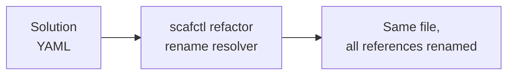

# Refactoring Tutorial

This tutorial covers `scafctl refactor`, which applies source-preserving edits to
a solution file. The first refactoring is `refactor rename resolver`, which
renames a resolver and rewrites every reference to it.

## Overview

Renaming a resolver by hand is error-prone: a resolver can be referenced in
several different ways, and missing one leaves a dangling reference that breaks
the solution. `refactor rename resolver` finds and rewrites all of them in a
single, comment-preserving edit.



It updates every form of reference:

- the resolver definition (the map key under `spec.resolvers`)
- `dependsOn` entries
- `rslvr:` references
- CEL `_.name` uses (in inputs and in `when`/`until` conditions)
- explicit Go-template `._.name` uses

Only the exact bytes of each reference are replaced, so comments, key order, and
formatting are preserved -- there is no YAML round-trip.

## A solution to rename

The example solution at `examples/refactor/solution.yaml` references the
`environment` resolver four different ways:

~~~yaml
spec:
  resolvers:
    environment:                       # the definition
      resolve:
        with:
          - provider: parameter
            inputs:
              value: dev
    appName:
      dependsOn:
        - environment                  # dependsOn reference
      resolve:
        with:
          - provider: parameter
            inputs:
              value:
                expr: '_.environment == "dev" ? "app-dev" : "app-prod"'  # CEL reference
    greeting:
      resolve:
        with:
          - provider: go-template
            inputs:
              template:
                tmpl: "Deploying {{ ._.appName }} to {{ ._.environment }}"  # template reference
    envAlias:
      resolve:
        with:
          - provider: parameter
            inputs:
              value:
                rslvr: environment      # rslvr reference
~~~

## Preview a rename with --dry-run

Always preview first. `--dry-run` lists every occurrence that would change and
leaves the file untouched:

```bash
scafctl refactor rename resolver environment env \
  -f examples/refactor/solution.yaml --dry-run
```

```text
Would rename resolver "environment" to "env" (5 occurrence(s)):
  examples/refactor/solution.yaml:13:5   environment -> env
  examples/refactor/solution.yaml:23:11  environment -> env
  examples/refactor/solution.yaml:30:26  environment -> env
  examples/refactor/solution.yaml:39:60  environment -> env
  examples/refactor/solution.yaml:48:24  environment -> env
```

## Apply the rename

Drop `--dry-run` to write the change in place:

```bash
scafctl refactor rename resolver environment env -f examples/refactor/solution.yaml
```

```text
Renamed resolver "environment" to "env" (5 occurrence(s)) in examples/refactor/solution.yaml
```

The definition, the `dependsOn` entry, the CEL expression, the template, and the
`rslvr` reference are all updated; every comment and blank line is preserved.

If you omit `-f`, the command auto-discovers a solution file in the current
directory. Because rename modifies a file, discovery is strict: if more than one
solution file matches, the command errors and asks you to pass `-f`.

## The safety guarantee: it refuses partial renames

A rename either updates every reference or does nothing. If the tool cannot
locate a reference to the target resolver byte-exact, it aborts with a non-zero
exit code rather than performing a partial (and potentially breaking) rewrite.

References that cannot be positioned today include:

- a context-dependent bare template accessor, `{{ .name }}`
- a `$`-rooted template accessor, `{{ $.name }}`
- an inline reference nested inside a literal value (for example a `rslvr:`
  buried in a literal map or list)

If any such reference targets the resolver you are renaming, you will see:

```text
rename resolver: N reference(s) to "environment" could not be located; aborting to avoid a partial rename
```

This check is name-scoped: an unlocatable reference to a *different* resolver
does not block your rename. When a rename is refused, update the ambiguous
reference to an explicit form (`._.name` in templates, `_.name` in CEL) and try
again.

## Exit codes

| Code | Meaning |
| ---- | ------- |
| 0    | Rename applied (or previewed with `--dry-run`) |
| 2    | Validation error: invalid new name, name collision, undefined resolver, or an unlocatable reference blocked the rename |
| 4    | The solution file could not be resolved, read, or parsed |

## Summary

- `refactor rename resolver <old> <new>` renames a resolver and every reference
  to it, preserving comments and formatting.
- Use `--dry-run` to preview; use `-f` to target a specific file.
- The rename refuses rather than performing a partial, solution-breaking rewrite.

## See also

- [Resolver Tutorial](resolver-tutorial.md) -- how resolvers and references work
- [Linting Tutorial](linting-tutorial.md) -- validate a solution after refactoring
