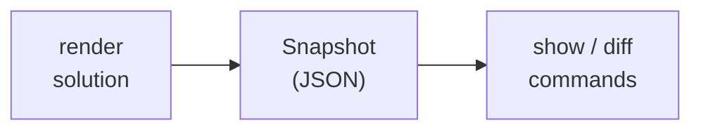

# Snapshots Tutorial

This tutorial covers using execution snapshots for debugging, testing, and comparing solution runs.

## Overview

Snapshots capture the state of resolver execution — values, timing, status, errors, and parameters — as a JSON file. They're useful for:

- **Debugging** — Inspect what every resolver produced
- **Testing** — Compare before/after to catch regressions
- **Auditing** — Record what ran and what it produced
- **Sharing** — Send a snapshot to a teammate for review (with redaction for secrets)



## When to Use Snapshots

Snapshots are **flag-triggered** (`--snapshot`), never automatically created. Here are the real-world scenarios where they provide value:

| Use Case | Scenario | How | Why Not Just Logs? |
|----------|----------|-----|-------------------|
| **Debugging a failed run** | A resolver fails or returns an unexpected value | `--snapshot` captures full state even when execution fails — you see which resolvers succeeded, which failed, and the exact error for each | Logs show temporal events; snapshots show the complete picture — every resolver's value, status, and timing in one structured file |
| **Regression detection** | You changed a solution, provider config, or parameter and need to verify nothing broke | Capture a known-good baseline, then diff after changes | `git diff` shows YAML changes; `snapshot diff` shows what those changes *did to the output* |
| **Environment comparison** | You need to see exactly which resolver values differ between staging and production | Snapshot with `-r env=staging` vs `-r env=production` and diff | Environment differences are computed at runtime by providers — they can't be seen by inspecting the solution YAML |
| **Golden-file testing** | Automated CI checks that resolver outputs haven't drifted | The `soltesting` package compares execution output against stored snapshots, normalizing timestamps and UUIDs | Manual inspection doesn't scale; golden files catch regressions automatically |
| **Audit trail** | Record what values were resolved at a specific point in time (before/after a deployment or config change) | Capture and archive snapshots with timestamps | Logs are ephemeral; snapshots are portable JSON files you can store and revisit |
| **Safe sharing** | A teammate needs to see your resolver output, but the solution uses secrets or credentials | `--redact` replaces values of `sensitive: true` resolvers with `<redacted>` | Copy-pasting terminal output risks leaking secrets and loses structure |

### Key Properties

- **Captures failures too** — Unlike normal output that stops on error, snapshots record partial state. A snapshot from a failed run shows you exactly which resolvers succeeded before the failure.
- **Structured data** — Every resolver's value, status, duration, phase, provider calls, and errors in one JSON file. Supports programmatic processing (`-o json`), CI pipeline assertions, and diff operations.
- **Redaction-safe** — Resolvers marked `sensitive: true` in the solution YAML have their values replaced with `<redacted>` when using `--redact`, making snapshots safe to share or store in version control.
- **Deterministic diff** — `snapshot diff` with `--ignore-fields duration,providerCalls` strips non-deterministic timing data, leaving only meaningful value and status changes.

## Creating Snapshots

### From `render`

Snapshots are created with `scafctl render solution`:


{}
```bash
# Render and save snapshot
scafctl render solution -f my-solution.yaml \
  --snapshot --snapshot-file=snapshot.json
```
{}
{}
```powershell
# Render and save snapshot
scafctl render solution -f my-solution.yaml `
  --snapshot --snapshot-file=snapshot.json
```
{}


### From `run resolver`

You can also capture snapshots when running resolvers only (without actions):


{}
```bash
scafctl run resolver -f my-solution.yaml \
  --snapshot --snapshot-file=snapshot.json
```
{}
{}
```powershell
scafctl run resolver -f my-solution.yaml `
  --snapshot --snapshot-file=snapshot.json
```
{}


This is useful when you want to inspect resolver execution without triggering actions.

### From `snapshot save`

Or use the dedicated save command:


{}
```bash
scafctl snapshot save -f my-solution.yaml --output snapshot.json
```
{}
{}
```powershell
scafctl snapshot save -f my-solution.yaml --output snapshot.json
```
{}


### With Parameters


{}
```bash
scafctl render solution -f my-solution.yaml \
  -r env=production \
  --snapshot --snapshot-file=prod-snapshot.json
```
{}
{}
```powershell
scafctl render solution -f my-solution.yaml `
  -r env=production `
  --snapshot --snapshot-file=prod-snapshot.json
```
{}


### With Redaction

Redact sensitive values (resolvers marked `sensitive: true`):


{}
```bash
scafctl render solution -f my-solution.yaml \
  --snapshot --snapshot-file=safe-snapshot.json --redact
```
{}
{}
```powershell
scafctl render solution -f my-solution.yaml `
  --snapshot --snapshot-file=safe-snapshot.json --redact
```
{}


## Viewing Snapshots

### Summary View (Default)


{}
```bash
scafctl snapshot show snapshot.json
```
{}
{}
```powershell
scafctl snapshot show snapshot.json
```
{}


Output:
```
Snapshot Summary

Solution:   my-app
Version:    1.0.0
Created:    2026-02-09T10:30:00Z
Duration:   145ms
Status:     success

Resolvers: 8 total
  ✅ Succeeded: 7
  ❌ Failed:    0
  ⏭  Skipped:   1

Parameters:
  env = production
```

### Resolver Details


{}
```bash
scafctl snapshot show snapshot.json --format resolvers
```
{}
{}
```powershell
scafctl snapshot show snapshot.json --format resolvers
```
{}


Shows each resolver's name, status, value, duration, and provider calls.

### JSON Output


{}
```bash
scafctl snapshot show snapshot.json --format json
```
{}
{}
```powershell
scafctl snapshot show snapshot.json --format json
```
{}


Full snapshot data for programmatic processing.

### Verbose Mode


{}
```bash
scafctl snapshot show snapshot.json --verbose
```
{}
{}
```powershell
scafctl snapshot show snapshot.json --verbose
```
{}


Includes additional details like individual provider call timing.

## Comparing Snapshots

### Basic Diff


{}
```bash
scafctl snapshot diff before.json after.json
```
{}
{}
```powershell
scafctl snapshot diff before.json after.json
```
{}


Output:
```
Snapshot Diff

Total: 8 resolvers
  Added:     1
  Removed:   0
  Modified:  2
  Unchanged: 5

Modified Resolvers:
  replicas: 2 → 5
  log_level: "debug" → "warn"

Added Resolvers:
  + cdn_endpoint: "cdn.prod.example.com"
```

### Ignore Timing

Filter out non-deterministic fields:


{}
```bash
scafctl snapshot diff before.json after.json \
  --ignore-fields duration,providerCalls
```
{}
{}
```powershell
scafctl snapshot diff before.json after.json `
  --ignore-fields duration,providerCalls
```
{}


### Show Only Changes


{}
```bash
scafctl snapshot diff before.json after.json --ignore-unchanged
```
{}
{}
```powershell
scafctl snapshot diff before.json after.json --ignore-unchanged
```
{}


### Output Formats


{}
```bash
# Human-readable (default)
scafctl snapshot diff before.json after.json --format human

# JSON for CI pipelines
scafctl snapshot diff before.json after.json --format json

# Unified diff format
scafctl snapshot diff before.json after.json --format unified

# Save diff to file
scafctl snapshot diff before.json after.json --output diff-report.json --format json
```
{}
{}
```powershell
# Human-readable (default)
scafctl snapshot diff before.json after.json --format human

# JSON for CI pipelines
scafctl snapshot diff before.json after.json --format json

# Unified diff format
scafctl snapshot diff before.json after.json --format unified

# Save diff to file
scafctl snapshot diff before.json after.json --output diff-report.json --format json
```
{}


## Common Workflows

### Debugging a Failure


{}
```bash
# 1. Capture the failing state
scafctl snapshot save -f broken-solution.yaml --output failing.json

# 2. Inspect what went wrong
scafctl snapshot show failing.json --format resolvers --verbose

# 3. Fix the issue and re-capture
scafctl snapshot save -f fixed-solution.yaml --output fixed.json

# 4. Verify the fix
scafctl snapshot diff failing.json fixed.json
```
{}
{}
```powershell
# 1. Capture the failing state
scafctl snapshot save -f broken-solution.yaml --output failing.json

# 2. Inspect what went wrong
scafctl snapshot show failing.json --format resolvers --verbose

# 3. Fix the issue and re-capture
scafctl snapshot save -f fixed-solution.yaml --output fixed.json

# 4. Verify the fix
scafctl snapshot diff failing.json fixed.json
```
{}


### Regression Testing


{}
```bash
# 1. Capture baseline
scafctl snapshot save -f solution.yaml --output baseline.json \
  --ignore-fields duration

# 2. Make changes to the solution
# ...

# 3. Capture new state
scafctl snapshot save -f solution.yaml --output current.json

# 4. Compare (ignore timing differences)
scafctl snapshot diff baseline.json current.json \
  --ignore-fields duration,providerCalls --format json

# 5. Use exit code in CI
if ! scafctl snapshot diff baseline.json current.json \
  --ignore-fields duration,providerCalls --ignore-unchanged; then
  echo "Snapshot regression detected!"
  exit 1
fi
```
{}
{}
```powershell
# 1. Capture baseline
scafctl snapshot save -f solution.yaml --output baseline.json `
  --ignore-fields duration

# 2. Make changes to the solution
# ...

# 3. Capture new state
scafctl snapshot save -f solution.yaml --output current.json

# 4. Compare (ignore timing differences)
scafctl snapshot diff baseline.json current.json `
  --ignore-fields duration,providerCalls --format json

# 5. Use exit code in CI
scafctl snapshot diff baseline.json current.json `
  --ignore-fields duration,providerCalls --ignore-unchanged
if ($LASTEXITCODE -ne 0) {
  Write-Output "Snapshot regression detected!"
  exit 1
}
```
{}


### Environment Comparison


{}
```bash
# Capture staging
scafctl render solution -f solution.yaml -r env=staging \
  --snapshot --snapshot-file=staging.json

# Capture production
scafctl render solution -f solution.yaml -r env=production \
  --snapshot --snapshot-file=production.json

# Compare configurations
scafctl snapshot diff staging.json production.json --ignore-unchanged
```
{}
{}
```powershell
# Capture staging
scafctl render solution -f solution.yaml -r env=staging `
  --snapshot --snapshot-file=staging.json

# Capture production
scafctl render solution -f solution.yaml -r env=production `
  --snapshot --snapshot-file=production.json

# Compare configurations
scafctl snapshot diff staging.json production.json --ignore-unchanged
```
{}


### Safe Sharing


{}
```bash
# Redact secrets before sharing
scafctl snapshot save -f solution.yaml --output shareable.json --redact
```
{}
{}
```powershell
# Redact secrets before sharing
scafctl snapshot save -f solution.yaml --output shareable.json --redact
```
{}


## Examples

| Example | Description | Run |
|---------|-------------|-----|
| [basic-snapshot.yaml](../../examples/snapshots/basic-snapshot.yaml) | Basic snapshot capture | `scafctl render solution -f examples/snapshots/basic-snapshot.yaml --snapshot --snapshot-file=/tmp/snapshot.json` |
| [snapshot-diff.yaml](../../examples/snapshots/snapshot-diff.yaml) | Comparing snapshots across environments | See example header for full commands |
| [redacted-snapshot.yaml](../../examples/snapshots/redacted-snapshot.yaml) | Redacting sensitive data | `scafctl render solution -f examples/snapshots/redacted-snapshot.yaml --snapshot --snapshot-file=/tmp/redacted.json --redact` |

## Snapshot Command Reference

| Command | Description |
|---------|-------------|
| `scafctl snapshot show <file>` | Display a saved snapshot |
| `scafctl snapshot diff <a> <b>` | Compare two snapshots |
| `scafctl snapshot save -f <solution>` | Run resolvers and save snapshot |
| `scafctl render solution --snapshot` | Create snapshot during render |

### Flags

| Flag | Commands | Description |
|------|----------|-------------|
| `--format` | show, diff | Output format (summary/json/resolvers/human/unified) |
| `--verbose` | show | Include additional detail |
| `--ignore-unchanged` | diff | Only show differences |
| `--ignore-fields` | diff | Comma-separated fields to ignore |
| `--output` | save, diff | Output file path |
| `--redact` | save, render | Redact sensitive resolver values |
| `-r key=value` | save | Pass resolver parameters |

## Using Snapshots with the MCP Server

When using AI agents (VS Code Copilot, Claude, Cursor), the MCP server provides snapshot tools:

- **`show_snapshot`** — Display snapshot contents with structured output (same as `scafctl snapshot show`)
- **`diff_snapshots`** — Compare two snapshots and return structured diffs showing added, removed, modified, and unchanged resolvers

The `analyze_execution` prompt automatically suggests using snapshots for debugging.

## Next Steps

- [Functional Testing Tutorial](functional-testing.md) — Write and run automated tests
- [Configuration Tutorial](config-tutorial.md) — Manage application configuration
- [Resolver Tutorial](resolver-tutorial.md) — Learn about resolvers that snapshots capture
- [Cache Tutorial](cache-tutorial.md) — Manage cached data from HTTP calls
- [MCP Server Tutorial](mcp-server-tutorial.md) — AI-assisted snapshot analysis
