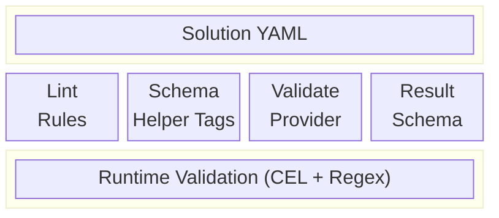

# Validation Patterns Tutorial

Learn how to validate resolver outputs, enforce constraints on inputs, and use schema validation to catch issues early.

## Overview

scafctl offers multiple validation layers that work together to ensure configuration correctness:



- **Schema helper tags** — provider-level input constraints (type, length, pattern, enum)
- **Validation provider** — runtime regex and CEL-based checks on resolver values
- **Result schemas** — JSON Schema validation of action outputs
- **Lint rules** — static analysis at `scafctl lint` time

---

## 1. Schema-Level Validation with Provider Inputs

Provider schemas use JSON Schema constraints to reject invalid input before execution.

### Available Constraints

| Constraint | Applies To | Helper Function | Description |
|------------|-----------|----------------|-------------|
| `enum` | strings, ints | `WithEnum(vals...)` | Restrict to allowed values |
| `pattern` | strings | `WithPattern(regex)` | Must match regex |
| `minLength` / `maxLength` | strings | `WithMinLength(n)` / `WithMaxLength(n)` | String length bounds |
| `minimum` / `maximum` | numbers | `WithMinimum(n)` / `WithMaximum(n)` | Numeric range bounds |
| `minItems` / `maxItems` | arrays | `WithMinItems(n)` / `WithMaxItems(n)` | Array size bounds |
| `format` | strings | `WithFormat(fmt)` | Semantic format hint (`uri`, `email`, `date`, `uuid`) |
| `default` | any | `WithDefault(val)` | Default value if omitted |

### Example: Provider Schema in Go

```go
schema := schemahelper.ObjectSchema(
    []string{"name", "environment"}, // required fields
    map[string]*jsonschema.Schema{
        "name": schemahelper.StringProp("Service name",
            schemahelper.WithPattern(`^[a-z][a-z0-9-]*$`),
            schemahelper.WithMinLength(3),
            schemahelper.WithMaxLength(63),
            schemahelper.WithExample("my-service"),
        ),
        "environment": schemahelper.StringProp("Target environment",
            schemahelper.WithEnum("development", "staging", "production"),
            schemahelper.WithExample("production"),
        ),
        "replicas": schemahelper.IntProp("Number of replicas",
            schemahelper.WithMinimum(1),
            schemahelper.WithMaximum(100),
            schemahelper.WithDefault(3),
        ),
        "tags": schemahelper.ArrayProp("Resource tags",
            schemahelper.WithMaxItems(20),
            schemahelper.WithItems(schemahelper.StringProp("tag value",
                schemahelper.WithMaxLength(128),
            )),
        ),
        "callback_url": schemahelper.StringProp("Webhook callback URL",
            schemahelper.WithFormat("uri"),
        ),
    },
)
```

When a resolver passes invalid input to this provider, the lint system catches it at analysis time:


{}
```bash
scafctl lint my-solution.yaml
```
{}
{}
```powershell
scafctl lint my-solution.yaml
```
{}


```
ERROR [invalid-provider-input-type] resolver 'deploy': input 'replicas' expects integer, got string
ERROR [schema-violation] resolver 'deploy': input 'name' does not match pattern '^[a-z][a-z0-9-]*$'
```

---

## 2. Runtime Validation with the `validation` Provider

The `validation` provider runs checks during the **validate phase** of a resolver, or as a standalone transform.

### Pattern: Regex Matching

Validate string values against regex patterns:

```yaml
# examples/providers/validation/regex-patterns.yaml
apiVersion: scafctl.io/v1alpha1
kind: Solution
metadata:
  name: regex-validation-demo
  version: 1.0.0
spec:
  resolvers:
    - name: email
      value: "user@example.com"
      validate:
        with:
          - provider: validation
            input:
              match: '^[a-zA-Z0-9._%+-]+@[a-zA-Z0-9.-]+\.[a-zA-Z]{2,}$'
              message: "Must be a valid email address"

    - name: semver
      value: "v1.2.3"
      validate:
        with:
          - provider: validation
            input:
              match: '^v?\d+\.\d+\.\d+(-[a-zA-Z0-9.]+)?$'
              message: "Must be a valid semantic version"

    - name: k8s_name
      value: "my-service-01"
      validate:
        with:
          - provider: validation
            input:
              match: '^[a-z][a-z0-9-]{0,61}[a-z0-9]$'
              notMatch: '--'
              message: "Must be a valid Kubernetes resource name"
```

{}
Run this example

```bash
scafctl run solution -f regex-patterns.yaml
```
{}

### Pattern: CEL Expression Validation

Use CEL expressions for complex, type-aware validation:

```yaml
# examples/providers/validation/cel-validation.yaml
apiVersion: scafctl.io/v1alpha1
kind: Solution
metadata:
  name: cel-validation-demo
  version: 1.0.0
spec:
  resolvers:
    - name: port
      value: 8080
      validate:
        with:
          - provider: validation
            input:
              expression: "__self >= 1024 && __self <= 65535"
              message: "Port must be in the unprivileged range (1024-65535)"

    - name: environment
      value: "staging"
      validate:
        with:
          - provider: validation
            input:
              expression: "__self in ['development', 'staging', 'production']"
              message: "Environment must be one of: development, staging, production"

    - name: password
      value: "SecureP@ss1"
      validate:
        with:
          - provider: validation
            input:
              match: '.{8,}'
              message: "Password must be at least 8 characters"
          - provider: validation
            input:
              match: '[A-Z]'
              message: "Password must contain an uppercase letter"
          - provider: validation
            input:
              match: '[0-9]'
              message: "Password must contain a digit"
          - provider: validation
            input:
              match: '[!@#$%^&*]'
              message: "Password must contain a special character"
```

> [!NOTE]
> **Tip:** `__self` refers to the resolver's current value inside validate and transform phases. Use `_` to access the full resolver data map for cross-field validation.

### Pattern: Cross-Field Validation

Validate relationships between different resolver values:

```yaml
apiVersion: scafctl.io/v1alpha1
kind: Solution
metadata:
  name: cross-field-validation
  version: 1.0.0
spec:
  resolvers:
    - name: min_replicas
      value: 2

    - name: max_replicas
      value: 10
      validate:
        with:
          - provider: validation
            input:
              expression: "__self >= _.min_replicas"
              message: "max_replicas must be >= min_replicas"

    - name: environment
      value: "production"

    - name: replicas
      value: 3
      validate:
        with:
          - provider: validation
            input:
              expression: |
                _.environment == 'production'
                  ? __self >= 3
                  : __self >= 1
              message: "Production requires at least 3 replicas"
```

---

## 3. Action Result Schema Validation

Actions can define a `resultSchema` to validate their output structure using JSON Schema:

```yaml
apiVersion: scafctl.io/v1alpha1
kind: Solution
metadata:
  name: result-schema-demo
  version: 1.0.0
spec:
  resolvers:
    - name: config
      resolve:
        with:
          - provider: http
            input:
              method: GET
              url: https://api.example.com/config

  actions:
    - name: deploy
      resultSchema:
        type: object
        required:
          - status
          - deploymentId
        properties:
          status:
            type: string
            enum: [success, pending, failed]
          deploymentId:
            type: string
            pattern: "^deploy-[a-f0-9]{8}$"
          instances:
            type: array
            minItems: 1
            items:
              type: object
              required: [id, region]
              properties:
                id:
                  type: string
                region:
                  type: string
                  enum: [us-east-1, us-west-2, eu-west-1]
        additionalProperties: false
      steps:
        - provider: exec
          input:
            command: "echo '{\"status\":\"success\",\"deploymentId\":\"deploy-a1b2c3d4\",\"instances\":[{\"id\":\"i-1\",\"region\":\"us-east-1\"}]}'"
```

If the action output doesn't match the schema, execution fails with a clear error:

```
ERROR: action 'deploy' result does not match schema: property 'status' must be one of [success, pending, failed]
```

---

## 4. Lint-Time Static Validation

`scafctl lint` catches issues without executing the solution:


{}
```bash
scafctl lint my-solution.yaml
```
{}
{}
```powershell
scafctl lint my-solution.yaml
```
{}


### Key Validation Rules

| Rule | Severity | What It Catches |
|------|----------|----------------|
| `schema-violation` | error | Unknown fields, type mismatches, pattern violations |
| `unknown-provider-input` | error | Input key not in provider's schema |
| `invalid-provider-input-type` | error | Literal value wrong type for field |
| `invalid-expression` | error | CEL syntax errors |
| `invalid-template` | error | Go template syntax errors |
| `finally-with-foreach` | error | `forEach` in `finally` block (unsupported) |
| `resolver-self-reference` | error | Using `_.name` instead of `__self` in validate/transform |
| `permissive-result-schema` | info | `resultSchema` without `type` constraint |
| `undefined-required-property` | error | Required property not defined in `properties` |


{}
```bash
# Lint with auto-fix where possible
scafctl lint --fix my-solution.yaml

# Lint all solutions in a directory
scafctl lint ./solutions/
```
{}
{}
```powershell
# Lint with auto-fix where possible
scafctl lint --fix my-solution.yaml

# Lint all solutions in a directory
scafctl lint ./solutions/
```
{}


---

## 5. Common Validation Patterns Reference

### String Patterns

```yaml
# Email
match: '^[a-zA-Z0-9._%+-]+@[a-zA-Z0-9.-]+\.[a-zA-Z]{2,}$'

# URL (http/https)
match: '^https?://[^\s/$.?#].[^\s]*$'

# Semantic version
match: '^v?\d+\.\d+\.\d+(-[a-zA-Z0-9.]+)?(\+[a-zA-Z0-9.]+)?$'

# Kubernetes resource name (RFC 1123)
match: '^[a-z][a-z0-9-]{0,61}[a-z0-9]$'

# UUID
match: '^[0-9a-f]{8}-[0-9a-f]{4}-[0-9a-f]{4}-[0-9a-f]{4}-[0-9a-f]{12}$'

# IPv4 address
match: '^\d{1,3}\.\d{1,3}\.\d{1,3}\.\d{1,3}$'

# CIDR notation
match: '^\d{1,3}\.\d{1,3}\.\d{1,3}\.\d{1,3}/\d{1,2}$'

# ISO 8601 date
match: '^\d{4}-\d{2}-\d{2}$'
```

### Numeric Constraints with CEL

```yaml
# Port range
expression: "__self >= 1 && __self <= 65535"

# Unprivileged port
expression: "__self >= 1024 && __self <= 65535"

# Percentage
expression: "__self >= 0.0 && __self <= 100.0"

# Memory limit (MB, must be power of 2)
expression: "__self > 0 && __self % 2 == 0"

# Timeout (1s to 5min)
expression: "__self >= 1 && __self <= 300"
```

### Collection Constraints with CEL

```yaml
# Non-empty array
expression: "size(__self) > 0"

# Array max size
expression: "size(__self) <= 50"

# All items match pattern
expression: "__self.all(item, item.matches('^[a-z-]+$'))"

# At least one item meets criteria
expression: "__self.exists(item, item.startsWith('prod-'))"

# No duplicates
expression: "size(__self) == size(__self.distinct())"

# Map has required keys
expression: "has(__self.region) && has(__self.zone)"
```

### Multi-Rule Composition

Apply multiple validation rules by chaining `validation` provider entries:

```yaml
validate:
  with:
    - provider: validation
      input:
        match: '.{8,}'
        message: "Must be at least 8 characters"
    - provider: validation
      input:
        match: '[A-Z]'
        message: "Must contain an uppercase letter"
    - provider: validation
      input:
        notMatch: '\s'
        message: "Must not contain whitespace"
    - provider: validation
      input:
        expression: "__self != _.username"
        message: "Must not match the username"
```

---

## 6. Validation Failure Diagnostics

When validation fails, scafctl provides structured error messages. Use the MCP `explain_error` tool or inspect the output directly:


{}
```bash
# Run with verbose output to see validation details
scafctl run solution -f my-solution.yaml -v 2
```
{}
{}
```powershell
# Run with verbose output to see validation details
scafctl run solution -f my-solution.yaml -v 2
```
{}


Common validation error patterns and their meaning:

| Error Pattern | Cause | Fix |
|--------------|-------|-----|
| `validation failed: match` | Value didn't match the regex in `match` | Check the regex or the input value |
| `validation failed: notMatch` | Value matched the regex in `notMatch` | Ensure value doesn't contain forbidden pattern |
| `validation failed: expression` | CEL expression returned `false` | Review the expression and input data |
| `'field' is required for X operation` | Missing required provider input | Add the field to your resolver input |
| `unknown operation` | Invalid operation value | Check the provider's `enum` list |

---

## Next Steps

- [CEL Expressions Tutorial](cel-tutorial.md) — dive deeper into CEL functions for validation
- [Linting Tutorial](linting-tutorial.md) — static analysis and auto-fix
- [Functional Testing Tutorial](functional-testing.md) — automated tests that verify validation behavior
- [Provider Reference](provider-reference.md) — full schema docs for all providers
